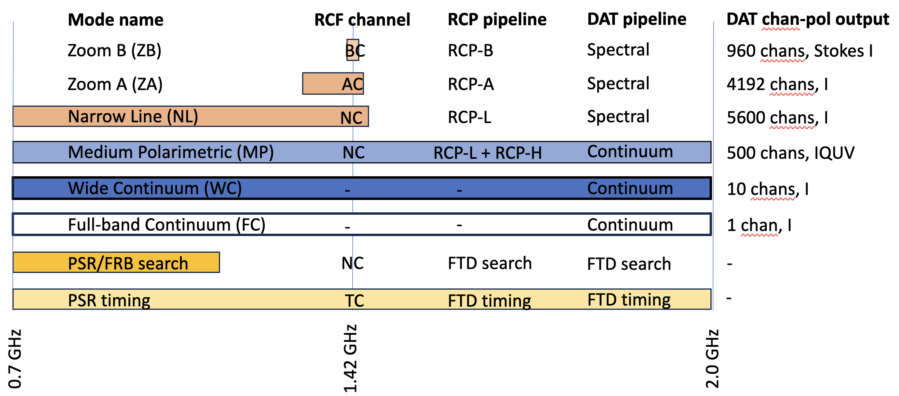

DSA-2000 Document No. 00012

DAT Design

Casey Law

Caltech/OVRO

+-----------------------------------------------------------------------+
| +--------------------------------+--------------------------------+   |
| | Version:                       | 2                              |   |
| +--------------------------------+--------------------------------+   |
| | Version date:                  | 8/8/23                         |   |
| +--------------------------------+--------------------------------+   |
| | Original date:                 | 2023-08-08                     |   |
| +--------------------------------+--------------------------------+   |
| | > Controlled document:         | No                             |   |
| +--------------------------------+--------------------------------+   |
| | WBS Level 2:                   | DAT--Data Management           |   |
| +--------------------------------+--------------------------------+   |
| | Document type:                 | DES--Design Report             |   |
| |                                |                                |   |
| |                                | Design Report                  |   |
| +--------------------------------+--------------------------------+   |
+=======================================================================+
|                                                                       |
+-----------------------------------------------------------------------+

Revision History

+----+----------+---------+---------------------+---------------------+
| ** | **Date** | **S     | **Reasons /         | **Author(s)**       |
| Ve |          | ections | Remarks**           |                     |
| r. |          | Aff     |                     |                     |
| ** |          | ected** |                     |                     |
+====+==========+=========+=====================+=====================+
| 1  | 20       | All     | Original            | Casey Law           |
|    | 23-08-08 |         |                     |                     |
| 2  |          | All     | PDR feedback        | Casey Law           |
|    | 20       |         |                     |                     |
|    | 23-10-28 |         |                     |                     |
+----+----------+---------+---------------------+---------------------+

#   {#section .TOC-Heading}

# Table of Contents {#table-of-contents .TOC-Heading .unnumbered}

[Introduction [4](#introduction)](#introduction)

[Interfaces [4](#interfaces)](#interfaces)

[Design Goals [4](#design-goals)](#design-goals)

[1.1 Large Data Buffer [4](#large-data-buffer)](#large-data-buffer)

[1.2 Knowing Data State [4](#knowing-data-state)](#knowing-data-state)

[1.3 Data Reduction [4](#data-reduction)](#data-reduction)

[Quality Assurance [4](#quality-assurance)](#quality-assurance)

[1.4 Custom Algorithms [4](#custom-algorithms)](#custom-algorithms)

[Components [4](#components)](#components)

[1.5 On-Site Data Store [4](#on-site-data-store)](#on-site-data-store)

[1.6 Off-Site Data Store
[4](#off-site-data-store)](#off-site-data-store)

[1.7 Metadata database and QA
[4](#metadata-database-and-qa)](#metadata-database-and-qa)

[1.8 Post-Processing System
[4](#post-processing-system)](#post-processing-system)

[1.9 Task-based Processing Framework
[4](#task-based-processing-framework)](#task-based-processing-framework)

[1.10 Post-Processing Pipelines
[4](#post-processing-pipelines)](#post-processing-pipelines)

[1.11 Images [4](#images)](#images)

[1.12 Fast Time Domain [4](#fast-time-domain)](#fast-time-domain)

[1.13 Development Effort [4](#development-effort)](#development-effort)

[Visibility and Operations
[4](#visibility-and-operations)](#visibility-and-operations)

[Development and Implementation
[4](#development-and-implementation)](#development-and-implementation)

Abstract

The Data Management subsystem is responsible for receiving data products
output by the Radio Camera Processor (RCP) subsystem and processing them
into science-ready data products that are distributed to the Public
Archive (ARC). This "post-processing" occurs on the RCP hardware and on
the post-processing system, a separate computing cluster that is
co-located with RCP. This document describes the DAT design, including
integrations with RCP and ARC, and how it meets requirements to produce
science ready data products.

# Introduction {#introduction .unnumbered}

DSA-2000 is a radio interferometer optimized for high survey speed and
sensitivity. The array is novel for having a large number of antennas,
massively commensal digital design, and a focus on survey observing. As
a result, the telescope will produce data at a very high rate (up to 300
TB/hr output by radio camera processor) that must be processed with a
low enough latency to avoid overwhelming data storage systems and
buffers. The data subsystem (DAT) is responsible for managing this data
produced by the Radio Camera Processor (RCP) subsystem, science
processing, and serving data to science users. A key part of the
real-time processing includes DSA-2000-specific software pipelines to
generate science-ready products.

The primary survey program of the DSA-2000 is the "Cadenced all-sky
survey", which will observe 3pi steradians of the sky repeatedly. The
survey will use 8594 10-sq-deg fields are observed to cover the
observable sky. During this survey, the DAT subsystem processes 12763
polarization-channels of image output, in addition to fast time domain
(FTD) products. These commensal pipelines will simultaneously produce:

1.  Full Continuum (FC; 1, 1.3 GHz and 10, 130 MHz) Stokes I images

2.  Wide Continuum (WC; 500, 2.604 MHz) Stokes IQUV images

3.  Narrow Line -- (NL; 5600, 130.2 kHz) Stokes I images

4.  HI Zoom A -- (ZA; 4192, 8 kHz) Stokes I images

5.  HI Zoom B -- (ZB; 960, 1 kHz) Stokes I images

6.  FTD timing \-- Folded Stokes profiles

7.  FTD search \-- Localization and transient spectra

{width="6.5in"
height="2.870833333333333in"}Figure 1: Summary view of RCF, RCP, and DAT
nomenclature and how processing is distributed across the observing
band.

Figure 1 shows what parts of the observing band are processed to produce
these data products. It also maps processing and acronyms from Radio
Camera Front-end (RCF) channel widths to RCP[^1] and DAT pipelines. On
the right side, the channel-polarizations processed by DAT are defined.
Many science requirements are relevant to the DAT output, which helps
constrain the processing and data management within DAT. This document
describes the DAT design that meets those requirements.

# Interfaces {#interfaces .unnumbered}

The RCF, RCP, DAT, and ARC subsystems represent a sequence of processing
stages that separate processing types. These subsystems can be developed
in parallel with each other and can be scaled up by adding hardware and
software to process more antennas, bandwidth, or data types. This
"separation of concerns" has been demonstrated at the DSA-110 and
OVRO-LWA instruments, both of which have FX correlators that have
similar roles to the RCF and RCP subsystems of DSA-2000. In these
current-generation instruments, the correlators produce raw data that
are reduced and cleaned into science ready products on a specialized
hardware platform, analogous to DAT. Finally, prepared data products are
served to the public via data stores and services located off site,
analogous to ARC.

The DAT subsystem requirements are defined in document
"D2k-00021-DAT-REQ v1". DAT is defined by two interfaces, RCP to DAT and
DAT to ARC, described in documents "D2k-00023-DAT-ICD v1" and
"D2k-00022-DAT-ICD v1", respectively. Some parts of the RCP subsystem
are dedicated to fast time domain (FTD) processing and send non-imaging
data to DAT (see "D2k-00026-RCP-DES v1" and "D2k-00018-RCP-DES v1").
Additional calculations were performed in a jupyter notebook
"[DSA-2000_data.ipynb](https://github.com/Radio-Camera-Initiative/DSA-2000_calculator/blob/main/DSA2000_data.ipynb)"
(available on github).

Figure 2 shows the flow of data through these interfaces. First, data
flows from RCP into DAT. The configuration of RCF and RCP defines the
structure of data received by DAT. A key concept is "commensality", in
which data are generated in parallel by hardware operating on specific
frequency range or data type. For example, data can be produced by the
RCP Zoom A and Zoom B imaging pipelines on distinct hardware. These
pipelines produce images of similar structure that are tuned to
different spectral range and resolution and may require different
handling by DAT.

After processing, data flows from DAT into ARC. DAT must extract a
subset of all data in order to reduce the data rate to a manageable
level. The ARC subsystem expects data that meets a uniform standard for
quality, sensitivity, and structure. DAT must ensure that products meet
these expectations before they are distributed off site to archives and
science users.

{width="0.5848534558180227in"
height="0.6741830708661417in"}{width="0.5848534558180227in"
height="0.6741830708661417in"}{width="0.5848534558180227in"
height="0.6741830708661417in"}Figure 2: Data flow through RCP, DAT, and
ARC subsystems. The RCP and DAT subsystems are co-located with each
other and the array, while ARC is off site and connected by the
internet.

# Design Goals {#design-goals .unnumbered}

The DAT subsystem performs multiple functions:

1.  Provides a large, redundant data buffer for the high-latency
    processing required to make science ready data products.

2.  Holds knowledge of the state and science readiness of any data
    product.

3.  Processes data across channel ranges, fields ("mosaicking") and time
    ("stacking") to reduce data rate for transfers off site.

4.  Allows for automated and human-based Quality Assurance (QA).

5.  Provides a CPU-first software environment that allows for custom
    algorithms to be developed in response to real-world conditions.

Here, we describe each of these goals in detail and how they motivate
components of the DAT design.

# Large Data Buffer

**Components: on-site storage system, off-site storage system**

DAT receives data at a rate of roughly 22.2 GB/s and must process and
reduce that in real-time, albeit with a larger latency than the RCP.
After processing, data are accumulated on DAT while waiting to be
shipped to ARC. Some products also must remain in DAT to be accumulated
with future observing epochs of the same part of the sky. All of these
features require a large (PB-scale) storage system on site with
redundant back up off site.

## Knowing Data State

**Component: metadata database**

The post-processing applies corrections to produce science ready data.
This is the same information required to control data quality before
mosaicking and stacking, as well as assessment prior to distribution to
ARC. By virtue of being co-located with RCP computing, it also can
receive information on the quality of the observation as the data are
generated by RCP (e.g., RFI issues for baseline weighting). This makes
DAT the most appropriate location to track overall data quality.

## Data Reduction

**Component: Computing cluster**

DAT performs a variety of processing to reduce the data volume and
prepare it for science applications. Example processing includes:

-   Correct for image-plane artifacts,

-   Mosaic a set of fields into a tile,

-   Stack mosaics over multiple epochs, and

-   Process FTD pulse search data into an image and burst spectrum.

## Quality Assurance {#quality-assurance .unnumbered}

**Component: Software for controlling and exposing data quality**

QA is required in real time for many data products. Automatic QA will
need to be developed in order to stack images or reschedule observations
lost during bad weather/hardware conditions. Each data product requires
expert users to define QA (initially manually, eventually automated).
Some data products will require manual interaction to select (e.g,. Cut
in time) or label (e.g., "looks good") prior to archiving. Furthermore,
a visual (we-based) interface will be needed for manual QA.

## Custom Algorithms

**Component: Framework for customizable, task-based processing**

Post-processing has a requirement of real-time processing, but with a
larger latency than RCP. More importantly, post-processing will need to
be able to adapt to changing observing conditions, as well as able to
incorporate newer algorithms. This makes it suitable for a task-based
framework with dedicated computing that is sized to meet the most
demanding period or mode. Most likely, this processing is implemented on
CPUs for simplicity and flexibility. However, GPU implementations should
also be supported as algorithms become more robust and industrialized.

# Components {#components .unnumbered}

Figure 2 shows the interfaces to DAT and components within DAT. We
detail the components (and related software) in subsections here.

Figure 2: Diagram of DAT interfaces and hardware components of DAT.

## On-Site Data Store

Figure 3 shows how data flows in and out of the on-site data store. It
receives data output by RCP, holds artifacts of the post-processing
pipelines, and stores products of the post-processing pipelines (see
[Section
4.5](https://caltech.sharepoint.com/sites/ovro/projects/dsa2000documents/Project/Document%20Library/Editable%20Documents/D2k-00012-DAT-DES%20v1.docx?d=wb7a822b5f97c4abab0d7e47dbeb8acaa&csf=1&web=1&e=RAclVu&nav=eyJoIjoiNjMxODI4NzYxIn0%3D)).

The RCP produces data at a rate of 22.2 GB/s across all products. This
would accumulate at a rate of roughly 2 PB per day. The rate and volume
would require an unusually high I/O for typical centralized data storage
systems (placing it on the "IO500" list of top performing systems world
wide) that is very expensive.

To reduce the cost of the centralized storage system, we define the
RCP/DAT interface as the local storage on the RCP nodes (see
"D2k-00023-DAT-ICD v1"). The DAT post-processing operates on the RCP
node to perform initial image processing, up to and including mosaicing
of field images into a tile. That reduces the data rate written to disk
to 3.8 GB/s, averaged over a 5-hour mosaic pattern observation and
inclusive of all mosaic image channels.

The on-site, on-RCP storage must buffer both RCP field images at a rate
of 22.2 GB/s (over all channels, uncompressed). The size of the
respective storage scales with the number of channels produced there.
Assuming on-RCP processing requires 72 hours to complete, the nodes
require 18/3.6/15 TB of redundant, usable storage per RCP-L, RCL-H, and
Zoom A/B node, respectively. The RCP nodes will include local storage to
accommodate this DAT requirement.

The on-site, centralized storage must buffer DAT mosaic images at a rate
of 3.8 GB/s (all channels, assuming 2x compression). The Survey
Implementation Plan is structured around mosaics of roughly 5x5 fields,
which reduce the mosiac output rate to 2.93x lower than the notional
field output rate. Assuming a centralized buffer that lasts for the
nominal all-sky epoch of 4 months, the centralized store requires 31.8
PB to store images.

Secondly, the mosaics will be accumulated in "stacks", which have a
fixed pixel grid that covers the visible sky. No mosaic edges are
required here, so the stack size is smaller by a factor of roughly 2. We
estimate 14.5 PB is required to save stacks.

Finally, data for fast time domain applications (PSR/FRB and PT systems)
is far smaller and accumulates at a rate of roughly 1 PB per 4 months.
In total, the centralized storage system should support 46.2 PB of
usable space.

The DSA-2000 project hired Tsolo.io as consultants on the design of the
centralized on-site storage system. The proposed design uses an
object-based storage system with S3 API based on the open-source
software-defined storage system known as Ceph. The requirement and
costed design documents developed by Tsolo.io are available for review
upon request.

Figure 3: Data flow within DAT, highlighting the central role of the
on-site data store. Note that the on-site data store includes storage on
RCP nodes and in a centralized storage system.

## Off-Site Data Store

The data are large, so there are significant cost savings to
accumulating the spectral and polarimetric image products in place over
multiple epochs ("stacking"). To keep data safe against disk failures or
algorithmic failures, we will preserve a redundant copy off site. This
copy is a duplicate of the data stored in the centralized on-site data
store (up to 48 PB usable space).

The off-site data store should support read and write access, but not
continually. A 'cold' form of storage, such as tape drives would be
appropriate for the expected access pattern. However, it would be useful
to preserve the object-based scheme used in the on-site data store, so
that data can be restored from off-site to on-site in a transparent way.

Notes from 18 April 2024:

IPAC has tape robot and owns tapes. They are stored by a service
provider (climate controlled). Could be costly for shipping and
chain-of-custody processes. Note: ARC already uses this for public data.
Also have exercised restoring of data. Tape robot has no overhead.

Labor costs of running our own facility will be prohibitive.

Cloud (AWS Glacier) may be smarter for remote location. Egress fees may
never be incurred.

We can be our own backup early in the project, since we'll have 5-yrs of
storage.

Need to calculate transfer costs for service to site. Compare to ingress
costs.

Access to this data: do we need regular interaction to stacks? Backups?
Do we want to fix stacks when there is a problem in co-add (but not on
disk anymore)?

Do we really anticipate going back to year one when at year 5?

Be sure to check again with Tsolo.io for their ideas.

## Metadata database and QA

Diverse and voluminous data are processed by DAT into science-ready
products. To meet science requirements, DAT must be able to (1) describe
the provenance of data, (2) correct for some artifacts, and (3) reject
data that cannot be made to meet science requirements. Each of these
features should be associated with a specific output product, such as a
polarization-channel of a large image cube. Each output product should
also be associated with a scheduled observation, such that data that
fails to meet science requirements can be reobserved. FTD products are
generally larger packages of data that are recorded less frequently.
They do not dominate the cost as the data volumes are generally much
smaller than the largest image cube products.

These features require the development of a database to track the state
of RCP and DAT outputs. RCP will produce field channel-images at a rate
of roughly 21 per second. Accumulating that over 5 years of survey
observing sets a requirement of 3 Gigarows of space. For a low latency,
the database should be able to add 1000 rows per second. Each row would
correspond to a unique id for a data product output by RCP. The columns
of the database would be defined to represent the quality of data and
state of processing.

Data quality must be exposed to the operations team and manual QA must
be facilitated by tools to accept good data and reject bad data.
Software tools to visualize and control data products will be built
around the metadata database.

## Post-Processing System

The post-processing system is the computational engine for science
processing. The OVRO-LWA instrument is a valuable pathfinder for design
of this cluster. A commodity compute cluster can serve a role in
commissioning and high-throughput pipeline processing. The key is to
design the cluster to accommodate the I/O requirements to/from the
centralized storage system. This cluster is assumed to have a CPU-first
role, but includes GPUs for implementing algorithms.

The DAT post-processing system will read data at the same rate as
mosaics are written, 2.8 GB/s. After processing, the output rate is much
smaller, since pipelines extract data from the most voluminous image
cubes. FTD products will also be much smaller after processing, as many
products will be recorded as "candidates of interest", but will be
rejected by quality control filters.

Algorithmic bottlenecks are difficult to define up front. Compression
algorithms have a 1 GB/s throughput, which we require to be subdominant
to other computing. For 2.8 GB/s input rate and making compression a 5x
subdominant, then we require 14 servers. Each server should manage the
entire processing graph (see below) in a streaming and parallel sense,
so we design each with 30-core EPYC processors and 2 RTX A4000 GPUs.

## **Task-based Processing Framework**

The post-processing pipelines may be decomposed into a series of
processing blocks, referred to as "tasks". These tasks have dependencies
that are defined up front to decide how the pipeline should be executed
most efficiently. Schedulers can also be aware of the distribution of
data and computing resources to optimially schedule work near data. In
many cases, some shared computation may be cached to reduce the work
load. Finally, post-processing may fail at any time, but scheduling
systems can record what\'s being done and restart as necessary.

A variety of task-based processing frameworks exist for distributed
computing, including open source solutions like Legion and dask. We will
choose a framework based on the balance of ease of use, computational
efficiency, and reliability.

## Post-Processing Pipelines

The post-processing system is the hardware that runs the post-processing
software pipelines. Post-processing pipelines transform the RC output to
the PP output. The pipeline must be designed for each output product,
since they each have a science requirement (e.g. ZA, "Zoom A", detects
HI from the local universe and has a modest dynamic range requirement
due to the low per-channel sensitivity).

Figure 4 shows graphs of the tasks we expect to apply to the three major
classes of processing: continuum imaging (producing MP, WB, FB outputs),
spectral imaging (producing ZA, ZB, NL outputs), and FTD (search and
timing).

### Images

Six output data products are images with different spectral or
polarimetric configuration. The major classes of processing for images
include dewarping for ionospheric phase effects, image-plane
deconvolution and convolution (removing PSF and improving brightness
temperature sensitivity), mosaicking/stacking, and a variety of QA
stages.

Some aspects of the processing pipeline design are based on the OVRO-LWA
instrument. This low-frequency radio interferometer images the entire
sky with a dense antenna configuration. A dedicated storage system will
receive image output from a cadenced, full-polarization imaging
pipeline. In that case, the post-processing consists of tools for
image-plane correction, source detection, and transient source
identification. At low frequencies, the sky is confusion limited at
arcminute resolutions, so image stacking is not required.

For DSA-2000, image post-processing will use the WC (130 MHz) images to
estimate residual ionospheric phase errors by the way it warps the image
plane. We will compare source positions of bright (\>1 mJy) sources to a
sky model to estimate a warp model that can be applied to all image
outputs. This needs to be done prior to mosaicking in order to stack
field images to the same, true positions.

A typical DSA-2000 field will include at least one 1 Jy source (Stokes
I), so a typical 10.3-minute integration requires a dynamic range of
5x10^5^ (FC; 1.3 GHz bandwidth) and 2x10^4^ (MP; 2.0 MHz bandwidth).
Image-plane deconvolution will be required to remove sidelobes with
relative amplitudes of 2x10^-3^ within 10" and 4x10^-4^ within 100". The
latter ("far sidelobes") will be detectable in Stokes I above the noise
of images with channel widths than about 100 kHz. That motivates the
continuum pipeline graph, which places deconvolution on Stokes I images
wider than NL. Near sidelobes (\<10") for bright sources will be masked.
Images sent to ARC will include per-pixel, per-channel masks.

HI and polarimetric data cubes are the largest and cannot sustainably be
shipped off site or stored in the public archive. The largest data
reduction in DAT occurs via extraction from these large cubes. HI cubes
will be extracted based on a priori knowledge from galaxy catalogs.
Polarimetric cubes are extracted toward all 20 sigma Stokes I sources.

{width="6.087125984251968in"
height="2.7518875765529307in"}

{width="6.0783005249343836in"
height="2.646593394575678in"}

{width="6.080861767279091in"
height="2.989757217847769in"}

Figure 4: (Top) Graph of image processing required for NL, ZA, and ZB
products. Data follows the arrows from left to right. The baseline
design allocates all tasks up to and including mosaicking to the RCP
node, but everything after the imaging pipeline is implemented as part
of the DAT subsystem. (Middle): Graph for MP, WC, FC image processing.
(Bottom): Graph for FTD timing and PSR/FRB search systems.

### Fast Time Domain

Two separate RCP systems produce three data products that are associated
with fast time domain science. The PSR/FRB search system will search for
pulsars via a periodic search algorithm and transients via a transient
search algorithm. These systems will output data products for each
candidate that will be post-processed by DAT for high-latency,
more-refined analysis and confirmation.

The transient search system and post-processing are heavily influenced
by the DSA-110 instrument. This system is currently discovering and
characterizing FRBs through a real-time search system that triggers
post-processing. Candidate FRBs are identified at a low rate, such that
human interaction is possible for QA. Quick-look visualizations will be
automatically classified and exposed to team members for manual review.

The periodic search system uses a different data structure, but a
similar concept. Real-time candidates trigger data products that can be
post-processed at higher latency. Quick-look visualizations will be
classified and shown to team members for validation. Validated events
are saved in the on-site archive and eventually sent to ARC to be served
to the public.

Finally, the pulsar timing system processes tied-array voltage beams for
known pulsars in order to measure precise arrival times for pulses. The
output is sent to DAT for post-processing, but since these are targeted
observations, the QA is easier to automate. False positives do not
define the post-processing, but instead quick-look visualizations can
quickly characterize quality for automated and manual assessment.

## Development Effort

These components require substantial software development effort. We
group the effort into categories of "Science Processing",
"Infrastructure", and "Management". A major milestone in the development
timeline is the commencement of construction in FY25 and surveys in FY
28.

For Science Processing, we envision work being done to adapt existing
code, write new algorithms and commision the system with knowledge of
radio interferometry and science applications. This work will likely
have significant contributions from students and postdocs, who are not
formally counted in the work estimate. However, a group of programmers
or technically-minded scientists will be required to lead development
without the distraction of early career obligations. A potential
allocation of effort is:

-   Mosaic, stack, full- and wide-band continuum formation -- 1 FTE per
    year in FY 25, 26, 27

-   Calibration, deconvolution, convolution, PSF and full-pol beam
    modeling (serves calibration role) -- 1 FTE per year in FY 25, 26,
    27

-   Automated image and FTD QA -- 0.5 FTE per year in FY 26, 27

-   Extraction of spectro-polarimetric cubes -- 0.5 FTE (IT staff) in FY
    27, 28

For Infrastructure, we envision work to build software tools and
frameworks that facilitate the Science Processing. This work will be
done by professional software engineers or astronomers with deep
computing experience. A potential allocation of effort is:

-   Workflow framework and web apps for post-processing visibility,
    management, and maintenance -- 1 FTE (software dev) in FY 26, 27, 28
    (Potentially mirrored by effort in OPL)

-   Servers and network maintenance -- 1 FTE (IT staff) in FY 26, 27, 28
    (Potentially mirrored by effort in OPL or RCP)

-   Database engineer -- 1 FTE (IT staff) FY 26, 27, 28 (Potentially
    mirrored by effort in OPL)

For Management, we envision work to marshal the teams doing software
development, ensure best development practices, and communicate across
subsystems. This is a system level hire that will make significant
contributions to the development of DAT software.

# Visibility and Operations {#visibility-and-operations .unnumbered}

DAT needs to operate continually with a processing latency that is low
enough to prevent disks from filling, while also ensuring that data have
science value. The subsystem is composed of hardware and software
components that may fail or need to be tuned to meet changing
environmental conditions (bad calibration, RFI, failed antennas).
Furthermore, human interaction for some data quality checks.

For all of these reasons, DAT requires status or health of various
components must be made visible:

-   Computing hardware

-   Storage hardware (on and off site)

-   QA metrics

-   Pipeline execution

-   Data science readiness.

This makes DAT connected to OPL, the observation planner subsystem, such
that there is an opportunity for shared development. In some cases,
these components can be built from frameworks that include web
applications to expose their status. In other cases, custom web
applications need to be built. These applications will be integrated
with the M&C subsystem to provide a centralized interface for array
operations.

# Development and Implementation {#development-and-implementation .unnumbered}

A key concept for the DSA-2000 design is "commensality". Digitized data
may be copied and distributed to distinct hardware to produce multiple
output data products. A new product is effectively a new flow of data
through dedicated hardware in RCF, RCP, and DAT. This "horizontal"
scaling can be implemented through the addition of computing resources
in these three subsystems.

Development of individual observing modes or data products can be
demonstrated on a subset of the entire frequency range (subset of all
RCF processing). As we validate performance, we can iterate on the
design in order to scale up to the full observing band. Development can
then proceed to another observing mode or data product, which is
processed on distinct hardware and in principle will not collide with
other observing modes. In this way, the array capabilities will grow as
development alternates between adding new features and scaling them up.

Many core algorithms described in the pipelines are already prototyped
in open source software. In those cases, the pipeline development
consists of integration (where possible) or re-implementation of the
algorithms. The DSA-2000 team will continue to work with outside
partners on new algorithm development, such as is required for
calibration. Finally, we note that many hardware solutions can be solved
by paying vendors to design and install them. We have demonstrated that
by consulting with tsolo.io for the on-site data storage system.

[^1]: Here, we use "RCP" to refer to all processing between RCF and DAT.
    This includes radio camera and time-domain processing, which
    includes the PT subsystem.
