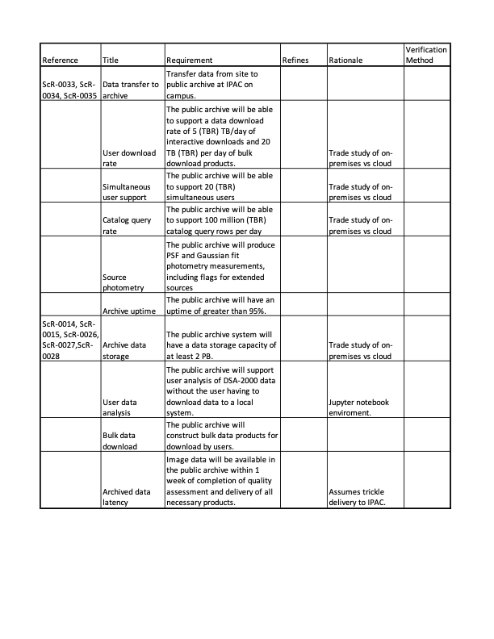

DSA-2000 Document No. 00013

Public Archive Requirements and Design

Rachel Akeson, Lee Armus, Vandana Desai, Gregory Dubois-Felsmann, Steve
Groom, George Helou, David Imel, Ben Rusholme

IPAC

+-----------------------------------------------------------------------+
| +--------------------------------+--------------------------------+   |
| | Version:                       | 1                              |   |
| +--------------------------------+--------------------------------+   |
| | Version date:                  | 8/7/23                         |   |
| +--------------------------------+--------------------------------+   |
| | Original date:                 | 2023-08-07                     |   |
| +--------------------------------+--------------------------------+   |
| | Controlled document:           | No                             |   |
| +--------------------------------+--------------------------------+   |
| | WBS Level 2:                   | ARC--Public Archive            |   |
| +--------------------------------+--------------------------------+   |
| | Document type:                 | DES--Design Report             |   |
| |                                |                                |   |
| |                                | Design Report                  |   |
| +--------------------------------+--------------------------------+   |
+=======================================================================+
|                                                                       |
+-----------------------------------------------------------------------+

Revision History

  --------------------------------------------------------------------------------
  **Ver.**   **Date**     **Sections   **Reasons / Remarks** **Author(s)**
                          Affected**                         
  ---------- ------------ ------------ --------------------- ---------------------
  1          2023-08-28   All          Original              Rachel Akeson, Lee
                                                             Armus, Vandana Desai,
                                                             Gregory
                                                             Dubois-Felsmann,
                                                             Steve Groom, George
                                                             Helou, David Imel,
                                                             Ben Rusholme

  --------------------------------------------------------------------------------

#   {#section .TOC-Heading}

# Table of Contents {#table-of-contents .TOC-Heading .unnumbered}

[1 Introduction [4](#introduction)](#introduction)

[2 Architecture Overview
[4](#architecture-overview)](#architecture-overview)

[2.1 Commissioning Data Access
[6](#commissioning-data-access)](#commissioning-data-access)

[3 Public Data Archive and User Interface
[6](#public-data-archive-and-user-interface)](#public-data-archive-and-user-interface)

[3.1 Image Service [6](#image-service)](#image-service)

[3.2 Source Catalog Service
[7](#source-catalog-service)](#source-catalog-service)

[3.3 Visualization and User Interface
[8](#visualization-and-user-interface)](#visualization-and-user-interface)

[3.4 Python Notebook Interactive Service
[8](#python-notebook-interactive-service)](#python-notebook-interactive-service)

[3.5 Cross-matching Service
[9](#cross-matching-service)](#cross-matching-service)

[4 Source Catalog Generation
[9](#source-catalog-generation)](#source-catalog-generation)

[5 Additional Archive Elements
[10](#additional-archive-elements)](#additional-archive-elements)

[5.1 Interface to Partner Archives
[11](#interface-to-partner-archives)](#interface-to-partner-archives)

[5.1.1 Pulsar Data [12](#pulsar-data)](#pulsar-data)

[5.2 Differential Image Products
[12](#differential-image-products)](#differential-image-products)

[5.3 Additional archival data products
[12](#additional-archival-data-products)](#additional-archival-data-products)

[6 Execution Plan [12](#execution-plan)](#execution-plan)

[6.1 Final Design Phase [13](#final-design-phase)](#final-design-phase)

[6.2 Archive and Pipeline Implementation
[13](#archive-and-pipeline-implementation)](#archive-and-pipeline-implementation)

[6.3 Operations [13](#operations)](#operations)

[7 Requirements [14](#requirements)](#requirements)

[8 Acronyms [16](#acronyms)](#acronyms)

Abstract

This document describes the design for the DSA-2000 public archive
implemented by IPAC. This archive will include calibrated images from
the Cadenced All-Sky Survey, as well as a derived source catalog.

# Introduction

The IPAC design for the DSA-2000 public archive and Science Platform
architecture provides access to public data products, as well as access
to computing resources co-located with the data, to support end-user
data analysis. This system architecture is closely based on existing
projects in which IPAC is either the lead institution or a major
partner. The architecture also provides for the creation of the source
detection and measurement pipeline, which will produce a
billion-object-scale all-sky catalog from the single-band all-sky
images. The design covers both the creation of the pipeline itself, and
the provision of a reusable infrastructure for pipeline creation which
can be used by other teams within the project to produce other internal
data products.

The DSA-2000 data will be housed and served through the NASA/IPAC
Infrared Archive (IRSA). IRSA is one of the NASA Astrophysics Archives
and is chartered to curate the science products of NASA\'s infrared and
submillimeter missions, including many large-area and all-sky surveys.
Community access to the public data products will be available through
IRSA\'s data access Web applications and International Virtual
Observatory Alliance (IVOA) service infrastructure. Co-location of the
public data products at IRSA will make the image and catalog datasets
from DSA-2000 available alongside the near- and mid-IR all-sky
photometric datasets already located there, including 2MASS and
WISE/NEOWISE, the Euclid survey data that will start to become available
in 2024, and the SPHEREx all-sky data that will start to be released in
2025. In addition, IRSA hosts or provides access to many additional
datasets on the Galactic and extragalactic sky, from the Spitzer mission
to Herschel and Planck, notably including extensive collections of data
on the community\'s well-known deep fields, highly valuable for
calibration and in-depth understanding of the properties of larger,
all-sky surveys.

# Architecture Overview

The archive user interfaces are based on the \"Science Platform\"
concept currently influencing the design of multiple projects\' and
centers\' archive interfaces and analysis environments, in astronomy and
beyond. Data will be accessible through standards-based Web APIs
(Application Program Interface), through a graphical \"portal\" user
interface layered on these services, and through an interactive
programming environment based on JupyterLab (Figure 1). Authorized users
will have access to storage and computing to use for their own data
analysis, at the sites where such resources are provided, in addition to
the available data products. The design of the DSA-2000 Science Platform
combines ideas and existing code from the Rubin Science Platform and
multi-archive science platform initiatives within NASA. The data and
analysis services available at the partner sites will be customizable,
via a flexible configuration-management system, to reflect the unique
data holdings and missions of each site.

The data service architecture is based on IVOA standards for metadata
and service definitions. Existing standards already cover much of the
space required to provide a high-quality service for the planned public
data products. At IPAC, we are already implementing the pipelines and
archive for the NASA SPHEREx mission, which will release public data
products strikingly similar to the planned public data products for
DSA-2000, and we will work with the IVOA to cover any gaps that are
found.

{width="3.5in"
height="3.527296587926509in"}

Figure 1: High-level architecture for IRSA data, services, and user
interfaces.

Data services for authorized users at the other DSA-2000 sites will be
based on the same concepts, but customized as needed for the specific
data products at each site. The multi-site architecture will be
supported by data discovery services, based on the IVOA\'s Registry
concept. Site-independent names for datasets will be defined, so that,
for datasets replicated at multiple sites, the same user queries and
analysis codes can be executed at whichever site is most appropriate.

The architecture uses contemporary software deployment approaches,
including containerization and configuration-as-code techniques, to
lower the complexity and maintenance requirements of service deployment,
and speed up the time from conception of a service to its deployment. It
leverages proven technologies from industry and the open-source
community to this end, including Kubernetes, as well as techniques for
their application already deployed in production in other archives,
notably by the NSF/DOE Vera C. Rubin Observatory.

The deployment architecture supports both on-premises and cloud-based
deployments of the same components. Both are already in use today in the
Rubin Observatory\'s Science Platform deployments at the Observatory
summit, at the US Data Facility at the SLAC National Accelerator
Laboratory, and in the Google cloud. We will perform a cost and
technical performance trade study on cloud usage before the Final
Decision Review. This will include the evaluation of the cloud for data
storage, photometry pipeline operations and user compute resources.

A common authentication and authorization system, based on contemporary
Web standards and security practices, will be shared by all sites,
providing for identity management and grouping that supports access to
proprietary data, collaborative work on science analyses, and the
management of limited resources.

The implementation of the source catalog generation will draw on a long
baseline of experience at IPAC. This experience includes current
projects to develop the image analysis pipelines for SPHEREx and NEO
Surveyor, and the currently active ZTF and NEOWISE pipelines.

## Commissioning Data Access

IPAC will implement project access to data during commissioning with the
following restrictions:

-   Release dates set in advance on large groups of data.

-   Data and people belong to groups, where each group can have access
    levels which differ by data set.

-   All data access requests are routed through control software.

This feature will also use the IRSA services for the team to validate
data during commissioning and before release to the community.

# Public Data Archive and User Interface

The public data product interface, to be provided in association with
IRSA, will initially be aimed at the Cadenced All-Sky Survey imaging
dataset and its derived billion-row source catalog. Basic read-only data
query services will be available to anonymous users, as they currently
are for IRSA, but capabilities requiring server-side storage, such as
the user workspace for files IRSA currently provides, or substantial
computation, will be available only to authenticated users. In
particular, the JupyterLab interactive computing service can only be
made available to authenticated users.

As mentioned above, the data services will be based on the use of
contemporary IVOA standards for both service protocols and data model
metadata. This will facilitate access to the archive not only through
the IPAC-provided User Interface (UI) but also through common community
tools such as TOPCAT and Aladin, as well as programmatic access via
community software such as PyVO.

## Image Service 

Service of the 10-band, 16-epoch Cadenced All-Sky Survey public image
dataset will be based on existing and future IVOA-standard image
metadata services at IRSA, likely exposed via both the SIAv2 and ObsTAP
protocols. These services are based on the standardized ObsCore data
model, which provides for spatial, temporal, wavelength, and
polarization metadata usable in queries via both SIAv2 and ObsTAP.

In addition to ObsCore, IRSA uses the de-facto community standard CAOM2
for a richer image metadata model (from which ObsCore may be derived).
We will create CAOM2 metadata for the images to allow for a more uniform
service at IRSA and facilitate more complex queries. CAOM2 allows for
the provision of, among other things, additional flexible observational
metadata, such as descriptions of observing conditions.

The services for the images themselves, given a metadata entry, use a
service architecture from the IVOA DataLink and ObsCore standards used
at several other archives including the Rubin Observatory, which
facilitates the discovery and retrieval of related data products such as
image previews, tables of sources discovered on the image, and image
provenance data.  This capability will be used to offer users access to
all available images for the selected field. The DataLink architecture
can also link to calculational services that operate on the image.
Essential to the envisioned archive is the image cutout service, which
would be accessed via the same DataLink interface.

The final design will specify serving the image data as 10-layer
spectral cubes, one per epoch, versus as 16-layer temporal cubes, one
per sub-band, or as individual images. The architecture can support any
of these options or even allow for multiple copies of the data organized
on different axes, if that were found to facilitate downstream use. The
10-band wide-area imaging data will be made available as a \"HiPS
cube\", an IVOA standard for the rapid visualization of wide-area
datasets, including pre-computed hierarchical tiles at lower
resolutions. A wide range of community tools can display these, and they
are also used in the existing IRSA UI tools.

Existing IRSA image visualization capabilities will be used for the
visualization of 2D and 3D (cube) FITS images. These already include
support for spectral cubes. These tools already support the generation
of color images based on the combination of data from multiple
user-selected bands, but these features would be enhanced to ease the
selection of desired inputs from the image collection.

## Source Catalog Service 

The public source catalog derived by IPAC from the Cadenced All-Sky
Survey image data will be served from a large relational database at
IRSA. Initial estimates put the catalog size at roughly 1 billion rows.
Existing all-sky catalog holdings at IRSA are already at and well beyond
this scale. The relational database will be made available for query
through an IVOA-standard TAP service based on the ADQL query language.
This service already exists at IRSA. Query results will be annotated
with community-standard metadata defining units and other aspects of the
catalog data model, enabling richer displays and programmatic use of the
data, especially in combination with other datasets.

In particular, we plan to add annotations for the IVOA PhotDM data
model, or a successor, to the data to enable completely data-driven
display of not only the per-band fluxes but also the band centers,
ultimately enabling the automatic display of SEDs for individual sources
based on the combination of data across all the passbands available in
IRSA data - or from external archives supporting this standard.

The TAP service will be extended with IVOA DataLink metadata that allows
navigating from catalog entries to related data. This is an existing
capability of the IRSA TAP service, but will be populated with links
specific to DSA-2000, including links to the source images on which the
catalog entries were observed. The planned user interface will provide
seamless access to these related items. Moreover, these links can be
traversed by any IVOA-compatible tool that supports DataLink, such as
TOPCAT, as well as by compatible Python interfaces such as PyVO.

Using the underlying service, the planned graphical user interface,
based directly on the existing TAP query capabilities in IRSA and the
Rubin Science Platform, will allow for form-driven queries based on
spatial coordinates as well as other attributes of the catalog entries.
It also assists users in constructing and executing free-form queries in
the ADQL language.

Query results will be displayed as tabular data, as well as in overlays
on user-selectable image data, either from DSA-2000 itself, or other
missions. Once a tabular result is displayed, the IRSA interface
provides for seamless search of the other major available all-sky source
catalogs on the archive, including WISE/CatWISE, 2MASS, and SPHEREx,
around selected sources in the query result.

IRSA will also make the Source Catalog available for bulk data access
and analysis in the form of a spatially sharded set of tiles. IRSA is
currently evaluating using the Parquet data format in this role for
existing data holdings because of its efficient compression and columnar
data-access properties. The Rubin Observatory is also planning to
release its main object catalog in this form. These ongoing projects are
aimed at enabling bulk access for many purposes, including two reference
use cases: large-scale statistical and machine-learning analyses, and
cross-matching with other catalogs. To support the latter use case, we
are currently engaged in collaborative efforts with other archives and
the IVOA to define a common spatial sharding procedure and data format
that will facilitate writing interoperable cross-matching software.

## Visualization and User Interface

The data portal graphical user interface for the DSA-2000 archive will
be based on IPAC's open-source "Firefly" user interface toolkit used in
IRSA, NED, the Exoplanet Archive, and the Rubin Science Platform. The
user interface will provide both query and visualization capabilities
based on the Firefly toolkit, covering both images and catalogs. Image
queries by location, wavelength, time, and image collection (e.g., data
product type) are supported and the resulting image metadata tables are
displayed along with context imagery as well as the selected images
themselves.

For the specific data products, existing Firefly image visualization
capabilities will be used for the visualization of 2D and 3D (cube) FITS
images, including spectral cubes. These tools also already support the
generation of color images based on the combination of data from
multiple user-selected bands.

The image visualization tool supports a wide range of features for image
viewing and analysis, including panning and zooming, stretching and
colorizing image data, inspection of the data from individual pixels,
image statistics, overplotting of coordinate systems, overplotting of
catalogs, blinking of images, calculation of profiles across the image
(e.g., enabling the visualization of the effective PSF, or a transect
through an extended source), and extraction of reprojected spectral data
from a point or region in a spectral cube.

For catalog queries, the user interface will support spatial searches by
coordinates or by object names from well-known databases. Both cone and
polygon searches are supported, as well as multi-object searches. For
catalog query results, the existing toolkit supports scientific
visualizations and exploratory data analysis, including 1D and 2D
histograms and scatter plots, with "brushing and linking\" features such
as filtering on numeric and category columns and selecting regions on
plots. Catalog results can be overplotted on large-area context imagery
or on specific image data products.

## Python Notebook Interactive Service

The Science Platform component of the archive, as adopted from the Rubin
Observatory, incorporates not only data services and a Web-based portal
user interface, but also an interactive computing capability based on
JupyterLab. This allows users to write their own code to work directly
with the data, running on servers co-located with the data. Python is
the natural language to use in such an environment, as it is the
implementation language of JupyterLab, but other interactively-oriented
languages such as R and Julia can also be supported in JupyterLab.

We will provide such a service in the public archive which is restricted
to registered users because of the implications for resource
utilization. The baseline design includes a basic level of service,
based on initial Rubin experience for a typical load of 100 active
users, but this should be revisited during the final design phase.

## Cross-matching Service

The TAP protocol for catalog queries already provides a mechanism for
performing queries against archive catalogs based on a list of targets
from a user-provided table. Queries of this nature will be possible
using the data services and graphical front-end planned to be used for
the public archive. This sort of query, when submitted through TAP, is
implemented as temporary-table uploads to the back-end relational
database, followed by spatial join operations. This approach is
functional and widely available in the community, including in existing
IRSA interfaces, but does not scale adequately to very large target
lists.

The rapid growth of interest in the statistical exploitation of
large-scale, all-sky or near-all-sky catalog datasets is outgrowing the
capabilities of traditional database-based solutions for cross-match
queries. Motivated by the size of the expected Rubin object catalog
(tens of billions of rows) and others expected to be available in this
decade, a number of groups are researching more parallel cross-matching
technologies for application to all-sky datasets. A key requirement for
the widespread acceptance of a solution would be the definition of a
standard data format, suitable for datasets from many projects and
missions, and scalable to datasets of many sizes and sky coverage
fractions.

IPAC is currently involved in a multi-project effort to develop one of
these solutions, led by the LINCC project and based on spatial sharding
of a dataset into tiles in the HEALPix system, using Parquet for the
file format, and enabling parallel computation for efficiency and low
latency for cross-match queries. Rubin Observatory requirements for a
solution in this space in the next 2-3 years make it very likely that a
community-accepted data format and associated open-source software will
be available in time for DSA-2000.

The baseline design includes provision of a copy of the catalog data in
Parquet to facilitate this use case. This dataset could be analyzed
locally in the public archive or downloaded by users and analyzed on
their own computing resources. We will provide a software toolkit to
support such analyses and will include it in the software pre-installed
in the JupyterLab environment.

# Source Catalog Generation

IPAC will develop and operate a pipeline to generate a source catalog
from the Cadenced All-Sky Survey, along with photometry for each epoch.
As the radio camera produces calibrated images rather than calibrated
visibilities, this pipeline will not utilize standard interferometry
techniques. The catalog pipeline will draw on a long baseline of
experience at IPAC, including current projects to develop the image
analysis pipelines for SPHEREx and NEO Surveyor, and the currently
active ZTF and NEOWISE pipelines. The catalog pipeline will include data
quality metrics, multi-wavelength bandmerging, and flags for extended
sources (Figure 2). As part of the final design phase, we will evaluate
different detection algorithms against simulated data to determine the
detection threshold and false positive rates. Methods to be evaluated
including those used for the VLA Sky Survey and using the calculated
beam as input for PSF-driven fitting. The expected high dynamic range
will mitigate the impact of sidelobes in the images, but given the high
sensitivity of the survey, very bright sources can still generate false
positive detections, and this will be included as part of the algorithm
evaluation and in the catalog data quality assessments. We will also
utilize ongoing work at IPAC to simultaneously fit sources across
multiple frequencies. We will work with the DSA-2000 team to select the
final source detection algorithm and detection thresholds. The initial
derivation of the catalog will be with the first data delivery to IPAC,
with reprocessing updates at 2.5 and 5 years after the survey stars.
Each catalog version will be available at IRSA for users to access. IPAC
will make the catalog pipeline code public including documentation on
how it is run at IPAC. Support for operation in other environments will
be very limited.

{width="2.5in"
height="3.220858486439195in"}

Figure 2: Catalog generation pipeline flow.

Each version of the catalog will contain data quality assessment (QA)
metrics. These metrics will include flags for use by archival users when
utilizing these data for science investigations. Examples of these flags
and metrics include:

-   Flags for source photometry measured from flagged image regions,
    such as those with excessive noise

-   Thresholds for noise per image and calibration values

-   Thresholds for photometric and astrometric solution precision

# Additional Archive Elements

This section includes possible additions to the DSA-2000 Archive. These
elements are not part of the current baseline budget, but will be
examined further during the final design phase to establish if any of
these functionalities should be added to the baseline.

## Interface to Partner Archives

In addition to the DSA-2000 data products held at IRSA, there will be
additional partner archives holding other science data products. IPAC
will provide and support an infrastructure to allow users to search
pre-selected data products from a single interface hosted at IRSA.

This partner archive search capability would work based on the following
principal elements:

-   local storage;

-   metadata specification following a consistent protocol and data
    model, based on IVOA standards, across all the archive sites and
    data products;

-   data-naming conventions that are site-independent and allow for
    migration or replication of datasets between sites;

-   data discovery services at each site that facilitate identification
    of and access to remote datasets (subject to bandwidth and
    authorization) when needed;

-   standard data at each site for the creation of image cutouts and the
    selection of time series; and

-   a common authorization solution.

We plan a common deployment architecture for the above services for each
site, based on the use of containerized software run in a container
orchestration system (such as Kubernetes) with service definition and
configuration based on a Devops-style model with \"configuration as
code\", and founded on common community open-source tool sets. The
deployment architecture would include common tools for monitoring and
logging, as well as for authorization/access control, across the
deployed services.

The architecture will be compatible with both on-premises and
cloud-based deployment, recognizing that the economics and performance
considerations may differ from archive site to archive site, as well as
over the lifetime of the DSA-2000 project. The data services will be
designed to be compatible with both Posix-like filesystems and
cloud-style object stores as storage backends.

The deployment architecture and implementation details will be specified
during the final design phase. However, we note that the Rubin Science
Platform (RSP), with which IPAC is closely involved, already provides a
fully open-source deployment infrastructure (sometimes referred to as
\"phalanx\" or the Rubin Science Platform) that meets nearly all these
requirements today. This deployment system is already in active use
across on-premises and cloud instances of the RSP, as well as having
been successfully deployed by multiple institutions[^1] that are not
part of the Rubin Observatory project team. This system therefore
represents at least a proof of concept and one likely viable option for
the DSA-2000 archive deployment software infrastructure.

As the archive subsystem partner, IPAC would provide deployable software
with guidance and documentation to other partners providing the
additional archive sites, including:

-   interface and metadata specifications that ensure interoperability
    among the DSA-2000 archive sites;

-   code to produce image cutouts and select time series data from data
    stored at the partner site;

-   a specification for the common infrastructure layer to be run at
    each site to support containerized deployments (e.g., Kubernetes);

-   software to provide an easily configured service-deployment
    mechanism above that layer;

-   a common authentication and authorization solution; and

-   a test suite for verifying basic compliance with the common metadata
    and service standards.

The partners operating the other archives are responsible for
implementation of the above to ensure product availability through IRSA.

### Pulsar Data

One example of a partner dataset is the pulsar timing data in the
NANOGrav dataset. In this case, during the final design phase, we will
examine how to achieve the greatest possible convergence between their
archive system design and the planned common architecture. We believe
the most important points to work on would be a) encouraging their use
of IVOA standards for data discovery and metadata, and b) determining
the need for----and if appropriate----ensuring interoperability of the
authorization mechanisms for data and resource access.

## Differential Image Products

In the baseline plan, IPAC will produce the source catalog at the first
data delivery and again at 2.5 and 5 years after the start of the
survey. All versions of the source catalog will be available to archive
users, with the most recent version as the search default. Additional
science would be enabled with more frequent comparisons of the reference
sky to current images to find transient sources. During the final design
phase, IPAC will develop a design and cost for this capability.

## Additional archival data products

The DSA-2000 survey data can be combined to form many additional data
products beyond the 10-channel multi-epoch survey. During the final
design phase, IPAC will document the additional resources needed to
include other archival level data products. Possible products include:

-   HI dataset: catalog of sources with image cube for each

-   Polarization dataset: Catalog of source with image for each

-   Additional pulsar and FRB products

# Execution Plan

This section includes the work planned from the final design phase
through operations. In each of these phases, IPAC will follow its
standard practices, covering processes like configuration management and
software development. IPAC uses a suite of standard tools, including
GitHub, jira and confluence.

## Final Design Phase

In preparation for the Final Design Review, IPAC will produce the
following:

-   Detailed design of the DSA-2000 archive, user interfaces, and
    catalog generation pipeline.

-   Level 3 requirements covering the IPAC work.

-   List and evaluation of implementation and operation risks.

As part of the detailed design work, specific items to be studied or
prototyped include:

-   Cloud vs. on-premises data storage and compute resources. This will
    be considered for both the pipeline processing needs and the user
    compute resources.

-   Architecture for the partner archive interface.

-   Photometry methodology and artifact identification for the catalog
    generation pipeline.

-   The interactions between bright source handling in the real-time
    camera system and the statistics and flagging of data in the image
    catalog.

-   A more frequent (\~monthly) difference imaging analysis to look for
    transient events.

-   Storage, interface and content for additional data products.

The IPAC team will also work with the other project elements to define
and document interfaces.

## Archive and Pipeline Implementation

All work described here will be performed by IPAC staff. The development
and operations of the archive and interface will be done by the IPAC
Archive Service Center (IASC), a Caltech recharge center. The IASC, led
by Steve Groom and Vandana Desai, consists of a team of scientists and
engineers with specialized skill sets and provides to IRSA data archive
services including: requirements definition, archive design and
architectural adaptation, data ingest scripts, database administration,
user-interface development and adaptation, the database query system,
"backend processing" connecting the database to the user-interface and
web-servers, adaptation of analysis tools to the specifics of a
project's data, system administration, archive testing and validation,
and interaction with the science community about the contents of the
archive, as well as the scientific, engineering, and managerial
leadership to organize and accomplish the deliveries for each project.

The work will follow standard IPAC procedures for software development,
including coding standards, configuration management and issue tracking.

## Operations

Processed data will be transferred to IPAC on a regular basis, but no
more frequently than monthly. Upon receipt, IPAC will make image data
available within two weeks. The catalog generation pipeline will be run
after the first year of data collection to generate the initial catalog.
The data will be reprocessed and new catalog versions produced after two
and five years of survey data collection.

Support for archival users will be provided through the standard IRSA
channels, including online documentation, help desk support and a
searchable knowledgebase.

Additional operational support will be considered as part of the final
design phase. This includes

1\. Using the first all-sky (deep) catalog in searching for pulsars in
all future epochs.

2\. Using the first all-sky image as a reference image for a transient
source search via difference imaging in on-site catalog processing
pipeline.

# Requirements

The following table includes the Level 2 requirements for the ARC
system.

{width="7.010417760279965in"
height="9.104166666666666in"}

# Acronyms

  -----------------------------------------------------------------------
  Acronym               
  --------------------- -------------------------------------------------
  2MASS                 Two-Micron All Sky Survey

  ADQL                  Astronomical Query Data Language

  API                   Applications Program Interface

  CAOM2                 Common Archive Observation Model Version 2

  DOE                   Department of Energy

  FITS                  Flexible Image Transport System

  IASC                  IPAC Archive Service Center

  IPAC                  Historically known as the Infrared Processing and
                        Analysis Center

  IRSA                  Infrared Science Archive

  IVOA                  International Virtual Observatory Alliance

  LINCC                 LSST Interdisciplinary Network for Collaboration
                        and Computing

  PhotDM                Photometry Data Model

  NASA                  National Aeronautics and Space Administration

  NED                   NASA Extragalactic Database

  NEOWISE               Near Earth Object Wide-field Infrared Survey
                        Explore

  QA                    Quality Assessment

  RSP                   Roman Science Platform

  SED                   Spectral Energy Distribution

  SIAv2                 Simple Image Access Version 2

  SPHEREx               Spectrophotometer for the History of the
                        Universe, Epoch of Reionization and Ices Explorer

  TAP                   Table Access Protocol

  TOPCAT                Tool for OPerations on Catalogues And Tables

  UI                    User Interface

  WISE                  Wide-field Infrared Survey Explore

  ZTF                   Zwicky Transient Facility
  -----------------------------------------------------------------------

[^1]: Including the IfA at the Royal Observatory, Edinburgh, and the
    national CC-IN2P3 computing center in Lyon, France.
