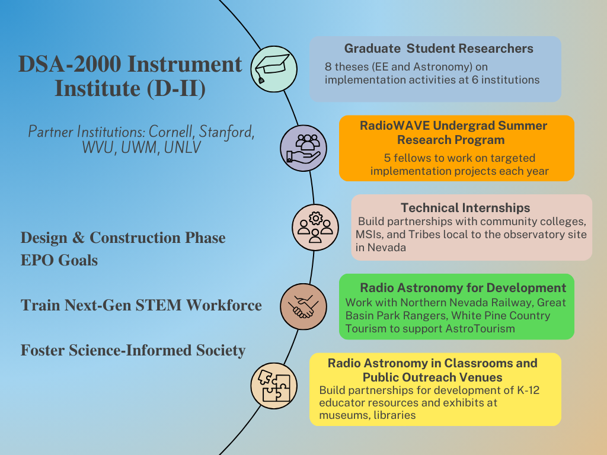

DSA-2000 Document No. 00020

Education and Public Outreach Plan

Akanksha Tiwary, Katie Jameson

Caltech

+-----------------------------------------------------------------------+
| +--------------------------------+--------------------------------+   |
| | Version:                       | 1                              |   |
| +--------------------------------+--------------------------------+   |
| | Version date:                  | 8/23/23                        |   |
| +--------------------------------+--------------------------------+   |
| | Original date:                 | 2023-08-23                     |   |
| +--------------------------------+--------------------------------+   |
| | Controlled document:           | No                             |   |
| +--------------------------------+--------------------------------+   |
| | WBS Level 2:                   | EPO--EPO                       |   |
| +--------------------------------+--------------------------------+   |
| | Document type:                 | OTH--Other                     |   |
| |                                |                                |   |
| |                                | Other                          |   |
| +--------------------------------+--------------------------------+   |
+=======================================================================+
|                                                                       |
+-----------------------------------------------------------------------+

Revision History

  --------------------------------------------------------------------------------
  **Ver.**   **Date**     **Sections   **Reasons / Remarks** **Author(s)**
                          Affected**                         
  ---------- ------------ ------------ --------------------- ---------------------
  1          2023-10-23   All          Original              

  --------------------------------------------------------------------------------

#   {#section .TOC-Heading}

# Table of Contents {#table-of-contents .TOC-Heading}

[1 Introduction [3](#introduction)](#introduction)

[2 Goals [4](#goals)](#goals)

[2.1 Train the Next-Generation of STEM Workforce
[5](#train-the-next-generation-of-stem-workforce)](#train-the-next-generation-of-stem-workforce)

[2.1.1 Graduate Student Researchers
[5](#graduate-student-researchers)](#graduate-student-researchers)

[2.1.2 RadioWAVE Undergraduate Summer Research Program
[5](#radiowave-undergraduate-summer-research-program)](#radiowave-undergraduate-summer-research-program)

[2.1.3 Technical Internships
[6](#technical-internships)](#technical-internships)

[2.2. Foster a science-Informed Society
[7](#foster-a-science-informed-society)](#foster-a-science-informed-society)

[2.2.1. AstroTourism [8](#astrotourism)](#astrotourism)

[2.2.2. K-12 Teacher Professional Development and Curriculum
[8](#k-12-teacher-professional-development-and-curriculum)](#k-12-teacher-professional-development-and-curriculum)

[3 Diversity and Inclusion
[9](#diversity-and-inclusion)](#diversity-and-inclusion)

[4 Evaluation [10](#evaluation)](#evaluation)

[5 References [10](#references)](#references)

# Introduction

The DSA-2000 Education Programs and Outreach (EPO) efforts will build
off the Owens Valley Radio Observatory\'s (OVRO) rich history in radio
astronomy, instrumentation, and student training to improve the links
between scientists, students, and society. Radio astronomy encompasses
all the STEM skills that underpin a strong developed economy. Modern
astronomers need knowledge in physics, mathematics, and computing;
Developing, maintaining, and running radio telescopes require key skills
in technology and engineering. The DSA-2000 is a transformational
project for many reasons, including its commitment to tap into radio
astronomy to inspire the next generation of scientists and engineers,
and to develop a workforce with the skills needed to compete in the
global economy.

Since the radio array is likely to be built in Nevada, our EPO efforts
during the design and construction of the DSA-2000 will prioritize the
needs of Nevadan students and communities. The state of Nevada has a
compelling need for STEM education and workforce training. Nevada has
distinct regional differences, both economically and demographically,
making it simultaneously one of the most urban and most rural states in
the nation. This diversity presents both challenges and opportunities
for STEM education and workforce development. ^1^

The mission of the DSA-2000 EPO is to inspire and engage diverse
communities with the wonders of cutting-edge radio astronomy. Close
collaboration with relevant government, industry, academic and
development partners, including local and traditional leadership, will
ensure the sustainability of our EPO initiatives, which will be
established to help expand Nevada\'s STEM-capable workforce, increase
research competitiveness, and create a more scientifically literate
society.

{width="5.044479440069991in"
height="3.7764687226596676in"}

Fig 1. Overview of the DSA-2000 Education Programs and Outreach Efforts

# Goals

The goals of the DSA-2000 Education Programs and Outreach are:

**2.1** Train the next-generation of STEM Workforce by creating
education and training programs that prepare students for the jobs of
tomorrow

**2.2** Foster a science-informed society that appreciates astronomy and
radio wave technology\'s impact on our daily lives and cosmic
understanding

## Train the Next-Generation of STEM Workforce

The project will initiate the DSA-2000 Instrument Institute (D-II),
building on the heritage

of the Radio Camera Initiative (RCI), to engage, train, and foster
community among a diverse, distributed

student collective. The D-II will channel efforts at academic
institutions in the US towards implementing

the DSA-2000 research infrastructure, and to simultaneously train a
network of undergraduate

and graduate students.

OVRO has a proven \>60-year record of student/postdoc involvement in the
implementation and system-verification of ground-breaking radio
astronomy research infrastructure. The design phase of the DSA-2000 has
so far deeply involved three students and six postdocs, with training
opportunities ranging from receiver and analog-signal-chain design,
forward modeling of the radio camera data products, and the novel
application of computer-vision techniques to interferometric images.

The D-II will be constituted the following three streams:

### 2.1.1 Graduate Student Researchers {#graduate-student-researchers .unnumbered}

Eight theses (EE and Astronomy) at six institutions will be based on
implementation activities spanning the breadth of the DSA-2000 project,
ranging from end-to-end signal chain verification to implementation of
key post-processing pipelines. Students will validate their work using
data from partial antenna arrays during construction.

### 2.1.2 RadioWAVE Undergraduate Summer Research Program {#radiowave-undergraduate-summer-research-program .unnumbered}

DSA-2000's RadioWAVE program will be built into Caltech's highly
successful WAVE Fellows program; More than 90 percent of WAVE fellows,
who are drawn from historically minoritized communities, enroll in
graduate school. The WAVE Fellows program recognizes that diversity of
background, experience, and thought is essential to achieving and
maintaining scientific excellence. D-II will equally provide research
experiences for STEM-focused students from community colleges and
minority-serving institutions (MSIs) in Nevada.

Women and minorities often come about their interest and therefore
opportunities to pursue STEM careers through a circular path, often
outside the normal pipeline and disproportionately through paths that
are typically not associated with matriculation in major graduate
research institutions, such attending Minority Serving Institutions
(MSIs) and two-year or community colleges. Community colleges, for
example, often are seen by some minorities as the alternative pathway
towards four-year colleges and universities. Historically Black Colleges
and Universities (HBCU), Tribal Colleges and Hispanic Serving
Institutions (HSI) are notable because they offer an alternative pathway
to STEM careers.

Five RadioWAVE fellows will work on targeted implementation projects
each year within the Caltech Cahill Radio Astronomy Lab, Receiver Lab,
and the Software and Algorithms Lab, and at OVRO. Fellows will carry out
the work over a 10-week period during the summer and submit two interim
reports, a research abstract, and final paper. At the conclusion of the
program, students give an oral or poster presentation at symposia
modeled on a professional technical meeting.

In addition to engaging in a mentored research and engineering
activities, RadioWAVE Fellows participate in:

-   Weekly seminars by Caltech faculty & JPL scientists and engineers

-   An academic and professional development series on developing a
    research career, graduate school admissions, effective writing and
    oral communications, and other topics of interest to future
    researchers

-   Effective writing workshops

-   Social and cultural activities

-   Weekly small student-faculty dinners

-   Special field trips

RadioWAVE is under development in partnership with the Caltech Student
Faculty Programs (SFP) and Nevadan MSIs and community colleges (Table 1)
for a pilot run in FY24.

+-------------------------+-----------------+--------------------------+
| **Institution**         | **Category**    | **Primary Contact**      |
+=========================+=================+==========================+
| University of Nevada,   | MSI, AANAPISI,  | Yingtao Jiang,           |
| Las Vegas (UNLV)        | HSI             |                          |
|                         |                 | *Professor, Associate    |
|                         |                 | Dean of Undergraduate    |
|                         |                 | Programs*                |
+-------------------------+-----------------+--------------------------+
| Truckee Meadows         | MSI, HSI        | Anne Flesher,            |
| Community College       |                 |                          |
|                         |                 | *Dean, Math and Physical |
| (TMCC)                  |                 | Sciences Division*       |
+-------------------------+-----------------+--------------------------+
| College of Southern     | MSI, AANAPISI,  | TBA                      |
| Nevada                  | HSI             |                          |
+-------------------------+-----------------+--------------------------+
| Western Nevada College, | MSI, HSI        | TBA                      |
| Carson City             |                 |                          |
+-------------------------+-----------------+--------------------------+
| Great Basin College     | Community       | TBA                      |
|                         | College         |                          |
+-------------------------+-----------------+--------------------------+
| Nevada State College,   | MSI, AANAPISI,  | TBA                      |
| Henderson               | HSI             |                          |
+-------------------------+-----------------+--------------------------+

Table 1. Internship partners in Nevada

### 2.1.3 Technical Internships {#technical-internships .unnumbered}

The DSA-2000 will be a landmark facility for research and education in
astronomy. The public and highly accessible nature of the data products
represent a democratization of access to the radio sky. Design efforts
have proceeded in close collaboration via contract with industry
partners, including Praxis Optical Networks (site infrastructure), TEAM
Environmental and WSP (permitting), Minex Engineering Corporation
(antennas), and Real-Time Radio Systems and Nvidia (radio camera
processor).

DSA-2000 is building partnerships (Table 1) with community colleges,
MSIs, and Tribes local to the observatory site to provide technical
internships for students from diverse backgrounds to directly assist
with implementation. From our initial discussions with UNLV and TMCC, we
anticipate collaborative development of tailored internship
opportunities, including for-credit internships. These Computing and
Engineering Technology internships would lead to careers in electronics,
information technology, and facilities maintenance, while also helping
MSIs increase student engagement and retention. We will recruit interns
to continue on with the DSA-2000 project through implementation and into
operation.

Student training will be facilitated by synergistic activities of the
D-II, in addition to sustained research

mentorship. We will build on the highly successful online RCI seminar
series with regular virtual seminars by invited and internal speakers,
as well as "Ask me anything" sessions with members of the DSA-2000
engineering staff. D-II members will convene for annual conferences to
present their research.

The D-II synergistic activities in student training are modeled on
well-tested programs that key team members are part of, which involve
students with cutting-edge radio astronomy instrumentation
(Pulse@Parkes, the Arecibo Remote Command Center, and the Pulsar Search
Collaboratory).

## 2.2. Foster a Science-Informed Society  {#foster-a-science-informed-society .unnumbered}

Too few Nevadans consider STEM careers in large part because they are
not exposed to STEM education as students or are not made aware of the
many exciting career opportunities in STEM available to those with some
postsecondary education.^2^ Moreover, the 2020 Nevada Statewide Plan for
the Improvement of Pupils places a greater emphasis on collaboration
than ever before, recognizing that collective impact is essential to
student success. By working together as a system, Nevada\'s education
stakeholders amplify their impact and achieve more than they would
individually.

From outreach activities and lesson plans that encourage curiosity in
our programs, to informal education offerings that provide opportunities
for learning outside the classroom, DSA-2000 EPO aspires to reach and
engage diverse members of society ---from preschoolers to retirees. Our
outreach initiatives will provide unique opportunities for our
researchers to promote their work to diverse audiences.

We are investigating a broad range of top-down and bottom-up STEAM
networks to help us bring the excitement of contemporary science to the
general public, school students and teachers, and to significantly
extend our reach throughout the lifecycle of the project. For example,
Pathways to STEM Nevada (formerly Nevada STEM Pipeline) was developed as
a resource to engage students, teachers, parents, and the community in
STEM education and employment. The effort is at the forefront to
increase the number of students interested in pursuing college degrees
with the overarching goal of strengthening future workforce and economic
development in the state. The DSA-2000 will advertise on the
user-friendly web portal that provides information on various programs,
resources and employment opportunities for K-20 students, parents, and
the community. DSA-2000 will also participate in annual community events
such as Northern Nevada Science and Technology Festival and Great Basin
Astronomy Festival.

Our strategic partnerships (Table 2) aimed towards equity and impact
will help us with our goal of fostering a science-informed society.
Communication will take place by telecon or video conferencing or
in-person meetings where possible, and dissemination will occur by web
tools.

+-----------------+-----------------+-----------------+-----------------+
| *               | **EPO           | **Audience**    | **Primary       |
| *Organization** | Category**      |                 | Contact**       |
+=================+=================+=================+=================+
| Caltech Student | Formal Learning | STEM            | Carol Casey,    |
| Faculty         |                 | Undergraduates  | Associate       |
| Programs        |                 |                 | Director        |
+-----------------+-----------------+-----------------+-----------------+
| Northern Nevada | Informal        | Kids, young     | Mark Basset,    |
| Railway         | Learning        | adults, general | Executive       |
|                 |                 | public          | Director        |
+-----------------+-----------------+-----------------+-----------------+
| White Pine      | Public Outreach | Local community | Kyle Horvath,   |
| County Tourism  |                 | and tourists    |                 |
| and Recreation  |                 |                 | Tourism         |
|                 |                 |                 | Director        |
+-----------------+-----------------+-----------------+-----------------+
| Great Basin     | Informal        | Kids, young     | TBA, Park       |
| National Park   | Learning        | adults, general | Astronomy       |
|                 |                 | public          | Ranger          |
+-----------------+-----------------+-----------------+-----------------+
| Discovery       | Informal        | Kids, young     | TBA             |
| Museum          | Learning        | adults, general |                 |
|                 |                 | public          |                 |
|                 |                 | (Exhibits)      |                 |
+-----------------+-----------------+-----------------+-----------------+
| Desert Research | Formal +        | K-12 Educators  | TBA             |
| Institute       | Informal        |                 |                 |
|                 | Learning        | (Teaching       |                 |
|                 |                 | resources)      |                 |
+-----------------+-----------------+-----------------+-----------------+
| Great Basin     | Public Outreach | Artists         | TBA             |
| Native Artists  |                 |                 |                 |
+-----------------+-----------------+-----------------+-----------------+

Table 2. Outreach and Engagement Partners in Nevada

### 2.2.1. Astrotourism {#astrotourism .unnumbered}

The efforts to promote education in STEM and socio-economic development
would be translated by Astrotourism projects with Northern Nevada
Railway and White Pine County Tourism and Recreation. Launched in 2009,
the Northern Nevada Railway\'s Star Train Program is a unique and
educational experience that offers passengers the chance to learn about
the stars and planets while enjoying a scenic train ride, from the
Railroad Museum in Ely through the Nevada desert. The popular program is
led by experienced Great Basin National Park rangers, who share their
knowledge of the night sky with passengers in a fun and informative way.
In the interest of promoting literacy in STEAM, local history, and
tourism in the region, the development of a visitor center is under
consideration.

### 2.2.2. K-12 Teacher Professional Development and Curriculum {#k-12-teacher-professional-development-and-curriculum .unnumbered}

The Desert Research Institute (DRI) is a recognized world leader in
basic and applied environmental research, serving as the non-profit
research arm of the Nevada System of Higher Education. DRI's Green Boxes
initiative are self-contained teaching kits that provide educators with
two or more weeks of lesson plans along with all of the supplies
necessary to conduct each activity. Every box uses active learning
strategies to engage students in hands-on projects that foster critical
thinking and problem-solving skills. These lessons are designed to
enhance student literacy in various STEM subject areas, from
introduction to multiwavelength astronomy, water conservation in the
Desert, to investigation of the four seasons as citizen scientist. Green
Boxes are available to all formal and informal educators in Nevada, free
of charge.

DSA-2000 intends to work with DRI Green Boxes initiative to introduce
the radio-frequency window, discovered some 75 years ago, that served to
transform our understanding of the universe. Radio astronomy is not just
a collection of results, but also a rapidly growing field concerned with
the instruments used to gather data, including instrumental properties,
advantages, and limitations.

It stands ready today to assist STEM educators at all levels as a
valuable teaching tool. By describing cosmic phenomena different from
anything in our earthly experience, coupled with dimensions that
transcend human comprehension, it should arouse in students a deep
curiosity, hopefully, to the point where they will want to learn
more.^6^

# Diversity and Inclusion 

Caltech's mission is to expand human knowledge and benefit society
through research integrated with education. This depends on the pursuit
of diversity, equity, and inclusion in all aspects of institutional
life. Pedagogical and research practices that engage, motivate and
support students from all backgrounds are implemented.

For example, the Caltech Student-Faculty Programs (SFP) office and the
Caltech Center for Inclusion and Diversity (CCID) provide training to
Caltech faculty, postdocs, and graduate students to promote the use of
effective, inclusive approaches to teach, mentor and advise. The CCID
additionally provides education, advocacy, and allyship across the
Caltech community. Institute-wide community-building programs, such as
the First-Year Success Research Institute, Graduate Summer Research
Institute, affinity organizations, and employee resource groups have
been initiated. At an organizational level, the President's Diversity
Council and Divisional DEI Committees (one chaired by the PI) work to
advance diversity, equity, and inclusion in support of Caltech's
mission.

The DSA-2000 fosters and supports diversity in STEM careers by
incorporating purpose-built hiring practices. At a high level, these
include: targeted advertising with professional societies, including AAS
and IAU, and society chapters that support under-represented groups;
flexible workplace practices to support those with caretaker
responsibilities or disabilities; rigorous application of rubrics in
candidate assessment; and a requirement for gender-representative
shortlists with a target of at least 40% women and 40% men.

# Evaluation

Assessment of D-II activities will be accomplished through monitoring of
participant experiences, performance, and future trajectories. Feedback
mechanisms will include longitudinal surveys and discussions at the
annual conferences, a joint review of annual committee reports on
graduate student progress, and existing assessment procedures in the
Caltech WAVE program and Caltech Center for Teaching, Learning, and
Outreach (CTLO). Evaluation metrics and methodologies for our outreach
programs will be developed in collaboration with subject matter experts
(CTLO) and program stakeholders to ensure that they are aligned with
program goals and objectives. Caltech currently tracks gender and
race/ethnicity (both self-identified) as the main demographics.

# References

1)  <https://stempathways.epscorspo.nevada.edu/>

2)  STEM Strategic Plan for Nevada 2017

3)  Nevada Department of Education Statewide Plan for the Improvement of
    Pupils 2020

4)  Nevada STEM Framework 2024

5)  Derman, Samuel. "Need a Classroom Stimulus? Introduce Radio
    Astronomy." *Physics Teacher* 48, no. 4 (April 2010): 251--55.
    doi:10.1119/1.3361996.

6)  <https://www.dri.edu/science-alive/green-boxes/>
