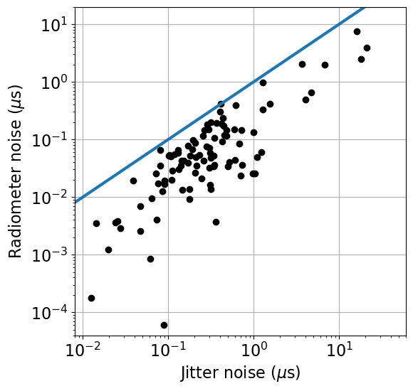

DSA-2000 Document No. 00026

Pulsar Timing Design

Vikram Ravi, Casey Law, Jack Hickish

Caltech, Real-Time radio

+-----------------------------------------------------------------------+
| +--------------------------------+--------------------------------+   |
| | Version:                       | 3                              |   |
| +--------------------------------+--------------------------------+   |
| | Version date:                  | 10/6/23                        |   |
| +--------------------------------+--------------------------------+   |
| | Original date:                 | 2023-10-06                     |   |
| +--------------------------------+--------------------------------+   |
| | Controlled document:           | No                             |   |
| +--------------------------------+--------------------------------+   |
| | WBS Level 2:                   | PT--Pulsar Timing              |   |
| +--------------------------------+--------------------------------+   |
| | Document type:                 | DES--Design Report             |   |
| |                                |                                |   |
| |                                | Design Report                  |   |
| +--------------------------------+--------------------------------+   |
+=======================================================================+
|                                                                       |
+-----------------------------------------------------------------------+

Revision History

+----+----------+---------+---------------------+---------------------+
| ** | **Date** | **S     | **Reasons /         | **Author(s)**       |
| Ve |          | ections | Remarks**           |                     |
| r. |          | Aff     |                     |                     |
| ** |          | ected** |                     |                     |
+====+==========+=========+=====================+=====================+
| 1  | 20       | All     | Original            | Casey Law           |
|    | 23-10-06 |         |                     |                     |
| 2  |          | All     | Filling out doc,    | Vikram Ravi         |
|    | 20       |         | based on discussion |                     |
| 3  | 23-10-10 | Int     | with NANOGrav       | Jack Hickish        |
|    |          | erfaces |                     |                     |
|    | 20       | / Impl  | Expand hardware     |                     |
|    | 23-10-17 | / Refs  | specs. Change to    |                     |
|    |          |         | 16+16b input.       |                     |
+----+----------+---------+---------------------+---------------------+

#   {#section .TOC-Heading}

# Table of Contents {#table-of-contents .TOC-Heading .unnumbered}

[1 Introduction [4](#introduction)](#introduction)

[2 Interfaces [4](#interfaces)](#interfaces)

[3 Pulsar Timing Requirements
[4](#pulsar-timing-requirements)](#pulsar-timing-requirements)

[4 Implementation Specifications
[6](#implementation-specifications)](#implementation-specifications)

[4.1 Hardware [6](#hardware)](#hardware)

[4.2 Software Pipeline [7](#software-pipeline)](#software-pipeline)

[5 References [7](#references)](#references)

Abstract

The pulsar timing system receives tied-array voltage beams targeting
known millisecond pulsars from RCF. The pulsar timing system uses the
known pulsar properties to "fold" data into a shape and format suitable
for measuring time-of-arrival and save it for further processing by DAT.
Here, we document the purpose of the pulsar timing system, its
interfaces, and parameters that define the hardware and software for
analysis.

# Introduction

Figure 1 shows how the data flows through the pulsar timing system. The
RCF will coherently sum antenna voltage streams to form up to four
voltage beams. The pulsar timing system is part of the RCP subsystem
that will receive that data, process it, and generate a data set that
retains pulsar timing information. The file will be saved to the on-site
data storage managed by DAT. On-site calibration is applied by DAT prior
to transmission for off-site processing and archiving.

Figure 1: Data flow through pulsar timing system.

# Interfaces

RCF produces tied-array voltage beams for a small number of targets
(currently, 4) for the purpose of precision estimates of the pulse
arrival times. The pulsars suitable for timing are known in advance of
an observation (in some cases, DSA-2000 will have discovered them). It
is assumed that there will be one "primary" timing beam where the array
is optimally phased, and that the other beams will suffer from bandwidth
smearing effects that will degrade the sensitivity. It is further
assumed that the data for each beam will have the following properties:

-   16-bit complex samples

-   2.1-MHz channels

-   Two polarizations

Several metadata items are necessary for each observation, presumed to
be served from the M&C system. Critical items include the start time of
the observation, presumed to be in UTC(GPS), the name of the pulsar to
be timed, and some information on the specific choice of phase center
(usually assumed to be a standard antenna).

The output of the pulsar timing system will be sent to DAT for further
processing. The dedispersed, folded antenna power will be saved to the
on-site data store centralized storage in a standard format ("psrfits").
Each PT data set will be registered with the metadata database, which
will track RCP output data sets, how they are post processed, and
ultimately served to the public via ARC.

# Pulsar Timing Requirements

Relevant science requirements include: ScR-0013 (commensality), ScR-0016
(recovering UTC/GPS time with 10ns rms), ScR-0022 (folding with 2048
phase bins for periods as short as 1 ms with, \<5 ns tracking of
phase-bin assignment), ScR-0025 (4 beams within primary beam), and
ScR-0039 (40 dB polarization purity after calibration).

The highest-level requirement is set by timing precision, which is
likely of most relevance to GW detection. In general, pulse times of
arrival (ToAs) for the best-timed pulsars can be modeled to better than
100-ns precision, and significant improvements require longer
integrations to beat down pulse-jitter noise (see Figure 2) at a bare
minimum. The requirements are being refined to consider possible
time-correlated errors, the specifics of polarization performance, and
the requirements for multiple beams. A high-level requirement related to
the science is also being drafted.

{width="3.9270833333333335in"
height="3.722548118985127in"}

**Figure 2:** Rough estimates of the jitter and radiometer noise
components for the 100 brightest cataloged millisecond pulsars with
reliable measurements of *W* and *S_psr*, assuming DSA-2000 observations
for 3600s (SEFD of 2.5 Jy, 1300 MHz of bandwidth).

The data products require a series of processing steps:

-   Coherent dedispersion: removing the effects of dispersive delays in
    voltage data up to dispersion measures (DMs) of a few x 10\^3 pc/cc.

-   Up-channelization: form finer channels within each coarse 2.1-MHz
    channel.

-   Formation of polarization products: create one (total intensity),
    two (XX/YY or RR/LL) or four (IQUV) correlation products.

-   Folding: accumulate correlation products into pulse-phase bins over
    some sub-integration interval according to a predictor.

-   Storage: write results to disk with appropriate header information
    in psrfits format.

The system is expected to observe effectively all the time, as there
will almost always be a pulsar in the beam. The core timing program for
GW detection will involve dedicated observations of \~200 millisecond
pulsars in a dynamically scheduled manner for \~25% of the time.

# Implementation Specifications

## Hardware

A number of pulsar timing systems with similar characteristics to those
of the DSA2000 already exist at other radio telescopes. The performance
achieved with these systems provides useful context for hardware
implementation choices at the DSA.

Pre-existing systems include:

1.  MeerKAT \[1\]: A single compute server is used to process a 27 Gb/s
    data stream comprising a dual-polarization beam with 875 MHz
    bandwidth (8b+8b complex samples). Server specifications are:

    a.  2 x Intel Silver 4110 CPUs

    b.  192 GB RAM

    c.  2x Nvidia RTX 2080 Ti GPUs

    d.  1 x 40 Gb Ethernet NIC

    e.  8 TB NVME storage

    f.  24 TB SATA storage

2.  Parkes CPAF \[2\]: A single compute server is used to process a 70
    Gb/s data stream comprising a dual-polarization beam with 922 MHz
    bandwidth (oversampled by a factor of 32/27 with 16b+16b complex
    samples). Here the system used a single 100 Gb Ethernet NIC and a
    pair of Nvidia A10 GPUs.

3.  SKA1-Mid \[2\]: A single compute server is used to process a 91 Gb/s
    dual-polarization beam with 2500 MHz bandwidth (oversampled by a
    factor 8/7 with 8b+8b complex samples). GPU choice for this system
    has not yet been made.

Each 1300 MHz-wide, dual-polarization beam from the DSA's RCF system is
transmitted as an 83Gb/s stream of 16b+16b complex-valued samples. It is
reasonable to assume that the data from a single beam can be received on
a single 100 Gb Ethernet link. Given performance in similar systems, it
the systems described above, it is also reasonable to assume that a
single server, hosting a pair of current-generation, mid-range GPUs,
would be adequate to perform all required processing on a single beam.

The assumed specifications of a single-beam, PT processing node are:

1.  2 x AMD EPYC 9124 Processor (16 core, 3.0GHz each)

2.  2 x Nvidia A5000 GPUs

3.  384 GB DDR5 memory

4.  1 x 100 Gb Ethernet NIC

5.  16 TB NVME storage

6.  16 TB SATA storage

As with the MeerKAT system, fast NVME storage is included in the design
so that it is possible to record \~20 minutes of raw beam voltages.
These may be processed offline, enabling development and refinement of
the processing algorithms.

It is likely that a server with these specs could comfortably keep up
with the real-time processing requirements of a single beam. Software
prototyping will verify this and ascertain if it might be possible to
process multiple beams on a single server to reduce the overall system
cost. It is also likely that the PT design will, as much as possible,
use common hardware with the RCP system.

## Software Pipeline

The processing required by the PT software pipeline may be achieved in
its entirety using pre-existing code.

For example, the pipeline could almost readily be implemented with a
data capture code capable of placing \~83.2 Gb/s into ring-buffer
memory, followed by existing implementations of the above pipeline in,
e.g., dspsr. Pulsar timing software (e.g., tempo2, psrcat) would be
required to form predictors for folding.

Specifications for calibration, monitor and control, and other on-site
processing tasks are being developed. It is these challenges, rather
than the implementation of the PT signal processing pipeline, which form
the bulk of design work to be completed.

# References

\[1\] Bailes, M., "The MeerKAT telescope as a pulsar facility: System
verification and early science results from MeerTime", Publications of
the Astronomical Society of Australia, vol. 37, 2020.
doi:10.1017/pasa.2020.19.

\[2\] Private communication, Jameson, A., October 2023
