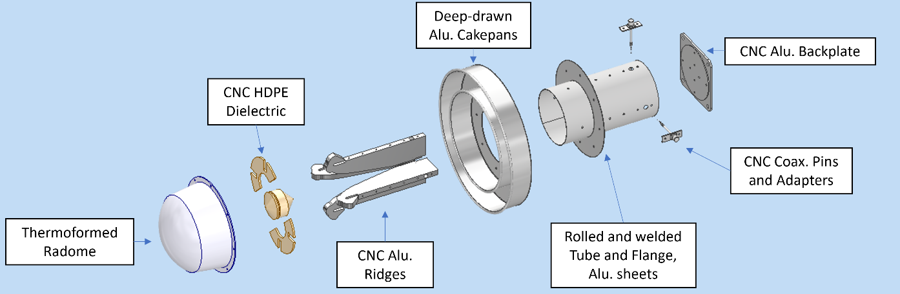

DSA-2000 Document No.

DSA-2000 System Design Description

Francois Kapp

Caltech

+-----------------------------------------------------------------------+
|   --------------------------------- --------------------------------- |
|   Version:                          2                                 |
|                                                                       |
|   Version date:                     2023-12-17                        |
|                                                                       |
|   Original date:                    2023-12-08                        |
|                                                                       |
|   Controlled document:                                                |
|                                                                       |
|   WBS Level 2:                      SYS--System Level Engineering     |
|                                                                       |
|   Document type:                    DES--Design Report                |
|   --------------------------------- --------------------------------- |
|                                                                       |
|   : Table : DSA-2000 System Decomposition                             |
+=======================================================================+
|   ------------------------------------------------------------------- |
|                **Name**           **Signature (PDF)**     **Date**    |
|   ------------ ------------------ ----------------------- ----------- |
|   **PI**       Gregg Hallinan                                         |
|                                                                       |
|   **Project    Francois Kapp                                          |
|   Engineer**                                                          |
|                                                                       |
|   **Project    Katie Jameson                                          |
|   Manager**                                                           |
|   ------------------------------------------------------------------- |
|                                                                       |
|   : Table : DSA-2000 External Interfaces Summary                      |
+-----------------------------------------------------------------------+

: Table : DSA-2000 Modes and States Description

Revision History

  --------------------------------------------------------------------------------
  **Ver.**   **Date**     **Sections   **Reasons / Remarks** **Author(s)**
                          Affected**                         
  ---------- ------------ ------------ --------------------- ---------------------
  1          2023-10-25   All          Original for PDR      Francois Kapp
                                       Review                

  2          2023-12-17   All          PDR Review Updates,   Francois Kapp
                                       additional details    
                                       added for site        
                                       buildings, Document   
                                       numbers added and     
                                       updated.              
  --------------------------------------------------------------------------------

  : Table : DSA-2000 Internal Interfaces Summary

#   {#section .TOC-Heading}

# Table of Contents {#table-of-contents .TOC-Heading}

[1 Introduction [5](#introduction)](#introduction)

[1.1 Applicable Documents
[5](#applicable-documents)](#applicable-documents)

[1.2 Reference Documents
[5](#reference-documents)](#reference-documents)

[1.3 System Context [6](#system-context)](#system-context)

[1.4 DSA-2000 Design Approach
[7](#dsa-2000-design-approach)](#dsa-2000-design-approach)

[1.5 DSA-2000 Lifecycle [7](#dsa-2000-lifecycle)](#dsa-2000-lifecycle)

[1.5.1 Concept Design Phase
[7](#concept-design-phase)](#concept-design-phase)

[1.5.2 Technology Maturation Phase
[7](#technology-maturation-phase)](#technology-maturation-phase)

[1.5.3 Preliminary Design Phase
[8](#preliminary-design-phase)](#preliminary-design-phase)

[1.5.4 Final Design Phase [8](#final-design-phase)](#final-design-phase)

[1.5.5 Implementation Phase
[8](#implementation-phase)](#implementation-phase)

[1.5.6 Operational Phase [9](#operational-phase)](#operational-phase)

[1.5.7 Decommissioning and Site Restoration Phase
[9](#decommissioning-and-site-restoration-phase)](#decommissioning-and-site-restoration-phase)

[2 System Requirements [9](#system-requirements)](#system-requirements)

[3 System design [9](#system-design)](#system-design)

[3.1 System Observations
[9](#system-observations)](#system-observations)

[3.2 Data Products [9](#data-products)](#data-products)

[3.3 System Modes and States
[10](#system-modes-and-states)](#system-modes-and-states)

[3.4 Subsystem Definitions
[16](#subsystem-definitions)](#subsystem-definitions)

[3.5 Interface Identification
[20](#interface-identification)](#interface-identification)

[4 Subsystem Designs [26](#subsystem-designs)](#subsystem-designs)

[4.1 Antenna Stations [26](#antenna-stations)](#antenna-stations)

[4.2 Analog Signal Path [26](#analog-signal-path)](#analog-signal-path)

[4.3 Radio Camera Frontend
[26](#radio-camera-frontend)](#radio-camera-frontend)

[4.4 Data Management [26](#data-management)](#data-management)

[4.5 Radio Camera Processor
[26](#radio-camera-processor)](#radio-camera-processor)

[4.6 Signal Network (SNW)
[26](#signal-network-snw)](#signal-network-snw)

[4.7 Monitoring and Control (MNC)
[27](#monitoring-and-control-mnc)](#monitoring-and-control-mnc)

[4.8 Observation Planner (OPL)
[27](#observation-planner-opl)](#observation-planner-opl)

[4.9 Control Network (CNW)
[27](#control-network-cnw)](#control-network-cnw)

[4.10 Timing and Synchronization
[28](#timing-and-synchronization)](#timing-and-synchronization)

[4.11 Support Equipment [28](#support-equipment)](#support-equipment)

[4.12 Facilities [28](#facilities)](#facilities)

[4.12.1 Fiber network [28](#fiber-network)](#fiber-network)

[4.12.2 Site Buildings [28](#site-buildings)](#site-buildings)

[4.12.2.1 Control Building [30](#control-building)](#control-building)

[4.12.2.2 Fabrication and Maintenance Building
[32](#fabrication-and-maintenance-building)](#fabrication-and-maintenance-building)

[4.12.2.3 Accommodation Building
[33](#accommodation-building)](#accommodation-building)

[4.12.3 Weather Station [33](#weather-station)](#weather-station)

[4.12.4 RFI Monitoring Station
[33](#rfi-monitoring-station)](#rfi-monitoring-station)

[4.13 Pulsar Timing [33](#pulsar-timing)](#pulsar-timing)

[4.14 Public Archive [33](#public-archive)](#public-archive)

[5 Logistics [33](#logistics)](#logistics)

[5.1 Availability Analysis
[33](#availability-analysis)](#availability-analysis)

Abstract

This document describes the high-level system design of the DSA-2000. It
informs the lower-level design, incorporated in a series of subsystem
designs, and elaborates the implementation of the system requirements,
which in turn refines the science requirements.

# Introduction

The Deep Synoptic Array 2000, or DSA-2000, is a radio telescope array
optimized for survey purposes. The array will consist of 2048 5m
diameter dishes, which can instantaneously cover the 0.7 -- 2 GHz
frequency range and will span an area of 19 km × 15 km on a radio quiet
site in a valley in Nevada. With near complete sampling of the uv-plane,
it will be possible to use a real-time "radio camera" instead of a
traditional digital correlator backend. During its five-year prime
phase, the DSA-2000 will repeatedly image the entire viewable sky
(\~30,000 deg²) over sixteen epochs, detecting more than 1 billion radio
sources. The data will be combined into a full-Stokes sky map with 500
nJy/beam RMS noise.

This document summarizes the top level (Level 1) design, with most of
the design work occurring in the subsystems (Level 2), incorporated here
by reference.

## Applicable Documents

The following documents are applicable to the extent stated in this
document. In case of conflict between an applicable document and this
document, the applicable document shall take precedence.

1.  DSA-2000 Science Requirements, Version: PrePDR, D2k-00011-SYS-SPC

2.  DSA-2000 System Requirements, Version: 1, D2k-00028-SYS-SPC

3.  DSA-2000 Concept of Operations, Version 0.01, D2k-00003-PRJ-MGT

4.  Survey Plan DSA-2000 Survey Implementation Plan (D2K-SIP), Version
    2.8, D2k-00053-PRJ-OTH

## Reference Documents

The following documents are referenced in this document. In case of
conflict between a reference document and this document, this document
shall take precedence.

1.  Hallinan, Gregg; Ravi, V.; et al. The DSA-2000 --- A Radio Survey
    Camera

2.  Selina, R.; Rao, U.; Bailes, M.; De Villiers, D. DSA-2000 Conceptual
    Design Review: Report from the Review Panel. Version 04: 05/12/2022

3.  ArcGIS site for Spring Valley:
    <https://praxis.maps.arcgis.com/apps/instant/sidebar/index.html?appid=f686dbeef8414f1d97b26763143bd6af&locale=en>

4.  Desert Research Institute Weather Station -- North Spring Valley:
    <https://wrcc.dri.edu/weather/nnsv.html>

5.  Uptime Institute Web Site: <https://uptimeinstitute.com/tiers>

6.  Antenna Requirements: DSA-2000 Document No. 00031

7.  Fabrication plan: DSA-2000 Document No. 00032

8.  Design document for antenna mount: DSA-2000 Document No. 00036

9.  Design document, solar power: DSA-2000 Document No. 00033

10. Conference presentation: Design of the DSA-2000 5m Diameter Antennas
    GASS2023 J04-4 AUG25.pdf

11. Memo: Specifying the wavefront errors for high accuracy widefield
    Mapping Antennas, DSA-2000 Document No. 00030

12. Memo: Dish FEA and Metrologyv2, DSA-2000 Document No. 00035

13. Analog Signal Path Design Document, DSA-2000 Document No. 00034

14. RCF Preliminary Design, DSA-2000 Document No. 00016

15. DAT Design, DSA-2000 Document No. 00012

16. RCP imaging pipeline design, DSA-2000 Document No. 00025

17. RCP computing hardware design, DSA-2000 Document No. 00051

18. PSR/FRB search subsystem design, DSA-2000 Document No. 00018

19. Monitoring and Control Design, DSA-2000 Document No. 00037

20. Observation Planner Design, DSA-2000 Document No. 00017

21. Timing and Synchronization: Preliminary Design, DSA-2000 Document
    No. 00045

22. DSA-2000 Fiber Infrastructure Preliminary Design, DSA-2000 Document
    No. 00057

23. Pulsar Timing Design, DSA-2000 Document No. 00026

24. Public Archive Requirements and Design, DSA-2000 Document No. 00013

## System Context

The context diagram for the DSA-2000 is shown in Figure 1. From the
context, we identify external interfaces as well as work breakdown
items. Important stakeholders, like the local community, do not interact
with the system, but do interact with the site, and are therefore shown
for completeness. Education and public outreach, ad site permitting are
examples of activities that are designed to include the local community
as much as possible from the early design of the system.

{width="6.5in"
height="4.813888888888889in"}

Figure : DSA-2000 Context diagram

## DSA-2000 Design Approach

The DSA-2000 is being designed using a risk-based approach. Technologies
and subsystems that were novel and therefore riskier, were advanced
prior to the formal top-down system engineering. In this way, the
viability of key enabling technologies could be proven before committing
large funding to the project. The team has the benefit of access to many
experienced scientists and engineers with a broad understanding of the
requirements for an instrument of this type. This means that there is a
high level of system understanding, even at the subsystem level. Because
of this, the design of the key enabling technologies were done so that
they would be easy to integrate into an actual system. The project is
now connecting the bottom-up and top-down work, to ensure that the
integration of all subsystems can be managed within the budget and
schedule. This process will continue into the Final Design Phase to
ensure all requirements are met as the subsystem detail designs mature.

## DSA-2000 Lifecycle

The lifecycle phases of the DSA-2000 System are as follows:

1.  Concept Design Phase (Completed with the conclusion of the Concept
    Design Review)

2.  Technology Maturation Phase

3.  Preliminary Design Phase (Concludes in a Preliminary Design Review)

4.  Final Design Phase (Concludes in a Final Design Review)

5.  Implementation Phase (Includes construction, engineering
    verification and commissioning)

6.  Operational Phase

7.  Decommissioning and Site Restoration Phase

Phases may overlap and boundaries between phases can be crossed. For
example, activities in the Technology Maturation Phase will result in
artifacts that are used in the Concept and Final Design Phases. Each of
the phases are briefly elaborated below.

### Concept Design Phase

The Concept Design Phase commenced with the conceptualization of the
instrument, documented in the Astro2020 APC White Paper (Hallinan, et
al., 2019); and concluded with the Concept Design Review, which was
documented in the panel report (Selina, Bailes, Rao, & De Villiers,
2022).

### Technology Maturation Phase

The Technology Maturation Phase is a project critical phase that
overlaps with the both the Concept and Preliminary Design Phases. The
intention behind this phase is to mature key enabling technologies --
identified as Technology Drivers in (Hallinan, et al., 2019) -- to the
point where the major project risks related to these technologies are
retired. The key technologies that are developed during this phase
include:

1.  The robust, low-cost azimuth/elevation antenna subsystem, including:

    a.  The manufacturing system for the prime reflector

    b.  The design of the complete antenna subsystem

2.  The signal path, including:

    a.  The wideband Low Noise Amplifier (LNA)

    b.  The wideband feed covering the 0.7 -- 2 GHz band

    c.  The fiber transmitter and fiber receiver

3.  The Radio Camera

The artefacts of this phase are typically captured in internal reports,
papers, or memo's, which are subsequently captured in the formal project
documentation.

To support verification of these technologies, the Technology Maturation
Phase includes two dedicated verification events:

1.  The construction of a small-scale test array, called the DSA-2000
    Test Array. The requirements for the test array will be a minimal
    subset of the requirements for the full array and explicitly capture
    ultimate design requirements as goals, with requirements set to
    match the development stage appropriate at the time of execution.
    The test array additionally serves as a development and evaluation
    platform and may be retrofitted repeatedly during development. Once
    the project proceeds to the implementation phase, the test array
    will be brought to production standard and used as a staging
    platform to test software systems, prior to production release. The
    test array therefore exists beyond the Technology Maturation Phase.

2.  The single node Radio Camera Processor prototype. This is a single
    node of the integrated Radio Camera Processor, running with
    simulated inputs.

The Technology Maturation Phase results in varying levels of product
maturity across the system. The maturation of the technology requires a
corresponding maturation of the products. An artefact of this, is that
there are subsystems and components that are more developed than others.
It is expected that this would be aligned with the perceived technology
risk at the start of the project -- higher risk elements were
prioritized.

### Preliminary Design Phase

The Preliminary Design Phase formally starts at the conclusion of the
Concept Design Phase and concludes in a Preliminary Design Review (PDR).
Key project milestones that occur during this phase, are the submission
of the MSRI-2 preliminary proposal, and the commencement of the
environmental approval process.

During the Preliminary Design Phase, all products are defined and
requirements for the system and subsystems are formalized, released, and
controlled for the remainder of the project. A project execution plan,
with associated work breakdown structure, project, schedule, budget, and
risk register is developed and maintained for the remainder of the
project.

### Final Design Phase

The Final Design Phase commences with the closeout of the Preliminary
Design Review and concludes in a Final Design Review (FDR). Key project
milestones during this phase are the environmental approval for
construction and final funding proposal submissions.

By the conclusion of this phase, all design documentation for the system
will be released and controlled.

### Implementation Phase

The start of the Implementation Phase is predicated on three key
milestones:

1\. The environmental approval to proceed

2\. The funding approval/s to proceed

3\. The closeout of the Final Design Review

While the actual implementation tasks can only be started during this
phase, the Final Design Phase will provide the baseline for the
Implementation Phase, which will be maintained and ultimately lead to an
Operational Support Baseline (OSBL) -- the formal start of the
Operational Phase. The OSBL requires all as-built documentation, as well
as the support systems and information needed to operate the system
during the remainder of its lifecycle.

Prior to production, the system and any products that enter serial
production will be subject to a Production Readiness Review (PRR). This
review augments the FDR output with a review of the appropriate
production plans.

### Operational Phase

The Operational Phase includes the actual operation of the instrument
produced by the project, which will initially be guided by the Concept
of Operations document and develop further. This phase also implements
the Logistics Support Plan, which is produced during the Final Design
Phase, released for review during the Final Design Review, and
subsequently maintained and updated during the Implementation Phase to
reflect the as built status accurately.

Routine and corrective maintenance commences when the first antennas are
constructed and reaches full scale during the operational phase. This
means that the Operational Phase overlaps with the Implementation Phase
since the deployment of the array will take time. The maintenance done
prior to the release of the OSBL will be useful to develop the
maintenance plans to maturity.

### Decommissioning and Site Restoration Phase

At the end of the instrument life, it must be decommissioned, and the
site restored to a natural state. Preparation and planning for this
phase must be reviewed at all stage gates to ensure the design is
compatible with the decommissioning and restoration plans that will be
required by the Bureau of Land Management.

# System Requirements

The Requirements for the DSA-2000 are captured in
D2k-00028-SYS-SPC-DSA-2000 System Requirements. That document also
provides traceability to the science requirements.

# System design

## System Observations

The DSA-2000 will perform a diverse set of observations, as described in
the science and system requirements. These are listed here -- for
definitions refer to the System Requirements:

1.  Continuum Imaging

2.  Zoom Band A Imaging

3.  Zoom Band B Imaging

4.  Pulsar Timing

5.  Fast Time Domain - FRB Search

6.  Fast Time Domain - Pulsar Search

7.  Target of Opportunity

These observations will all run concurrently, with only Target of
Opportunity and Directors Time as exceptions, since the pointings will
be specific to the opportunity.

## Data Products

To capture the results of the observations above, the following data
products will be produced and made available through a public archive:

1.  Continuum Imaging Data Product

2.  Continuum Polarization Imaging Data Product

3.  HI Low resolution Data Product

4.  Zoom band A (Extragalactic) Imaging Data Product

5.  Band B (Galactic) Imaging Data Product

6.  Extracted source catalogues

7.  Pulsar Timing Data Product

8.  Fast Transient Search Data Product

9.  Fast Periodic Search Data Product

Definitions of the Data Products are captured in the System
Requirements.

## System Modes and States

The DSA-2000 is designed for survey, and operation is highly automated.
This allows a very simple implementation of system modes and states, as
shown in Figure 2. When the system is in SURVEY Mode, where it is
intended to be most of the time, all observations run commensally. SAFE
Mode is used to deal with adverse environmental conditions -- primarily
strong wind, but also prolonged periods of low solar irradiation. MANUAL
Mode is used for human Operators to control the system and is useful in
Commissioning and Test. A DEGRADED State is defined when the telescope
status does not meet the requirements to be available. A description of
the modes and states and transitions is captured in

Table 1. In SURVEY and MANUAL Modes or in the DEGRADED state, it is
possible to partition the array into up to 4 subarrays for engineering,
maintenance, and test purposes. Modes and Commands are managed by the
Monitoring and Control subsystem and must be adhered to by all on-site
subsystems.

{width="6.5in"
height="4.217660761154856in"}

Figure : The Modes and States of the DSA-2000

+----------+------------------------+----------------+----------------+
| St       | Description            | Entry          | Exit           |
| ate/Mode |                        | Conditions     | Conditions     |
+==========+========================+================+================+
| OFF      | In this state, power   | 1.  Power      | 1.  Operator   |
| State    | is unavailable from    |     failure    |                |
|          | the grid, due to       |     from any   |   Intervention |
|          | maintenance or a fault |     system     |     to restore |
|          | condition - internal   |     condition  |     power.     |
|          | or external to the     |     detected   |     System     |
|          | system. The state can  |     by MNC,    |     will enter |
|          | be commanded by an     |     followed   |     SAFE Mode. |
|          | Operator, or           |     by a       |                |
|          | automatically by the   |     Shutdown   |                |
|          | MNC, following         |     Command    |                |
|          | detection of a power   |     issued to  |                |
|          | outage. Each subsystem |     all system |                |
|          | will initiate shutdown |     elements.  |                |
|          | prior to entering this |                |                |
|          | state. Backup power    | 2.  Shutdown   |                |
|          | from FAC will provide  |     Command    |                |
|          | sufficient power for   |     issued by  |                |
|          | an orderly shutdown.   |     an         |                |
|          | Individual antennas    |     Operator   |                |
|          | may still be powered   |     prior to a |                |
|          | from their solar power |                |                |
|          | stations and will      |    maintenance |                |
|          | enter a SAFE state     |     or other   |                |
|          | after a timeout for    |     task that  |                |
|          | communications. The    |     requires   |                |
|          | system, prior to       |     the OFF    |                |
|          | entering the OFF state |     State, or  |                |
|          | will issue a notice to |     for        |                |
|          | Operators and the      |     reasons of |                |
|          | Support Team.          |     safety.    |                |
|          |                        |                |                |
|          |                        | 3.  System     |                |
|          |                        |     failure    |                |
|          |                        |     leading to |                |
|          |                        |     loss of    |                |
|          |                        |     power,     |                |
|          |                        |     from any   |                |
|          |                        |     mode.      |                |
+----------+------------------------+----------------+----------------+
| SAFE     | The SAFE Mode is       | 1.             | 1.             |
| Mode     | entered upon power-up, |  Automatically |  Automatically |
|          | whenever environmental |     when power |     to the     |
|          | conditions trigger MNC |     is         |     prior mode |
|          | to issue a SAFE        |     restored.  |     after the  |
|          | Command (expected to   |                |     entry      |
|          | be predominantly based | 2.             |     condition  |
|          | on wind speed          |  Automatically |     is         |
|          | exceeding the antenna  |     from any   |     cleared.   |
|          | limit), or by command  |     Mode or    |                |
|          | from an Operator. In   |     State if   | 2.  Manually   |
|          | this state, the        |     MNC        |     to any     |
|          | antennas will all      |     detects    |     mode or    |
|          | enter STOW, and        |                |     state by   |
|          | processing by RCF and  |  environmental |     an         |
|          | RCP will complete the  |     conditions |     Operator   |
|          | current task and then  |     outside    |     command,   |
|          | become idle. DAT and   |     the        |     provided   |
|          | ARC continue operating |     operating  |     the system |
|          | for as long as tasks   |                |     status is  |
|          | are available. All     | specification. |     not        |
|          | subsystems will        |                |     degraded   |
|          | initiate self-test and | 3.  Manually   |     and the    |
|          | report results to MNC. |     from any   |                |
|          | If the condition for   |     powered    |  environmental |
|          | entering SAFE Mode is  |     Mode or    |     conditions |
|          | cleared, MNC will      |     State by   |     are        |
|          | return the system to   |     an         |     favorable  |
|          | the previous           |     Operator   |     for the    |
|          | operational mode.      |     issuing a  |     target     |
|          |                        |     SAFE       |     mode.      |
|          | Any system updates     |     Command.   |                |
|          | will be performed with |                | 3.  Following  |
|          | the telescope in SAFE  |                |     power-up,  |
|          | Mode, after an         |                |                |
|          | Operator ensures that  |                |  automatically |
|          | the system is in a     |                |     to SURVEY  |
|          | suitable state for the |                |     Mode,      |
|          | update to be           |                |     unless     |
|          | performed.             |                |                |
|          |                        |                |    interrupted |
|          |                        |                |     by an      |
|          |                        |                |     Operator,  |
|          |                        |                |     provided   |
|          |                        |                |     the        |
|          |                        |                |     self-test  |
|          |                        |                |     results    |
|          |                        |                |     and        |
|          |                        |                |                |
|          |                        |                |  environmental |
|          |                        |                |     conditions |
|          |                        |                |     are        |
|          |                        |                |     available  |
|          |                        |                |     and        |
|          |                        |                |     favorable. |
+----------+------------------------+----------------+----------------+
| MANUAL   | In MANUAL Mode, the    | 1.  Manually   | 1.  Manually   |
| Mode     | telescope can be       |     from any   |     to any     |
|          | operated by an         |     powered    |     mode or    |
|          | Operator (on-site or   |     Mode or    |     state by   |
|          | remotely).             |     State by   |     an         |
|          |                        |     an         |     Operator   |
|          | Manual Mode can only   |     Operator   |     command,   |
|          | be entered by Operator |     issuing a  |     provided   |
|          | Command, from SAFE,    |     MANUAL     |     the system |
|          | SURVEY or DEGRADED     |     Command,   |     status in  |
|          | Modes/States. In this  |     provided   |     not        |
|          | mode the telescope is  |     the        |     degraded   |
|          | entirely under manual  |                |     and the    |
|          | control, although that |  environmental |                |
|          | includes scripted      |     conditions |  environmental |
|          | operation. This mode   |     are        |     conditions |
|          | is anticipated to be   |     favorable. |     are        |
|          | used mostly for test,  |     The        |     favorable  |
|          | commissioning, debug,  |     Operator   |     for the    |
|          | and potentially,       |     Command    |     target     |
|          | customized             |     will       |     mode.      |
|          | observations.          |     override   |                |
|          |                        |     self-test  |                |
|          |                        |     failures   |                |
|          |                        |     to allow   |                |
|          |                        |     debug of   |                |
|          |                        |     system     |                |
|          |                        |     problems.  |                |
|          |                        |                |                |
|          |                        | 2.             |                |
|          |                        |  Automatically |                |
|          |                        |     from SAFE  |                |
|          |                        |     Mode after |                |
|          |                        |     the entry  |                |
|          |                        |     condition  |                |
|          |                        |     is         |                |
|          |                        |     cleared,   |                |
|          |                        |     by command |                |
|          |                        |     from MNC.  |                |
|          |                        |     (Only if   |                |
|          |                        |     the system |                |
|          |                        |     was in     |                |
|          |                        |     MANUAL     |                |
|          |                        |     Mode prior |                |
|          |                        |     to         |                |
|          |                        |     automated  |                |
|          |                        |     transition |                |
|          |                        |     to SAFE    |                |
|          |                        |     Mode)      |                |
+----------+------------------------+----------------+----------------+
| SURVEY   | SURVEY Mode is where   | 1.  Manually   | 1.  Manually   |
| Mode     | the system is intended |     from any   |     to any     |
|          | to spend the bulk of   |     mode or    |     mode or    |
|          | its operational life,  |     state by   |     state by   |
|          | with an automated      |     an         |     an         |
|          | series of surveys,     |     Operator   |     Operator   |
|          | managed by the OPL. In |     command,   |     command,   |
|          | this mode, all         |     provided   |     provided   |
|          | functions operate      |     the system |     the system |
|          | under automated        |     status is  |     status in  |
|          | control and no human   |     not        |     not        |
|          | intervention is        |     degraded   |     degraded   |
|          | required, unless the   |     and the    |     and the    |
|          | system fails in a way  |                |                |
|          | that invalidates       |  environmental |  environmental |
|          | AVAILABLE status.      |     conditions |     conditions |
|          |                        |     are        |     are        |
|          |                        |     favorable. |     favorable  |
|          |                        |                |     for the    |
|          |                        | 2.             |     target     |
|          |                        |  Automatically |     mode.      |
|          |                        |     from SAFE  |                |
|          |                        |     Mode after | 2.             |
|          |                        |     the entry  |  Automatically |
|          |                        |     condition  |     to SAFE    |
|          |                        |     is         |     Mode, if   |
|          |                        |     cleared,   |     MNC        |
|          |                        |     by command |     detects    |
|          |                        |     from MNC.  |                |
|          |                        |     (Only if   |  environmental |
|          |                        |     the system |     conditions |
|          |                        |     was in     |     outside    |
|          |                        |     SURVEY     |     the        |
|          |                        |     Mode prior |     operating  |
|          |                        |     to         |                |
|          |                        |     automated  | specification. |
|          |                        |     transition |                |
|          |                        |     to SAFE    | 3.             |
|          |                        |     Mode)      |  Automatically |
|          |                        |                |     to         |
|          |                        | 3.  Following  |     DEGRADED   |
|          |                        |                |     Mode, by   |
|          |                        |    restoration |     command    |
|          |                        |     of power,  |     from MNC,  |
|          |                        |                |     when the   |
|          |                        |  automatically |     reported   |
|          |                        |     from SAFE  |     errors     |
|          |                        |     Mode,      |     cross a    |
|          |                        |     provided   |     defined    |
|          |                        |     the system |     threshold  |
|          |                        |     status is  |     to be      |
|          |                        |     not        |     below the  |
|          |                        |     degraded   |     AVAILABLE  |
|          |                        |     and the    |     limits as  |
|          |                        |                |     defined in |
|          |                        |  environmental |     the system |
|          |                        |     conditions |                |
|          |                        |     are        |  requirements. |
|          |                        |     favorable. |                |
+----------+------------------------+----------------+----------------+
| DEGRADED | DEGRADED State is      | 4.  Manually   | 1.             |
| State    | entered when the       |     from any   |  Automatically |
|          | telescope has failures |     powered    |     to the     |
|          | that mean it is not    |     mode or    |     prior mode |
|          | AVAILABLE as per the   |     state by   |     if the     |
|          | definition in the      |     an         |     system     |
|          | system requirements.   |     Operator   |     recovers   |
|          | It may be possible to  |     command,   |     from the   |
|          | perform a subset of    |     provided   |     error      |
|          | observations, but the  |     the        |     conditions |
|          | full commensal survey  |                |                |
|          | cannot continue. The   |  environmental |   sufficiently |
|          | OPL will determine if  |     conditions |     to meet    |
|          | any observations are   |     are        |     the        |
|          | possible and continue  |     favorable. |     AVAILABLE  |
|          | with these, while      |                |     limits.    |
|          | flagging any data for  | 5.             |                |
|          | observations that      |  Automatically | 2.             |
|          | cannot continue. Entry |     from any   |  Automatically |
|          | into DEGRADED State    |     powered    |     to SAFE    |
|          | will trigger           |     mode, by   |     Mode, if   |
|          | notification of the    |     command    |     MNC        |
|          | maintenance team for   |     from MNC,  |     detects    |
|          | intervention.          |     when the   |                |
|          |                        |     reported   |  environmental |
|          |                        |     errors     |     conditions |
|          |                        |     cross a    |     outside    |
|          |                        |     defined    |     the        |
|          |                        |     threshold  |     operating  |
|          |                        |     to be      |                |
|          |                        |     below the  | specification. |
|          |                        |     AVAILABLE  |                |
|          |                        |     limits as  | 3.  Manually   |
|          |                        |     defined in |     to MANUAL  |
|          |                        |     the system |     Mode, by   |
|          |                        |                |     Operator   |
|          |                        |  requirements. |     Command,   |
|          |                        |                |     to         |
|          |                        |                |     facilitate |
|          |                        |                |     system     |
|          |                        |                |     test and   |
|          |                        |                |     debug.     |
+----------+------------------------+----------------+----------------+

: Table : Control Network Port/Switch Count

## Subsystem Definitions

The DSA-2000 system is decomposed into 14 subsystems, each with a person
(Subsystem Lead) leading the development of the subsystem. The defined
subsystems of the DSA-2000 are shown in Figure 3 and further elaborated
in Table 2, as well as the remainder of this section of the document.

The system decomposition was driven by a combination of factors,
including the functional breakdown, performance considerations, risk,
procurement, implementation plans, expected cost and availability of
personnel. Where no suitable person was available within Caltech to take
on the role of Subsystem Lead, partnerships or contracts were entered
into to ensure the right skills for the position. Given the skills and
experience available in the subsystem lead group, a combined
bottom-up/top-down approach is followed to mature the design
expeditiously.

{width="2.07in" height="7.27in"}

+--------+---------+-----------------+-------------------------------+
| WBS    | Su      | Subsystem Name  | Brief Description             |
| Ref    | bsystem |                 |                               |
| erence | Acronym |                 |                               |
+========+=========+=================+===============================+
| 1.01   | AST     | Antenna         | Each of 2048 Antenna Stations |
|        |         | Stations        | consists of an individual     |
|        |         |                 | antenna with associated solar |
|        |         |                 | power system. The solar power |
|        |         |                 | system is optimized to        |
|        |         |                 | support the availability of   |
|        |         |                 | the antenna. Local Monitoring |
|        |         |                 | and Control at each AST is by |
|        |         |                 | an antenna controller -- a    |
|        |         |                 | single board computer that is |
|        |         |                 | connected to the MNC by the   |
|        |         |                 | CNW.                          |
|        |         |                 |                               |
|        |         |                 | The antenna also hosts        |
|        |         |                 | electronics from the ASP,     |
|        |         |                 | including the dual            |
|        |         |                 | polarization feed, 2 Low      |
|        |         |                 | Noise Amplifiers (LNA) and    |
|        |         |                 | the drivers for the RF over   |
|        |         |                 | Fiber links (in the Front-End |
|        |         |                 | Module).                      |
+--------+---------+-----------------+-------------------------------+
| 1.02   | ASP     | Analog Signal   | The Analog Signal Path        |
|        |         | Path            | includes the dual             |
|        |         |                 | polarization feed, 2 LNAs and |
|        |         |                 | dual RF over Fiber links,     |
|        |         |                 | which consist of a Front-End  |
|        |         |                 | Module at the antenna, fiber  |
|        |         |                 | patch cables and a Back-End   |
|        |         |                 | Module in the Control         |
|        |         |                 | Building. The Front-End       |
|        |         |                 | Module contains filters to    |
|        |         |                 | manage problematic RFI. The   |
|        |         |                 | fiber between the antenna and |
|        |         |                 | the Control Building is part  |
|        |         |                 | of Facilities. The ASP        |
|        |         |                 | interfaces to the antenna and |
|        |         |                 | the Radio Camera Frontend.    |
+--------+---------+-----------------+-------------------------------+
| 1.03   | RCF     | Radio Camera    | The Radio Camera Frontend     |
|        |         | Frontend        | receives the analog signals   |
|        |         |                 | for both polarizations from   |
|        |         |                 | all antennas via the ASP,     |
|        |         |                 | converts it to digital, and   |
|        |         |                 | then produces channelized     |
|        |         |                 | output data products. This    |
|        |         |                 | includes the channelized data |
|        |         |                 | for the Radio Camera          |
|        |         |                 | Processor, as well as beam    |
|        |         |                 | formed data for the Pulsar    |
|        |         |                 | Timing. The output of the RCF |
|        |         |                 | is passed to the Radio Camera |
|        |         |                 | Processor and Pulsar Timing   |
|        |         |                 | subsystems via the Signal     |
|        |         |                 | Network. This processing is   |
|        |         |                 | FPGA based, allowing for an   |
|        |         |                 | efficient interface between   |
|        |         |                 | the Analog to Digital         |
|        |         |                 | Converters and the processing |
|        |         |                 | in the FPGAs.                 |
+--------+---------+-----------------+-------------------------------+
| 1.05   | RCP     | Radio Camera    | The RCP is at the heart of    |
|        |         | Processor       | the design of the DSA-2000.   |
|        |         |                 | It is the deterministic       |
|        |         |                 | imaging pipeline that accepts |
|        |         |                 | a set of channelized signal   |
|        |         |                 | inputs from the RCF and       |
|        |         |                 | processes this further to     |
|        |         |                 | produce images. In contrast   |
|        |         |                 | to more traditional radio     |
|        |         |                 | telescope architectures, the  |
|        |         |                 | RCP includes                  |
|        |         |                 | cross-correlation, flagging,  |
|        |         |                 | calibration, gridding, and    |
|        |         |                 | imaging.                      |
+--------+---------+-----------------+-------------------------------+
| 1.04   | DAT     | Data Management | The data subsystem (DAT) is   |
|        |         |                 | responsible for data          |
|        |         |                 | management, data quality      |
|        |         |                 | assurance, further processing |
|        |         |                 | of images and mosaics, and    |
|        |         |                 | preparing data products for   |
|        |         |                 | the Public Archive. Since the |
|        |         |                 | processing in the RCP is      |
|        |         |                 | highly deterministic, and     |
|        |         |                 | that of the DAT less so, DAT  |
|        |         |                 | includes a data buffer to     |
|        |         |                 | store data until it is        |
|        |         |                 | science ready.                |
+--------+---------+-----------------+-------------------------------+
| 1.06   | SNW     | Signal Network  | The high-speed Ethernet       |
|        |         |                 | network that transports the   |
|        |         |                 | digital signals through the   |
|        |         |                 | telescope. The interfaces     |
|        |         |                 | between RCF and RCP; RCF and  |
|        |         |                 | PT, as well as RCP and DAT,   |
|        |         |                 | are all carried through the   |
|        |         |                 | SNW.                          |
+--------+---------+-----------------+-------------------------------+
| 1.07   | MNC     | Monitoring and  | Central Monitoring and        |
|        | (also   | Control         | Control. Provides the means   |
|        | MC)     |                 | to control all control points |
|        |         |                 | and monitor and log all       |
|        |         |                 | monitoring points as will be  |
|        |         |                 | defined for each subsystem.   |
|        |         |                 | MNC creates a framework that  |
|        |         |                 | allows subsystems to expose   |
|        |         |                 | monitor and control points,   |
|        |         |                 | as well as log data. It is    |
|        |         |                 | also capable of hosting       |
|        |         |                 | microservices that automate   |
|        |         |                 | low level operational aspects |
|        |         |                 | of the system. MNC interfaces |
|        |         |                 | with most on-site subsystems, |
|        |         |                 | including FAC for building    |
|        |         |                 | management, weather station   |
|        |         |                 | and RFI monitoring. MNC does  |
|        |         |                 | not have a direct interface   |
|        |         |                 | to ARC or SEQ. MNC controls   |
|        |         |                 | the telescope modes.          |
+--------+---------+-----------------+-------------------------------+
| 1.08   | OPL     | Observation     | Fully automated observation   |
|        |         | Planner         | planning, scheduling, and     |
|        |         |                 | execution of the surveys.     |
|        |         |                 | Interfaces to all relevant    |
|        |         |                 | information to determine the  |
|        |         |                 | best observations for an      |
|        |         |                 | optimum survey.               |
+--------+---------+-----------------+-------------------------------+
| 1.09   | CNW     | Control Network | Low-speed Ethernet monitor    |
|        |         |                 | and control network.          |
+--------+---------+-----------------+-------------------------------+
| 1.10   | TS      | Timing and      | Establish the time and        |
|        |         | Synchronization | frequency references for the  |
|        |         |                 | telescope and provide the     |
|        |         |                 | means to trace time back to a |
|        |         |                 | suitable standard. Distribute |
|        |         |                 | time for all time critical    |
|        |         |                 | functions, including to the   |
|        |         |                 | RCF, where data is            |
|        |         |                 | timestamped for the first     |
|        |         |                 | time.                         |
+--------+---------+-----------------+-------------------------------+
| 1.11   | SEQ     | Support         | All COTS or custom equipment  |
|        |         | Equipment       | directly required to operate  |
|        |         |                 | and maintain the telescope on |
|        |         |                 | site.                         |
+--------+---------+-----------------+-------------------------------+
| 1.12   | FAC     | Facilities      | The infrastructure and        |
|        |         |                 | buildings to host the         |
|        |         |                 | telescope and connect it to   |
|        |         |                 | all the required utilities.   |
|        |         |                 | Also includes communication   |
|        |         |                 | (backhaul fiber) and the      |
|        |         |                 | on-site fiber network.        |
+--------+---------+-----------------+-------------------------------+
| 1.20   | PT      | Pulsar Timing   | The hardware and software     |
|        |         |                 | required to produce pulsar    |
|        |         |                 | timing data products from the |
|        |         |                 | channelized, beam formed      |
|        |         |                 | signals, received from the    |
|        |         |                 | RCF.                          |
+--------+---------+-----------------+-------------------------------+
| 1.21   | ARC     | Public Archive  | The public facing interface   |
|        |         |                 | to the telescope. Hosting of  |
|        |         |                 | data products for access by   |
|        |         |                 | the science community.        |
|        |         |                 | Software, computing, and      |
|        |         |                 | storage systems to serve      |
|        |         |                 | science-ready data to science |
|        |         |                 | users, including the public.  |
|        |         |                 | The archive is to be          |
|        |         |                 | developed and managed by      |
|        |         |                 | Caltech/IPAC; and will be     |
|        |         |                 | hosted off-site.              |
+--------+---------+-----------------+-------------------------------+

: Table : Availability Allocation to Subsystems

## Interface Identification

From the system context and breakdown described above, several external
and subsystem interfaces are implied. A block diagram to support
identification of subsystem interfaces is shown in Figure 4.

The sky signals, after being received and amplified, are transmitted to
the Control Building via analog fiber links. Each antenna has two signal
paths, for a total of 4096 analog signals. The full sky band (700 MHz to
2 GHz) is then sampled, phase aligned and channelized in the RCF, before
being transmitted to the RCP via high-speed Ethernet network. For Pulsar
Timing, the signals are also formed into 4 steerable beams before being
transmitted to the PT subsystem to perform the timing processing. The
RCP performs the calculations of visibilities, flagging, calibration,
gridding, and imaging in a deterministic pipeline. The outputs of the
RCP -- single images -- are then further processed by the DAT to create
mosaics and perform quality checks before the science data products are
sent to the off-site ARC. Monitor and control signals are carried on a
separate network that interfaces to the endpoints with 1 Gigabit
Ethernet -- by copper (RJ45) connection when in the same rack, or SFP
fiber modules appropriate for the distance of the connection. The
distribution of MNC signals in the Array Area is done by Passive Optical
Network (PON). This reduces the fiber count. Optical splitters are
located in Nodes, distributed through the Array Area, and on average 12
antennas are served via a single fiber. The maximum distance of fiber
from the Control Building to the furthest antenna is less than 20 km.

In the Control Building, the Data Center area hosts racks of computing
equipment for all the on-site processing, using hot/cold aisle air
management and front to back cooling. Power Management and Cooling (not
shown in the diagram) are provided by the FAC subsystem. Power is backed
up by UPS to allow graceful shutdown. The current estimates indicate
that extended backup power would not be necessary to meet the
availability requirement. Small backup generators will serve the
Accommodation building and provide emergency power in case of an
extended power outage.

Backhaul fiber will connect the Control Building to the outside world.
The fiber will connect to the closest fiber route and from there a
service provider will be selected to provide connectivity to the outside
world.

{width="6.497689195100612in"
height="4.551388888888889in"}

Figure : Identification of DSA-2000 interfaces

At the conclusion of the preliminary design phase, not all interfaces
are fully defined. Key interfaces have preliminary interface control
documents. A list of system interfaces is provided in Table 4 together
with the status of documentation. Lead and Follow subsystems are defined
by which takes the lead in developing the ICD, rather than any technical
aspect of the interface itself.

  ---------------------------------------------------------------------------------
  Document                Lead        External     Description
                          Subsystem   Party        
  ----------------------- ----------- ------------ --------------------------------
  D2k-00087-FAC-EXT-ICD   FAC         Site         This interface includes the
                                      (Utilities   connection to and supply of
                                      and          electricity, communications,
                                      Resources)   water, physical access, and
                                                   provision for the supply of
                                                   Liquid Petroleum Gas (for
                                                   heating and backup power); as
                                                   well as the removal of waste
                                                   (sewerage and garbage).

  D2k-00088-TS-EXT-ICD    TS          Time         This document describes how the
                                      Reference    system will interface to
                                                   external providers of time
                                                   referencing. This is now planned
                                                   to be done using GNSS.

  D2k-00089-MNC-EXT-ICD   MNC         Operators    This document describes how an
                                                   operator would interface to the
                                                   system.

  D2k-00090-ARC-EXT-ICD   ARC         Science      This document describes how a
                                      Community    user would access the science
                                      via the      data.
                                      Public       
                                      Archive      
  ---------------------------------------------------------------------------------

  : Table : RFI Levels, Definition, Impact and Probability

  ------------------------------------------------------------------------------------
  Document                    Lead        Follow      Description
                              Subsystem   Subsystem   
  --------------------------- ----------- ----------- --------------------------------
  D2k-00060-AST-ICD           AST         ASP         The interface between the AST
                                                      and the ASP, consists of a
                                                      mechanical and power interface
                                                      for the elements of the ASP that
                                                      is hosted at the antenna, as
                                                      well as relaying Monitoring and
                                                      Control Data, which is
                                                      transferred via Ethernet between
                                                      the Antenna Controller and the
                                                      MNC subsystem. The Antenna
                                                      Controller will be selected to
                                                      provide all the required
                                                      low-level interfaces to connect
                                                      to the elements of the ASP.

  D2k-00061-AST-ICD           AST         FAC         AST interfaces to the site via
                                                      the pedestal, and the rest of
                                                      the system via the fiber
                                                      network. Both the installation
                                                      of the pedestal and the
                                                      termination of the fiber network
                                                      will be specified by the AST
                                                      subsystem, with the work carried
                                                      out under FAC..

  D2k-00065-ASP-FAC-ICD       ASP         FAC         ASP specific power, mechanical,
                                                      interconnect and cooling
                                                      interface requirements with the
                                                      standard racks provided by FAC.
                                                      Also includes the fiber
                                                      penetration to the Control
                                                      Building.

  D2k-00066-RCF-FAC-ICD       RCF         FAC         RCF specific power, mechanical,
                                                      interconnect and cooling
                                                      interface requirements with the
                                                      standard racks provided by FAC.

  D2k-00067-RCP-FAC-ICD       RCP         FAC         RCP specific power, mechanical,
                                                      interconnect and cooling
                                                      interface requirements with the
                                                      standard racks provided by FAC.

  D2k-00068-DAT-FAC-ICD       DAT         FAC         DAT specific power, mechanical,
                                                      interconnect and cooling
                                                      interface requirements with the
                                                      standard racks provided by FAC.

  D2k-00069-TS-FAC-ICD        TS          FAC         TS specific power, mechanical,
                                                      interconnect and cooling
                                                      interface requirements with the
                                                      standard racks provided by FAC.

  D2k-00070-PT-FAC-ICD        PT          FAC         PT specific power, mechanical,
                                                      interconnect and cooling
                                                      interface requirements with the
                                                      standard racks provided by FAC.

  D2k-00071-SNW-FAC-ICD       SNW         FAC         SNW specific power, mechanical,
                                                      interconnect and cooling
                                                      interface requirements with the
                                                      standard racks provided by FAC.

  D2k-00072-CNW-FAC-ICD       CNW         FAC         CNW specific power, mechanical,
                                                      interconnect and cooling
                                                      interface requirements with the
                                                      standard racks provided by FAC.

  D2k-00073-OPL-FAC-ICD       OPL         FAC         OPL specific power, mechanical,
                                                      interconnect and cooling
                                                      interface requirements with the
                                                      standard racks provided by FAC.

  D2k-00074-MNC-FAC-ICD       MNC         FAC         MNC specific power, mechanical,
                                                      interconnect and cooling
                                                      interface requirements with the
                                                      standard racks provided by FAC.
                                                      In addition, this interface
                                                      deals with the monitor and
                                                      control of the buildings,
                                                      including power, cooling and any
                                                      other facilities that require
                                                      automated monitoring or control.

  D2k-00075-SNW-FAC-ICD       SNW         FAC         SNW specific power, mechanical,
                                                      interconnect and cooling
                                                      interface requirements with the
                                                      standard racks provided by FAC.

  D2k-00076-FAC-ICD           FAC         General     Generic Data Center power,
                                                      mechanical, interconnect and
                                                      cooling interfaces and
                                                      standards.

                              MNC         All on-site The MNC interfaces to all
                                                      on-site subsystems and the
                                                      outside world for remote
                                                      monitoring and control. To
                                                      enable this, a set of generic
                                                      Interface Control Documents were
                                                      created, which describe the
                                                      basic mechanisms common to all
                                                      subsystems. Each subsystem must
                                                      then augment the generic
                                                      document with the details of
                                                      control and monitoring points,
                                                      logging requirements and any
                                                      additional interface details as
                                                      required. The generic interfaces
                                                      are listed below:

  MNC ICD Authorization                               The interface to the
  Database to Authorization                           Authorization Database, used to
  Interface:                                          authorize users or services.
  DSA2k-00038-MNC-ICD                                 

                                                      

  MNC ICD: Distributed Key                            The interface between the Open
  Value Store (EtcdI) to                              Source Distributed Key Value
  DSA-2000 Distributed Key                            Store \'etcd\' and the DSA-2000
  Value Store Instance:                               Distributed Key Value Store
  DSA2k-00039-MNC-ICD                                 Instance (DKVSI). The interface
                                                      is used to protect higher level
                                                      code from implementation changes
                                                      by providing a guaranteed
                                                      interface.

  MNC ICD: DKVSI and the                              The interface between DKVSI and
  Distributed Key Value Store                         the Distributed Key Value Store
  Horizontal Scaler Interface                         Horizontal Scaler, which
  (DKVSHSI):                                          provides horizontal scaling to
  DSA2k-00040-MNC-ICD                                 achieve the reach for all system
                                                      elements connected to MNC.

  Generic minimal interface                           The minimal interface between
  between any subsystem and                           any subsystem and the DKVS
  DKVS Horizontal Scaler                              Horizontal Scaler. It is used to
  Interface (DKVSHSI)                                 pass the minimally required set
  interface:                                          of monitor data into the MNC
  DSA2k-00041-MNC-ICD                                 subsystem and provides the
                                                      minimal set of commands each
                                                      subsystem is required to handle.

  MNC ICD Logging to                                  The logging interface for all
  Subsystem Interface:                                subsystems. The interface is
  DSA2k-00042-MNC-ICD                                 used to allow logs to be
                                                      aggregated onto a central server
                                                      and to allow changing log
                                                      verbosity via commands through
                                                      MNC.

  D2k-00076-AST-MNC-ICD       AST         MNC         The subsystem specific part of
                                                      the interface to the MNC.
                                                      Physical connectivity is by CNW
                                                      on 1 Gigabit Ethernet.

  D2k-00077-ASP-MNC-ICD       ASP         MNC         The subsystem specific part of
                                                      the interface to the MNC.
                                                      Physical connectivity is by CNW
                                                      on 1 Gigabit Ethernet.

  D2k-00078-RCF-MNC-ICD       RCF         MNC         The subsystem specific part of
                                                      the interface to the MNC.
                                                      Physical connectivity is by CNW
                                                      on 1 Gigabit Ethernet.

  D2k-00079-RCP-MNC-ICD       RCP         MNC         The subsystem specific part of
                                                      the interface to the MNC.
                                                      Physical connectivity is by CNW
                                                      on 1 Gigabit Ethernet.

  D2k-00080-DAT-MNC-ICD       DAT         MNC         The subsystem specific part of
                                                      the interface to the MNC.
                                                      Physical connectivity is by CNW
                                                      on 1 Gigabit Ethernet.

  D2k-00081-TS-MNC-ICD        TS          MNC         The subsystem specific part of
                                                      the interface to the MNC.
                                                      Physical connectivity is by CNW
                                                      on 1 Gigabit Ethernet.

  D2k-00082-PT-MNC-ICD        PT          MNC         The subsystem specific part of
                                                      the interface to the MNC.
                                                      Physical connectivity is by CNW
                                                      on 1 Gigabit Ethernet.

  D2k-00083-SNW-MNC-ICD       SNW         MNC         The subsystem specific part of
                                                      the interface to the MNC.
                                                      Physical connectivity is by CNW
                                                      on 1 Gigabit Ethernet.

  D2k-00084-CNW-MNC-ICD       CNW         MNC         The subsystem specific part of
                                                      the interface to the MNC.
                                                      Physical connectivity is by CNW
                                                      on 1 Gigabit Ethernet.

  D2k-00085-OPL-MNC-ICD       OPL         MNC         The subsystem specific part of
                                                      the interface to the MNC.
                                                      Physical connectivity is by CNW
                                                      on 1 Gigabit Ethernet.

  D2k-00062-ASP-ICD           ASP         RCF         The 2x2048 analog signals, after
                                                      conversion from optical to
                                                      electrical, will be carried from
                                                      the ASP to the RCF. It is
                                                      assumed that blind mate
                                                      connectors can be used for this
                                                      interface to eliminate cabling.

  D2k-00019-RCF-ICD-RCF_RCP   RCF         RCP         The interface between the RCF
                                                      and RCP subsystems. Used to
                                                      transfer high data rate (∼
                                                      10^13^ bits/s) digital,
                                                      channelized voltages from all
                                                      antennas in the DSA array to the
                                                      RCP processing nodes. Physical
                                                      connectivity is provided by the
                                                      SNW - a large (∼ 1000-port) 100
                                                      Gb/s Ethernet network. As such,
                                                      using the terminology of the OSI
                                                      (open systems interconnection)
                                                      model, this ICD concerns itself
                                                      with communication layers 4 and
                                                      higher.

  D2k-00063-RCF-ICD           RCF         TS          The interface between the TS and
                                                      RCF to provide timing and
                                                      synchronization.

  D2k-00064-RCF-ICD           RCF         PT          The interface between the RCF
                                                      and PT subsystems. Used to
                                                      transfer high data rate digital,
                                                      channelized, beam-formed
                                                      voltages from RCF to the PT
                                                      processing nodes. Physical
                                                      connectivity is provided by the
                                                      SNW - a 100 Gb/s Ethernet
                                                      network. As such, using the
                                                      terminology of the OSI (open
                                                      systems interconnection) model,
                                                      this ICD concerns itself with
                                                      communication layers 4 and
                                                      higher.

  D2k-00023-DAT-ICD           DAT         RCP         The interface from the RCP DAT.
                                                      High-speed, with sustained data
                                                      rates and latency requirements.
                                                      This interface is carried on the
                                                      high-speed Ethernet network
                                                      provided by SNW.

  D2k-00022-DAT-ICD           DAT         ARC         The mechanism for moving data
                                                      from the on-site post-processing
                                                      system to the off-site public
                                                      archive. The interface centers
                                                      on the concept of a "suitcase"
                                                      of data, which may be
                                                      transferred via fiber or shipped
                                                      disks.

  Note 1                      ASP         ASP         The series of interfaces between
                                                      the antennas and subsequent
                                                      processing is all contained
                                                      within the ASP subsystem. For
                                                      this reason, there is no system
                                                      level ICD for it. The technique
                                                      and performance of the transfer
                                                      of signals is a subject for the
                                                      subsystem design. These
                                                      interfaces are critical to the
                                                      performance of the telescope,
                                                      and therefore listed here, but
                                                      addressed within the subsystem.
  ------------------------------------------------------------------------------------

# Subsystem Designs

## Antenna Stations

The Antenna Stations design is described in the following documents and
artefacts:

1.  Requirements: D2k-00031-AST-REQ Antenna Requirements \[6\]

2.  Fabrication plan: D2k-00032-AST-OTH Antenna Fab \[7\]

3.  Design document for the mount: D2k-00036-AST-DES Antenna Turnhead
    and Mount Design \[8\]

4.  Design document, solar power: D2k-00033-AST-DES Antenna Solar Power
    Module V2 \[9\]

5.  Conference presentation: Design of the DSA-2000 5m Diameter Antennas
    GASS2023 J04-4 AUG25.pdf \[10\]

6.  Memo: D2k-00030-AST-DES Specifying the wavefront errors for high
    accuracy widefield Mapping Antennas.pdf \[11\]

7.  Memo: D2k-00035-AST-PRG Dish FEA and Metrologyv2.pdf \[12\]

## Analog Signal Path

Refer to the Analog Signal Path Design Document, document
D2k-00034-ASP-DES \[13\].

## Radio Camera Frontend

Refer to the RCF Preliminary Design, document D2k-00016-RCF-DES \[14\].

## Data Management

Refer to the DAT Design, document D2k-00012-DAT-DES \[15\].

## Radio Camera Processor

Refer to the RCP imaging pipeline design, document D2k-00025-RCP-DES
\[16\], RCP computing hardware design, document D2k-00051-RCP-DES
\[17\], and the PSR/FRB search subsystem design, document number
D2k-00018-RCP-DES \[18\].

## Signal Network (SNW)

The Signal Network is based on commodity Ethernet communications
equipment and is envisaged to be mostly a procurement exercise. The
subsystem will be specified in terms of number and distribution of
ports, link ranges, supported protocols, data rates, latencies,
subsystem availability, form factor, power constraints, cooling, and
interfaces in a procurement specification during the Final Design Phase.

Since the Signal Network is constrained to the Data Room in the Control
Building, no long-range links are required, but the Data Room will
contain space for 140 racks of equipment in a 400m^2^ space, therefore
short-range fiber interconnect will be needed.

## Monitoring and Control (MNC)

Refer to the Monitoring and Control Design, document D2k-00037-MNC-DES
\[19\].

## Observation Planner (OPL)

Refer to the Observation Planner Design, document D2k-00017-OPL-DES
\[20\].

## Control Network (CNW)

The Control Network is based on commodity Ethernet communications
equipment and is envisaged to be mostly a procurement exercise. The
subsystem will be specified in terms of number and distribution of
ports, link ranges, supported protocols, data rates, latencies,
subsystem availability, form factor, power constraints, cooling, and
interfaces in a procurement specification during the Final Design Phase.
The CNW extends from the Control Building to all antennas and forms a
part of the interface of all subsystems with then MNC. The connection to
the ASTs and other elements in the Array Area is via Passive Optical
Network (PON). The PON reduces the fiber and port count. Up to 16 AST's
could be connected to a single fiber through a splitter. In practice,
the fiber design achieves an average reduction ratio of 12 and we will
make provision for 200 ports on the CNW facing the Array Area.

The CNW will be distributed as top-of-rack switches in all the
subsystems that require multiple ports per rack. Within each rack, 24 1
GbE ports are provided (24 port switches are currently the most
economical option that will meet all requirements). The top-of-rack
switches aggregate links onto 10GbE for connection to switches mounted
in the MNC racks. The 10GbE links are provided on SFP ports, which allow
low-cost, intermediate range optical transceivers to be used for
interconnect.

A breakdown of the switch and port count is shown in Table 5.

The uplink ports are aggregated in 5 24 port 10GbE switches and one 20
port 40GbE switch. MNC will interface to the 40GbE switch.

  ------------------------------------------------------------------------
  Subsystem       Required 1    10 GbE Uplink  Number of      Available 1
                  GbE Ports     Ports          Switches       GbE Ports
  --------------- ------------- -------------- -------------- ------------
  AST             200           10             10             240

  ASP -- none,                                                
  included with                                               
  AST and RCF                                                 

  RCF             211           27             27             648

  RCP             530           67             67             1608

  DAT             27            13             13             312

  MNC             See Text                                    

  OPL             3             1              1              24

  TS              2             1              1              24

  FAC             6             1              1              24

  External        1             0              0              1

  **Total**       **980**       **120**        **120**        **2881**
  ------------------------------------------------------------------------

Since it is based on commodity hardware and industry standards, the
interfaces can assume these standards for the lower levels and specify
the higher layers only. During the Final Design Phase, dedicated
reference design and procurement specification documents for the CNW
will be produced.

## Timing and Synchronization

Refer to Timing and Synchronization: Preliminary Design, DSA-2000
Document No. 00045 \[21\], as well as referenced memos.

## Support Equipment

The support equipment is currently specified as follows:

1.  Staff Tools (the tools required by on-site staff to perform their
    daily duties)

    a.  Computers (one per staff member, replaced on a three-year cycle)

    b.  Mechanical Tool Kits (one per technician, individual tools
        maintained)

    c.  Electrical Tool Kits and handheld test equipment (one toolkit
        and multimeter per technician). Portable OTDR, Oscilloscope,
        Spectrum Analyzer and Network Analyzer per team.

2.  Special Tools -- currently a budgetary placeholder to accommodate
    any special jigs identified during final design and required for
    maintenance of antenna stations or other distributed system
    elements.

3.  Vehicles

    a.  2 x Antenna Assembly Vehicles -- off-road capable to access the
        entire site during implementation. One to be retained in case an
        antenna needs to be removed from its mount for maintenance.

    b.  4 x ATV's -- off-road capable to access the entire site
        routinely.

    c.  4 x Site Trucks -- off-road capable to access the entire site if
        required.

4.  A transportable antenna test bench that can be used to verify basic
    antenna operation and performance following major maintenance.

## Facilities

### Fiber network

Each antenna will transmit the analog signals for two polarizations back
to a Control Building via Radio Frequency over Fiber (RFoF) links. Each
antenna will also be connected to the Control Network via a fiber
connection. In total, each antenna requires three fibers. The control
network to the antennas is multiplexed -- optionally in the time or
frequency domain -- which reduces the total fiber count and resulting
cost. The fiber network design is advanced and documented in the Fiber
Infrastructure Preliminary Design, DSA-2000 Document number 00057
\[22\]. The fiber design, site location and layout are also captured in
an ArcGIS database (see reference \[3\]).

### Site Buildings

A conceptual layout of the buildings in the preferred location is shown
in Figure 5. In this sketch, the camera is positioned to the northeast
of the buildings, with the array extending to the east. The arrow in the
sketch points to the north. The buildings are planned in an old disused
quarry site, to reduce new ground disturbance. An existing 24kV power
line runs along a road that passes close to the location. There are
three site buildings planned: a Control Building (shown with a
light-colored roof), a Fabrication and Maintenance Building (shown with
a red roof), and an Accommodation Building (shown with a brown roof). An
area around the buildings will be paved to reduce dust. Parking for 19
vehicles and a laydown yard is also planned. A plan view of the site
layout is shown in Figure 6.

Two aspects that are designed to reduce the risk of RFI is that the data
center is located in the basement of the Control Building, and a berm is
to be created between the site building and the array to provide
additional RFI shielding.

{width="5.783794838145232in"
height="3.2533847331583554in"}

Figure : Site Building Conceptual Layout

{width="6.5in"
height="4.388194444444444in"}

Figure : Plan view of site building layout

#### Control Building

The Control Building will host, and the design is dominated by, the
processing facility in a data center designed according to Tier 1 as
defined by the Uptime Institute. The Uptime Institute \[5\] defines Tier
I as follows:

*"A Tier I data center is the basic capacity level with infrastructure
to support information technology for an office setting and beyond. The
requirements for a Tier I facility include:*

*An uninterruptible power supply (UPS) for power sags, outages, and
spikes.*

*An area for IT systems.*

*Dedicated cooling equipment that runs outside office hours.*

*An engine generator for power outages.*

*Tier I protects against disruptions from human error, but not
unexpected failure or outage. Redundant equipment includes chillers,
pumps, UPS modules, and engine generators. The facility will have to
shut down completely for preventive maintenance and repairs, and failure
to do so increases the risk of unplanned disruptions and severe
consequences from system failure."*

While the use of the Uptime Institute definition is useful,
certification of the data center is not required. A Tier 1 data center
is expected to be available 99.671% of time. For the DSA-2000 we apply
this requirement to the data center infrastructure only, and allocate
different availabilities to the individual subsystems as described in
section 5.

The rack space calculation is based on standard 42u high racks, 600mm
wide by 1200mm deep. The rack count is based on current subsystem
estimates as follows:

1.  RCF, PT and TS: 27 racks total (See RCF Design Document for detail)

2.  RCP:

    a.  Imaging: 380 x 4u servers, 8 per rack = 48 racks

    b.  Fast Time Domain: 150 x 4u servers, 8 per rack = 19 racks

3.  DAT:

    a.  Compute: 15 x 2 u servers, 1 rack

    b.  Storage: 12 racks

4.  OPL: Dual redundant servers, 1 rack allocated

5.  MNC: 2 racks

6.  SNW: Distributed

7.  CNW: Distributed + 1 rack for Array Area facing ports

8.  Backhaul Fiber/Communications: 1 rack

9.  Facilities/Building Management: 1 rack

Total rack count: 113

The primary constraint on the rack layout is the need to limit cabling
from the antennas to the RCF and MNC. All these signals are on fiber. A
secondary consideration is to limit the intra-rack cabling. Based on
these priorities, the RCF racks were placed on one side of the Data
Center, arranged in rows of 14 racks. This allows all the RCF racks to
be placed in two rows. To fit in 113 racks would then require a total of
9 rows, but to keep room for expansion, and to allow for an even number
of rows to simplify the hot/cold aisle containment, the design is for 10
rows, which would allow up to 140 racks to be installed. A sketch of
this layout is shown in Figure 7. Note the hot aisle containment between
rows of racks. Cooling units will be installed against the walls on the
margin (2.4m), allowing ample space. The UPS system will be installed in
an adjacent room. The Data Center, including the UPS room and the
cooling system will be contained in an EMC shielded area to prevent RFI.

{width="6.5in"
height="3.2534722222222223in"}

Figure : Data Center Rack Layout

The worst-case power consumption is for the imaging servers, each with a
power envelope of 2.7kW. Actual power consumption will be lower than
that, but with 8 servers in a rack, the per rack power consumption will
still reach close to 20kW, which is challenging for pure air cooling. We
are planning a hybrid water/air cooling system to address this. The rack
power envelope for pure air cooling design is 10kW per rack, which is
appropriate for the RCF racks. The total power envelope is 2 MW, with
200 kW of that budget allocated to the solar powered antenna stations.
While the power budget is still expected to mature during the final
design phase, estimating the power and cooling requirements based on 2
MW is a conservative approach at the conclusion of the preliminary
design phase. This would also allow ample cooling capacity to deal with
other heat sources, like the UPS, lighting, and people.

Adding a 2 MW UPS with batteries in a separate room, with space allowed
for fire suppression, and a 2 MW hybrid cooling system distributed along
the one side of the facility, completes the layout for the Data Center
as shown in Figure 8. Not shown in the image, are the underfloor cooling
air and water distribution (600 mm space) and the electrical and fiber
cable management systems above the racks. Since the connections to the
Array Area are all fiber, with no electrical penetrations, the filtering
is limited to the incoming power on the side of the UPS, which will also
face away from the Array Area. The resulting floor area is 520 m^2^.
This is assumed to be the basement floor of the Control Building. The
control room, labs, meeting rooms and supporting spaces will make up the
top floor.

In the preferred location, we have identified a quarry, which would be
an ideal place to locate the buildings. The ground is already disturbed,
leading to minimal environmental or cultural concern. The depression
will allow the building to take advantage of additional RFI attenuation
from the terrain.

{width="6.5in"
height="3.2534722222222223in"}

Figure : Data Center Layout

#### Fabrication and Maintenance Building

The Fabrication and Maintenance Building will be the facility where
antenna integration happens in the Implementation Phase, then become the
workshops and stores during Operations. The building will be sized to
accommodate sufficient antenna components to provide a buffer in times
of bad weather, when the Array Area may not be accessible. We estimate a
building of 900 m^2^ would be conservative. The building will be located
adjacent the Control Building, but away from the Array Area, as it will
not be fully shielded, and it is likely that welding and other noise
generating activities will be carried out here occasionally.

#### Accommodation Building

The Accommodation Building will provide overnight facilities. During
Construction and Commissioning, this will be used by the engineering
team members for short stays. Security staff will also use this while
working shifts. During Operations, it is intended that the building will
provide kitchen facilities, with on-site accommodation becoming less
frequent. The facility will be maintained to serve as emergency
accommodation and for times when night work is required, as well as for
on-going security use. The total capacity of the Accommodation Building
would be for 15 people to sleep there in a combination of single and
shared rooms.

### Weather Station

A weather station will be deployed to control the measure the
environmental conditions -- particularly wind strength. The location of
the weather station is still to be determined, but since there is a
publicly accessible weather station operated by the Desert Research
Institute \[4\] in the preferred location, towards the western side of
the valley, it would likely be more useful to place the DSA-2000 weather
station closer to the center of the array. The weather station will
access fiber through the same mechanism as the antennas and will operate
on solar power too. Commercially available weather stations will be
evaluated for RFI prior to making a build vs buy decision.

### RFI Monitoring Station

An RFI Monitoring Station will be deployed to perform continuous
long-term monitoring of the local RFI environment. If problematic
in-band interferers are detected, it would also be possible to use a
subset of the array to localize the source.

## Pulsar Timing

Refer to the Pulsar Timing Design, document D2k-00026-PT-DES \[23\].

## Public Archive

Refer to the Public Archive Requirements and Design, document
D2k-00013-ARC-DES \[24\].

# Logistics

The logistics support of a system the scale of DSA-2000 becomes an
important part of the design. Here we briefly describe the process to
date and what will follow during the Final Design Phase. During the
Final Design Phase, these concepts will be developed into a standalone
Logistics Support Plan.

## Availability Analysis

The overall availability of the telescope is specified in terms of
sensitivity and bandwidth in the following requirements:

-   SysR-0033 Availability The DSA-2000 shall be available for
    observation and/or calibration \> 80% of time during its operational
    life. Lost time includes scheduled and unscheduled maintenance, loss
    of performance due to RFI, power loss, weather stow and any other
    cause of system unavailability.

-   SysR-0034 Usable Bandwidth The DSA-2000, when available, shall have
    a usable bandwidth of \> 65%. Usable bandwidth is defined to be the
    fraction of channels over the Frequency Range where the noise is \<
    1.5 times the thermal noise.

-   SysR-0035 Usable collecting area The DSA-2000, when available, shall
    have \> 97% of the total array collecting area available and fully
    operational throughout the processing pipeline.

-   SysR-0036 System Lifetime The DSA-2000 shall be designed for an
    operational lifetime of 20 years (TBC), with a goal for all non-wear
    mechanical components of 40 years.

These requirements were used to perform a preliminary availability
analysis, which in turn was used to allocate availability per subsystem.
The results are shown in Table 6.

Radio Frequency Interference (RFI) impacts the availability of the
system as well. The impact of RFI is summarized in Table 7.

  -----------------------------------------------------------------------------
  Reference   Subsystem   Allocated      Rationale
              Acronym     Availability   
  ----------- ----------- -------------- --------------------------------------
  1.01        AST         90%            Limited by solar power, maintenance,
                                         and large number of antennas

  1.02        ASP         98.4%          Even distribution among subsystems for
                                         preliminary design

  1.03        RCF         98.4%          Even distribution among subsystems for
                                         preliminary design

  1.04        DAT         98.4%          Even distribution among subsystems for
                                         preliminary design

  1.05        RCP         98.4%          Even distribution among subsystems for
                                         preliminary design

  1.06        SNW         99.99%         Specified to supplier

  1.07        MNC         98.4%          Even distribution among subsystems for
                                         preliminary design

  1.08        OPL         100%           Human Backup

  1.09        CNW         99.99%         Specified to supplier

  1.10        TS          98.4%          Even distribution among subsystems for
                                         preliminary design

  1.11        SEQ         N/A            Support Equipment has only a secondary
                                         effect on availability

  1.12        FAC         99.671%        Tier 1 (lowest) data center
                                         availability

  1.20        PT                         Even distribution among subsystems for
                                         preliminary design

  1.21        ARC         N/A            The system can absorb downtime from
                                         the Archive without impact to the
                                         observing schedule, provided the
                                         on-site buffers do not get full.

  SYS         System      80.1%          This will be refined as the subsystem
                                         numbers mature. It is expected that
                                         some subsystems will easily exceed
                                         their allocations, which will then be
                                         moved to the subsystems where it is
                                         more challenging.
  -----------------------------------------------------------------------------

  -------------------------------------------------------------------------
  RFI     Definition            Impact                Expected % of time
  Level                                               
  ------- --------------------- --------------------- ---------------------
  4       Extreme RFI Levels    System Damage. The    Extremely unlikely to
          (above damage level)  most likely component occur during the
                                to be damaged due to  operational life of
                                high RFI levels is    the DSA-2000
                                the Low Noise         
                                Amplifier in the ASP. 
                                Measured results      
                                indicate a damage     
                                level of XX dBm at    
                                the input to the LNA. 

  3       Very High RFI Levels. Periods of activity   The system will be
                                where transmissions   designed to limit
                                cause non-linearity   total signal loss to
                                in the signal chain   \<\< 1% of time.
                                (e.g. ADC saturation) Current RFI
                                with a high duty      measurements indicate
                                cycle that cannot be  that this should be
                                excised in real-time  achievable without
                                from the data. Result compromise in the
                                is total data loss.   preferred location.

  2       High RFI Levels.      Periods of activity   The system will be
                                where transmissions   designed to limit
                                cause non-linearity   partial signal loss
                                in the signal chain   to \< 1% of time.
                                (e.g. ADC saturation) Current RFI
                                with a low duty cycle measurements indicate
                                (e.g. certain types   that this should be
                                of pulsed radar) that achievable without
                                can be excised in     compromise in the
                                real-time from the    preferred location.
                                data. Observations    
                                continue with medium  
                                impact. Result is     
                                partial and tolerable 
                                data loss for short   
                                times of the total    
                                band at low duty      
                                cycle.                

  1       Medium RFI Levels     Periods of activity   In our preferred
                                where observing can   location, the current
                                proceed.              estimate is that 5%
                                Transmissions occupy  of the band will be
                                a small fraction of   subject to
                                our band (\< a few    interference very
                                hundred MHz) and do   frequently -- in
                                not cause             practice, all the
                                non-linearity in our  time. The level
                                signal chain. We can  varies across the
                                still do astronomical array. The levels
                                observations without  will be monitored
                                too much impact.      during the Final
                                Result is partial and Design Phase, but it
                                tolerable data loss   is not expected to be
                                of a small portion of a limiting factor in
                                the total band.       telescope
                                                      availability, since
                                                      the requirements are
                                                      stated for 65% of the
                                                      band available.
  -------------------------------------------------------------------------

As the subsystem designs mature, the availability analysis based on the
designs, will be updated. To ensure the system design remains on track,
this will be done approximately halfway through the Final Design Phase,
and again just prior to the Final Design Review, with fully matured
designs. This enables a system-wide assessment of impacts and a
re-allocation of availability targets.

Reliability analysis can be difficult to perform accurately. Use of
manufacturer supplied Mean Time To/Between Failure specifications can be
misleading and unreliable. Several techniques are available to
subsystems or components to augment the analysis and improve
availability. These include:

1.  Increase Mean Time To Failure (MTTF):

    a.  ​Perform Highly Accelerated Lifecycle Testing (HALT) during the
        Final Design Phase. While this does not necessarily improve the
        quality of the analysis, it is an effective way of eliminating
        the main failure modes by design. This is performed on early
        prototypes, and failures are subjected to Root Cause Analysis
        (RCA) and then the design is modified to eliminate the root
        cause of the most frequent failures. This is more practical on a
        module scale, for example for the Antenna Controller, rather
        than at subsystem scale.

    b.  Perform Highly Accelerated Stress Screening (HASS) during
        production. HASS limits are lower than HALT limits and aim to
        weed out parts that have latent defects prior to integration
        into the system.

    c.  Robust testing for software​. Extensive testing of software in
        representative environments can improve the availability of the
        software, which for several subsystems is expected to be the
        dominant factor in overall system availability.

2.  Reduce Mean Time To Repair (MTTR):​

    a.  Definition of Line Replaceable Units (LRU's) that can be rapidly
        exchanged to return the system to operation​ quickly. This is
        particularly important for any elements deployed in the Array
        Area. Access to the array will be slow and limited by daylight
        and weather. Modular designs that can be replaced quickly will
        reduce the amount of time it takes to return the subsystem to
        operational status.

    b.  Determination of adequate Hot and/or Cold spares based on the
        availability analysis.

    c.  Automatic, rapid detection of failures by ample use of
        monitoring of all key parameters. It is possible to use Machine
        Learning techniques to do predictive maintenance as well,
        provided the monitoring data covers the key indicators of
        imminent failure.

    d.  Automatic localization of failures to a single LRU or piece of
        operational software​ will ensure that the correct repair is
        undertaken first time, reducing the MTTR.

    e.  If transient failures occur, the system will automatically
        return to operation if these failures are cleared by an
        automated restart.

    f.  Since the Array Area will be inaccessible during darkness, as
        well as during periods of bad weather, technicians will work in
        shifts during summer and over weekends to maximize the use of
        daytime for field work​.

    g.  The system will have 24/7 support for the equipment hosted in
        the Data Center of the Control Building.​

    h.  The system will include stores to keep and manage spares​. For
        larger parts, the stores will be hosted in the Maintenance and
        Fabrication Building, while smaller parts will be hosted in the
        Control Building, where humidity and electrostatic discharge
        will be controlled.

    i.  D-level maintenance (performed at OVRO) will be planned during
        the Final Design Phase, and then adjusted during Operations, to
        keep up with the replacement rate of spares on site.
