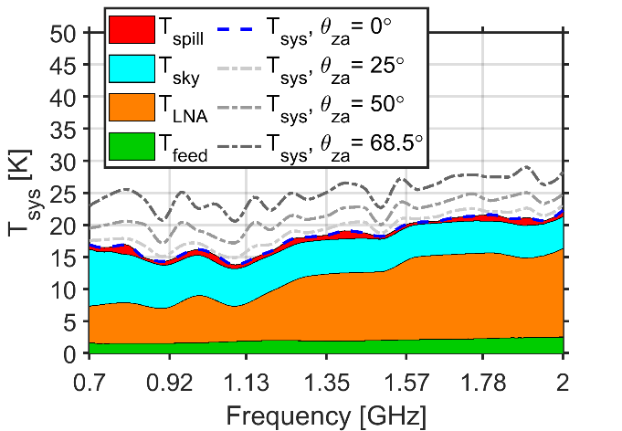

DSA-2000 Document No. 00034

Analog Signal Path Design Document

Sander Weinreb, Kiran Shila, Jonas Flygare, James W. Lamb

Caltech

+-----------------------------------------------------------------------+
| +--------------------------------+--------------------------------+   |
| | Version:                       | 1                              |   |
| +--------------------------------+--------------------------------+   |
| | Version date:                  | 2023-10-23                     |   |
| +--------------------------------+--------------------------------+   |
| | Original date:                 | 2023-10-15                     |   |
| +--------------------------------+--------------------------------+   |
| | Controlled document:           | No                             |   |
| +--------------------------------+--------------------------------+   |
| | WBS Level 2:                   | ASP--Analog Signal Path        |   |
| +--------------------------------+--------------------------------+   |
| | Document type:                 | DES--Design Report             |   |
| |                                |                                |   |
| |                                | Design Report                  |   |
| +--------------------------------+--------------------------------+   |
|                                                                       |
| : Table 2. Noise parameters for the example components.               |
+=======================================================================+
|                                                                       |
+-----------------------------------------------------------------------+

: Table 1. Gain parameters for the example laser diode and photodiode.

Revision History

  --------------------------------------------------------------------------------
  **Ver.**   **Date**     **Sections   **Reasons / Remarks** **Author(s)**
                          Affected**                         
  ---------- ------------ ------------ --------------------- ---------------------
  1          2023-10-23   All          Original              Weinreb, Shila,
                                                             Flygare, Lamb

  --------------------------------------------------------------------------------

#   {#section .TOC-Heading}

# Table of Contents {#table-of-contents .TOC-Heading}

[1 Introduction [4](#introduction)](#introduction)

[2 Requirements [4](#requirements)](#requirements)

[3 Design overview [5](#design-overview)](#design-overview)

[4 Design details [6](#design-details)](#design-details)

[4.1 Feed [6](#feed)](#feed)

[4.2 LNA [9](#lna)](#lna)

[4.3 Post-LNA electronics
[10](#post-lna-electronics)](#post-lna-electronics)

[4.3.1 Front-end module [11](#front-end-module)](#front-end-module)

[4.3.2 Optical link [12](#optical-link)](#optical-link)

[4.3.2.1 Link gain [12](#link-gain)](#link-gain)

[4.3.2.2 Linearity [13](#linearity)](#linearity)

[4.3.2.3 Link noise [13](#link-noise)](#link-noise)

[4.3.2.4 Dealing with tolerances
[14](#dealing-with-tolerances)](#dealing-with-tolerances)

[4.3.2.5 Laser safety [15](#laser-safety)](#laser-safety)

[4.3.3 Back-end module [15](#back-end-module)](#back-end-module)

[5 Monitor and control [15](#monitor-and-control)](#monitor-and-control)

[6 Future work [15](#future-work)](#future-work)

[6.1 Development [15](#_Toc148960916)](#_Toc148960916)

[6.2 Production readiness [15](#_Toc148960917)](#_Toc148960917)

[7 Interfaces [16](#interfaces)](#interfaces)

[8 Conclusions [16](#conclusions)](#conclusions)

[9 References [16](#references)](#references)

[10 Appendix [17](#appendix)](#appendix)

[10.1 Sideband phase decoherence
[17](#sideband-phase-decoherence)](#sideband-phase-decoherence)

[10.2 Linewidth decoherence
[17](#linewidth-decoherence)](#linewidth-decoherence)

[10.3 Delay drift [18](#delay-drift)](#delay-drift)

Abstract

The analog signal path (ASP) comprises everything from the feed up to
the input to the radio camera digitizer. We document the state of the
design of the ASP at the date of this revision. The overall architecture
is described, and details of the component parts presented. They have a
strong heritage so that risks are minimized, and considerable progress
has been made toward meeting the challenges of DSA-2000. The feed and
low-noise amplifier are well advanced, and development is now focused on
the optical link, with good progress being made.

# Introduction

The analog signal path comprises all the components between the antenna
reflector and the radio camera digitizer. These are:

-   The antenna feed, dual polarization;

-   Two low-noise amplifiers (LNA), one per polarization;

-   A dual-polarization front-end module (FEM) that filters out
    radio-frequency interference (RFI) and allows adjustment of the
    levels for transmission;

-   Two RF-over-fiber (RFoF) link to transmit the signals to the control
    building, one per polarization;

-   A dual-polarization back-end module (BEM) that conditions the
    signals for the radio camera front-end digitizer.

Physically, the optical transmit and receive components are incorporated
in the FEM and BEM respectively, but they need to be considered along
with the fiber transmission infrastructure as single system.
Accordingly, we allocate a separate subsection to discussion of the
optical link details.

The scale of the DSA-2000 does not allow for high-risk development, so
the system described here is based on elements that have been designed
and assessed in the field by members of the team and have been matured
to meet the DSA-2000 requirements. The primary extension is to achieve
the target of an observing band of 0.7--2.0 GHz. In addition, the fiber
lengths are an order of magnitude longer than for current OVRO
instruments. Improvements in system noise and efficiency have also been
made, and methods of mitigating the effects of radio frequency
interference (RFI) are being evaluated.

Several stages are planned to take the designs through to construction,
including integration testing in the lab and on the test array;
reliability testing; and finalizing designs for production. These are
laid out in detail in a separate work execution plan.

We report on the status of the overall design and status of development
in the following sections. Following that, we outline work needed to
achieve the level of performance, reliability, and operational readiness
for the final construction phase.

# Requirements

Specifications are derived from the science requirements on sensitivity.
From Thompson et al. \[1\] the rms noise in a single baseline
measurement for a single polarization expressed as an equivalent flux is

  -----------------------------------------------------------------------------------------------------------
  $$S_{\min} = \frac{2kT_{S}}{\eta_{q}A_{eff}\sqrt{N_{a}\left( N_{a} - 1 \right)}\sqrt{B\tau}}\ ,$$   \(1\)
  --------------------------------------------------------------------------------------------------- -------

  -----------------------------------------------------------------------------------------------------------

where:

$k$: Boltzmann constant

$T_{S}$: system temperature

$N_{a}$: number of (identical) antennas

$A_{eff}$: effective antenna collecting area

$\eta_{q}$: quantization efficiency

$B$: bandwidth

$\tau$: integration time

For a dual-polarization system this can be rearranged to give a
relationship between the system noise temperature and aperture
efficiency, $\eta_{a}$, and dish diameter, $D_{a}$, for given
requirements:

  --------------------------------------------------------------------------------------------------
  $$\frac{T_{S}}{\eta_{a}} \leq S_{\min}\frac{\pi}{8k}\ N_{a}{D_{a}}^{2}\sqrt{2B\tau}\ .$$   \(2\)
  ------------------------------------------------------------------------------------------ -------

  --------------------------------------------------------------------------------------------------

The quantization efficiency is assumed to be \~ 100%. The observing band
is 0.7--2.0 GHz, but up to 35% bandwidth loss is acceptable. Using the
science requirement for a sensitivity of 1 μJy in 1 hour of integration
around declination 0° (elevation 52°) we derive a requirement of

  ----------------------------------------------------------------------------
  $$\frac{T_{S}}{\eta_{a}} = 35\ K.$$                                  \(3\)
  -------------------------------------------------------------------- -------

  ----------------------------------------------------------------------------

The division between noise and efficiency is restricted by the current
technology to a range from about 22.8 K/65% to 24.5 K/70%.

# Design overview

Figure 1 lays out the architecture of the signal path. The feed captures
the signal from the primary reflector and the integrated orthomode
transducer (OMT) couples the two orthogonal linear polarizations to low
noise amplifiers (LNA) operating at ambient temperature. Coaxial cables
connect the LNAs to an enclosure on the antenna turning head where the
signals are amplified, filtered and the amplitude adjusted to a suitable
power level. The resulting signal modulates the current in a laser diode
and the optical signal is transmitted on a single-mode fiber to the
control building.

The optical fibers to the control building will be up to \~ 21 km long
and will have a number of splices and connectors that need to be made
precisely to minimize optical losses. In the control building the fibers
are connected to the back-end modules (BEM) that have photodiodes to
convert back to RF. These signals are then filtered, amplified, and set
to the appropriate level for the radio camera front-end analog to
digital converters (ADC).

A major challenge is dealing with radio frequency interference (RFI).
Major sources of concern in this band are ground-based cell phone
communications and aeronautical navigation and, in the near future,
satellite cell phone service. The project will select a site that is as
free from these interfering signals as possible, and work on other
protection and mitigation will proceed, but there will always be some
level of interference to deal with. The uncertainty and variability will
require several measures in the signal path to minimize the effect and
to deal dynamically with variable and evolving levels. As described
below, these strategies include filtering, both fixed and variable, and
gain control to adaptively optimize the system.

{width="6.5in" height="2.0493055555555557in"}

Figure 1. Schematic of the analog signal path showing the locations of
the major components.

The total gain required between the feed input and the digitizer is
about 76 dB. To allow for some variation in component values,
unpredictable RFI, antenna dependent fiber losses, etc., more gain is
built into the signal path, and step attenuators allow fine adjustment
to achieve optimum performance in operation. A major part of the design
development is the RFoF link.

# Design details

In the following sections, the design details and status of the elements
of the signal chain are reported. The emphasis is on the work that has
been done to extend existing designs to meet DSA-2000 requirements.
Areas of particular concern are dealt with in some detail.

## Feed

To meet the requirements of DSA-2000, the feed, in combination with the
5-m diameter antenna paraboloidal reflector, needs to achieve high
aperture efficiency, low noise, and low wide-angle sidelobes over a
0.7--2.0 GHz band. Several techniques are used to achieve this in a
quad-ridge choke horn (QRCH) design with a low-loss dielectric lens
\[2\]--\[4\]. The excitation point[^1] for each polarization is
essentially a probe across a circular ridged waveguide, with a short
coaxial cline to the connector. Ridged waveguides have higher
single-mode bandwidth than circular waveguides, a useful quality for the
application. The two orthogonal ridged guides share the same cylindrical
outer wall. From the excitation points, the ridges taper outward to
reduce the field coupling to the metallic guide and transition into a
free-space wave. At the aperture of the feed, separate measures are
applied to control the low and high frequency behaviors. For the low
frequencies, the tendency of part of the wave to diffract in the
rearward direction is countered with a high-impedance corrugated choke
structure, reducing the back lobe amplitude. For the mid to higher
frequencies, a dielectric lens helps to control the phase and to broaden
the illumination on the primary.

The antenna aperture efficiency, $\eta_{a}$, can be expressed as the
product of several factors:

  -------------------------------------------------------------------------------
  $$\eta_{a} = \eta_{sp}\ \eta_{ill}\ \eta_{ph}\ \eta_{xp}\ \eta_{b}.$$   \(4\)
  ----------------------------------------------------------------------- -------

  -------------------------------------------------------------------------------

A practical feed size for weight and blockage is of order a wavelength,
which allows little control of the pattern other than its width.
Widening the beam improves the illumination efficiency, $\eta_{ill}$,
but reduces the spillover efficiency, $\eta_{sp}$. The optimum width for
aperture efficiency may not be the best for sensitivity if the spillover
is at ambient temperature, compromising the system noise temperature,
but the noise penalty is counteracted by a shield round the primary rim
that directs spillover on to the cold sky \[5\].

The phase efficiency, $\eta_{ph}$, is maximized by ensuring the best-fit
phase center is at the prime focus for all frequencies across the band.
The residual error is quantified by $\eta_{ph}$. Cross-polar efficiency,
$\eta_{xp}$, is maximized as much as possible following Ludwig's third
definition \[6\] as aperture cross polarization not only reduces on-axis
efficiency, but also produces sidelobes in the intercardinal planes,
compromising the goal of a circularly symmetric pattern. Blockage
efficiency, $\eta_{b}$, reflects the reduction in aperture area due to
the feed and its support structure.

Full electromagnetic finite-element analysis was required to optimize
the feed performance \[4\]. The resulting design is shown in Figure 2,
and the performance results are shown in Figure 3. Not included in the
analysis to date is the radome that will be used to protect the lens and
weatherize the feed.

Previous horn designs have been verified by pattern measurements in an
anechoic chamber, giving high confidence in the simulations. Those
measurements will also be done for the final DSA-2000 design before
production and possibly on a small number of production items.

Brief summaries of the major components of the feed in Figure 2 and the
motivation for each in the design are given below:

**Choke-rings**

A deep "pan-like" structure;

Creates high-impedance surface, resulting in wider pattern with
minimized side and back-lobes;

Effect is limited to octave band, predominantly the low frequencies.

**Quad-ridge waveguide**

A circular metal ridge waveguide structure that provides bandwidth in a
compact format with single-ended output, and linear dual-polarization;

Wide ridges for lower current density (i.e., reduced ohmic loss).

**Dielectric load/lid/lens**

The dielectric load reduces aperture phase errors and widens the feed
pattern for mid and high frequencies in the band;

Realized with low-loss thermoplastic, High Density Polyethylene (HDPE);

**Radome**

Protects the lens from ultra-violet radiation, and the waveguide from
weather;

Thermoformed microwave transparent material.

{width="6.5in"
height="4.851393263342082in"}{width="6.5in"
height="4.851393263342082in"}{width="6.5in"
height="4.851393263342082in"}

Figure 2. *Left:* photo of prototype feed, and *Right:* cross-sectional
drawing showing the principal components. The radome that will guard the
lens against UV radiation and generally protect the feed from weather.

{width="6.513194444444444in"
height="4.434959536307962in"}{width="6.513194444444444in"
height="4.434959536307962in"}{width="6.513194444444444in"
height="4.434959536307962in"}

Figure 3. *Top-Left:* Simulated and measured return loss (*s*~11~ and
*s*~22~) and coupling between the output ports for the two
polarizations. *Top-Right*: System noise temperature at 8°C for four
zenith pointing angles with the zenith direction broken down in
component contributions. *Bottom*: Simulated aperture efficiency, with a
band average of 66 % including blockage.

The combined noise temperature, including the LNA described in the next
section, and the feed with spillover and aperture efficiency show in
Figure 2 are commensurate with the requirements in section 2.

## LNA

Shi and Weinreb \[7\] have demonstrated a design that covers the
DSA-2000 band with excellent performance both in terms of noise
temperature (11 K) and gain flatness (±1 dB). The LNAs are based on
Diramics \[8\] pHEMTs (pseudomorphic high electron mobility transistors)
that have proven to have exceptionally low noise, good reliability, and
good repeatability. A key feature of the design is the very low loss
input coupling and matching circuit. Dissipative losses there have a
significant effect on the noise temperature, but the use of a
silver-plated connector and a suspended substrate microstrip minimize
those losses. Additionally, it is important to avoid nickel-bearing gold
plating on the microstrip line to minimize ohmic loss.

{width="6.4944444444444445in"
height="2.473957786526684in"}{width="6.4944444444444445in"
height="2.473957786526684in"}

Figure 4. *Left:* Noise and gain curves for a prototype LNA show
excellent gain flatness and noise temperature across the observing band.
*Right:* Three prototype amplifiers show the same dependence of noise on
temperature.

Linearity measurements on prototype models show a 1-dB compression point
of about −35 dBm. While this is well above the nominal system noise
power level, the levels of RFI at the proposed sites currently and in
the future are not well known so the possibility of intermodulation
products still needs to be considered.

The LNAs will be attached directly to the feeds, exposed to solar
heating, ambient temperatures, and moisture. Although the LNA gain is
very stable over temperature, the noise temperature degrades with
increasing temperature \[7\]. We are investigating cooling paints \[9\]
that can significantly lower the amplifier temperature, even to below
ambient. Moisture ingress is minimized by an O-ring between the halves
of the amplifier block, as well as by connectors selected for hermetic
sealing.

Current LNA modules incorporate a diode that can inject noise at the
input to the LNA \[7\]. It is unlikely that this will be useful for
amplitude calibration since the full DSA-2000 will have unprecedented
capability for astronomical calibration. It is potentially a useful tool
for diagnosis, but the decision to include or delete if from the final
implementation will be made before production.

Losses in the cables at the output of the LNA are not critical due to
the high (\~ 40 dB) gain of the amplifier. Primary factors in the choice
of cable will be physical ruggedness, qualification for outdoor use, and
flexibility for the elevation wrap. A common failure mode is the
attachment between the connectors and cable. Electrical and mechanical
testing will be done on sample cables before production purchasing, and
as necessary acceptance testing will be performed before installation in
the field.

## Post-LNA electronics

The electronics between the LNAs and the digitizers comprise several
units that must be considered as a whole to optimize properly. A
critical aspect is the RFoF link, which has not yet been qualified to
meet the DSA-2000 project requirements. A section is devoted to analysis
of the link to justify the expectation that it will be able to meet the
requirements for DS-2000.

The two physical modules are the FEM at the antenna, and the BEM in the
control building. Prototype modules are shown in Figure 5. These are
intended to evaluate and verify the RF performance, and the final design
will be done in conjunction with the packaging design for
manufacturability and operations considerations.

{width="6.858333333333333in"
height="2.96in"}{width="6.858333333333333in"
height="2.96in"}

Figure 5. *Left:* A version of the prototype for the front-end module.
The RF path is in the top block, with the laser diode and its fiber
pigtail on the right. The lower block contains components for regulating
power and monitor and control. *Right:* An iteration of the back-end
module. The photodiode is on the left edge and the RF output on the
right.

### Front-end module

The front-end module conditions the signal for transmission to the
control building on the RFoF. The transmission side of the optical link
is an integral part of the module. It is based on a laser diode that is
directly modulated through its bias current. Laser diodes have high
equivalent noise temperatures due to their relative intensity noise
($RIN$) so sufficient gain is required to overcome this contribution to
the noise budget. However, the higher power levels make the signal path
more susceptible to RFI harmonics and intermodulation products due to a
non-linear transfer function.

Significant RFI is expected but the quantitative levels will depend on
the final site choice and will vary and evolve with time so a best
effort at mitigation is required. Minimization of out-of-band power with
a band-pass filter is the first step. For RFI within the nominal band,
low-level narrow-band signals can be rejected by dropping spectral
channels in the radio camera. Higher levels will cause harmonics and
intermodulation products, contaminating more channels. Up to 35% of the
band can be cut and still allow the science goals to be achieved.

An ultimate limit on non-linearity is set by the range of the ADC, but
the linearity of the analog path must also be considered. The laser
diode in the optical link is likely the primary source of non-linearity,
and the variation on performance among manufacturers and models is very
large. D'Addario \[10\] has tabulated an extensive set of measurements
comparing noise and linearity for a range of devices showing that even
consecutive serial numbers can have a range of performance. The final
choice of device is still open, but the circuit design is proceeding
with the goal of supporting a variety of potential devices.

The design is being optimized in several aspects for the expected
operating conditions. For example, the passband can be designed with a
positive slope to de-emphasize RFI cell tower signals in the
600--850 MHz band where the laser noise lower. This will then be
compensated in the BEM to provide a flat spectrum to the digitizer.
Additionally, to allow adaptation to short- and long-term variations in
RFI levels, selectable filters are included, and step attenuators enable
optimization of levels for different filter selections and RFI levels.

Though not in the baseline plan, a very flexible varactor-tuned filter
provides a −40-dB, 10-MHz-wide notch (appropriate for cell phone RFI),
remotely tunable from 700 to 950 MHz, has been designed and tested. This
same filter can be remotely tuned to give four −10-dB or two −20-dB
notches at separate frequencies. This sharp filter allows the radio
astronomy data within +40 and −20 MHz of the notch frequency to be
processed.

### Optical link

The analog optical link, based on developments for the OVRO-LWA (long
wavelength array) \[11\] and later the DSA-110, is divided between the
FEM and the BEM but has to be analyzed as a whole, including the optical
fibers. Loss at RF increase as the square of the optical loss, so the
transmission quality is crucial. The most commonly used wavelengths are
1310 nm and 1510 nm. The baseline plan for the optical fiber network,
based on cost performance tradeoffs, is to use Corning ALTOS® Loose
Tube, Gel-Free Cable, performance option 01, which specifies a loss of
0.4 dB·km^−1^ at 1310 nm, and 0.3 dB·km^−1^ at 1550 nm. Other
performance options have loss at 1550 nm as low as 0.2 dB·km^−1^ but for
reasons discussed below, the 1310 band is preferred.

Dispersion in the fiber reaches zero at a wavelength in the range
1302--1322 nm, with a slope 0.092 ps·nm^−2^·km^−1^. Around a wavelength
of 1550 nm the dispersion is \~ 17 ps·nm^−1^·km^−1^. For a laser diode
linewidth of 1 nm, and a fiber length of 25 km the dispersion across the
line is a significant 0.43 nm. The full implications of dispersion are
analyzed in the Appendix.

On balance, an operating wavelength of 1310 nm appears to be the better
choice and is adopted for the baseline plan. For 20 km of fiber, the
corresponding optical loss is 8 dB, resulting in a loss of 16 dB at RF.
An additional 1--2 dB optical loss may result from connections, splices,
bends, and twists, leading to a maximum optical attenuation of 10 dB
(20 dB for RF). For the dispersion we assume the above-mentioned fiber
specifications, and a laser center wavelength specification of
1300--1320 nm, which puts the dispersion in the range −40 to 32
ps·nm^−1^. This results in a maximum phase difference between the first
order modulation sidebands of a 2 GHz signal of 0.1°. For a 1 nm
linewidth the variation in phase is ±1.4°, which increases the effective
loss by a fraction of a decibel.

Diode selection is unfortunately complicated by the huge range of
structures, materials, manufacturers, and packaging types. Cost is a
critical determining factor, limiting the choice to a few Chinese
manufacturers. Other factors to be considered in the selection in
addition to wavelength and linewidth are quantum efficiency, relative
intensity noise ($RIN$), and linearity.

Potential devices have been identified and tested by D'Addario \[10\]
and a down-selection made for prototyping. For the design calculations
we use the datasheet for a Shengshi 1310-nm DFB laser diode \[12\],
though further testing may indicate a different part.

DSA-2000 antenna electronics will be in an uncontrolled temperature and
humidity environment, and laser diodes are known to be very temperature
dependent, so testing in an environmental chamber is required. Testing
over 200 diodes for the OVRO-LWA \[13\] showed a lot of scatter in
properties, differences from manufacturer's test data (better and
worse), and complicated temperature dependence. Temperature effects are
partly due to the fundamental diode physics, but thermal effects in the
packaging also produce significant and unpredictable changes. To deal
with this, we will do extensive testing of samples to ensure that the
variance in performance is acceptable, and possibly address quality
control issues with the manufacturer. Temperature control of the laser
diode is not ruled out but for reasons of reliability, power
consumption, and complexity it will be used only if it is demonstrated
that it is absolutely necessary.

Photodiodes present much less of a problem since they are readily
available with high quantum efficiencies (70--90%). A dc voltage of a
few volts needs to be applied to reduce the depletion layer capacitance
for good frequency response. Silicon diodes are suitable for 1310 nm
operation, but InGaAs is required for 1550 nm operation. Both have low
dark current (fractions of a nA), so the shot noise contribution is
small compared to the photon noise, even accounting for doubling for
every 10°C rise in temperature. Optical power levels are low, so do not
impose any significant constraints on the photodiode power handling. A
Shengshi Optical Tech. Co., Ltd MPD-XXXXX diode \[14\] is assumed in the
following discussion.

#### Link gain

It is useful to analyze optical links with directly driven laser diodes
in terms of their current gain since they have low input impedance and
high output impedance. Standard network theory is used to incorporate
this in a 50-Ω RF circuit. The current gain of the optical link is the
product of the laser diode quantum efficiency, $\eta_{ld}$, the optical
gain, $g_{opt}$, and the photodiode quantum efficiency, $\eta_{pd}$.
Typical values are 15--30% for $\eta_{ld}$, 5--90% for $g_{opt}$, and
70--90% for $\eta_{pd}$, leading to a range of current gains from −45 dB
to −12 dB. There is no direct link between the gain and the optical
power, but higher optical powers allow larger signal amplitudes. For the
components mentioned above, the range of possible current gains is given
in Table 1. The potential range is large (−50 dB to −20 dB), indicating
that a narrower range of specifications needs to be discussed with the
manufacturers. With the large number of devices required for DSA-2000,
the likelihood of having close to a worst-case combination is high, and
selecting specific combinations is unworkable.

+-----------------+-----------------+---------------+-----------------+
| parameter       | best case       | worst case    | unit            |
+=================+=================+===============+=================+
| laser           | 21              | 5^a^          | \%              |
| efficiency      |                 |               |                 |
+-----------------+-----------------+---------------+-----------------+
| optical gain    | −2.4^b^         | −12^c^        | dB              |
+-----------------+-----------------+---------------+-----------------+
| detector        | 84              | 74^d^         | \%              |
| efficiency      |                 |               |                 |
+-----------------+-----------------+---------------+-----------------+
| total current   | −20             | −52           | dB              |
| gain            |                 |               |                 |
+-----------------+-----------------+---------------+-----------------+
| Notes           |                 |               |                 |
|                 |                 |               |                 |
| ^a^ Not         |                 |               |                 |
| specified;      |                 |               |                 |
| estimated from  |                 |               |                 |
| maximum optical |                 |               |                 |
| power at        |                 |               |                 |
| operating       |                 |               |                 |
| voltage.        |                 |               |                 |
|                 |                 |               |                 |
| ^b^ Fiber       |                 |               |                 |
| length = 2 km,  |                 |               |                 |
| 2 dB other loss |                 |               |                 |
|                 |                 |               |                 |
| ^c^ Fiber       |                 |               |                 |
| length = 25 km, |                 |               |                 |
| 2 dB other loss |                 |               |                 |
|                 |                 |               |                 |
| ^d^ Not         |                 |               |                 |
| specified;      |                 |               |                 |
| based on        |                 |               |                 |
| difference      |                 |               |                 |
| between typical |                 |               |                 |
| and max.        |                 |               |                 |
+-----------------+-----------------+---------------+-----------------+

#### Linearity

In practice, the linearity of the laser modulation is not perfect, and
deviations can cause intermodulation products. There does not appear to
be an obvious theory for predicting non-linear terms in the gain, so it
is necessary to use the datasheets if they provide those data, or to
make measurements. The optical power vs. bias current can be expanded in
polynomial form and the non-linear terms determined. In practice, a
direct intermodulation measurement is a more accurate and reliable
method.

Intermodulation products rise at a linear or higher order power relative
to the signal, so it is important to keep the signal as low as possible
without compromising the SNR. The amount of intermodulation also depends
on the diode dc current bias and is temperature dependent \[13\]. It is
very important to quantify the distortion of the RFoF link over the full
range of device parameters and temperatures.

#### Link noise

Noise in the optical link is due primarily to the relative intensity
noise of the optical power, defined by

  ---------------------------------------------------------------------------------
  $$RIN = \frac{\left\langle \Delta P(t)^{2} \right\rangle}{P_{0}^{2}},$$   \(5\)
  ------------------------------------------------------------------------- -------

  ---------------------------------------------------------------------------------

where $\left\langle \Delta P(t)^{2} \right\rangle$ is the mean square
power fluctuation about the mean optical power, $P_{0}$.

When a laser diode is turned on by increasing the bias current, $I_{b}$,
above the threshold current, $I_{th}$, the $RIN$ is initially very high,
and then with increasing current the $RIN$ falls to some approximately
asymptotic value. If an RF modulating current is added to the bias
current its instantaneous amplitude must be low enough to keep the net
current above the threshold current by a small amount. Consequently,
both the permissible fractional modulation depth and the $RIN$ are
weakly dependent on the dc bias point, and the achievable
signal-to-noise is therefore also weakly bias dependent. An optimum bias
setting for intermodulation can therefore be found with little impact on
sensitivity.

As for the gain calculation, it is convenient to work in terms of
current. The $RIN$ equivalent noise current $i_{n}$, in a bandwidth $B$
for a bias current $I_{b}$ has an rms value

  ---------------------------------------------------------------------------------------------------------------------------
  $$\left\langle i_{n}^{2} \right\rangle = RIN{\times \left( I_{b} - I_{th} \right)}^{2}\ \ \ for\ I_{b} > I_{th}$$   \(6\)
  ------------------------------------------------------------------------------------------------------------------- -------

  ---------------------------------------------------------------------------------------------------------------------------

To keep the $RIN$ equivalent noise temperature below 1% of the system
temperature, the gain before the laser needs to be sufficient for the
system noise power rms current to exceed this by a factor of at least
ten. For a total $RIN$ of −155 dB·Hz^−1^ and $I_{b} = I_{th} + 20\ mA$,
the equivalent rms RF noise current driving the laser in a bandwidth
$B = 1.3\ GHz$ would be \~ 13 μA, so the rms current due to the system
noise would need to be \~ 90 μA, or a peak-to-peak of \~ 0.45 mA.

$RIN$ comprises laser noise and shot noise. The laser noise is often
divided into an intrinsic mechanism due to beating of spontaneous
emission with the stimulated radiation, and extrinsic mechanisms termed
technical noise that results from disturbances external to the diode
\[15\]. For our purposes, the details are not important, and the main
distinction is that laser $RIN$ is independent of optical attenuation
but the shot noise increases in proportion to optical attenuation. For
high optical attenuation, the shot noise will eventually dominate over
the laser noise. For 4 mW optical power, the shot noise contribution to
$RIN$ is −161 dB·Hz^−1^, so that the laser $RIN$ component is
−156 dBm·Hz^−1^. If there is 15 dB of optical loss, the shot noise $RIN$
is −153 dB·Hz^−1^, and the total $RIN$ is −146 dBm·Hz^−1^.

Post detection noise is primarily due to the amplifier following the
photodiode. The baseline plan uses an Analog Devices ADL5611, which has
a noise figure of \~ 2.1 dB in the relevant band. We will somewhat
arbitrarily use an effective noise temperature of 300 K to account for
the amplifier being operated with a source impedance different from the
specification. At the photodiode the equivalent rms noise current over
the band is then 0.33 μA. This is divided by the current gain to get the
equivalent noise at the input. For example, a gain of −15 dB, raises the
noise current to 10 μA.

Table 2 shows the range of possible noise levels for the best and worst
cases. As for the gain calculations, we note that the large quantity
makes it likely that worst cases will be encountered.

+---------------------+---------------+---------------+---------------+
| Parameter           | best case     | worst case    | unit          |
+=====================+===============+===============+===============+
| total $RIN$         | −155 ^a^      | −150          | dB·Hz^−1^     |
+---------------------+---------------+---------------+---------------+
| laser *RIN*^b^      | −168          | −150          | dB·Hz^−1^     |
+---------------------+---------------+---------------+---------------+
| shot noise (at      | −161          | −155          | dB·Hz^−1^     |
| laser output)       |               |               |               |
+---------------------+---------------+---------------+---------------+
| Equivalent noise    |               |               |               |
| current at laser    |               |               |               |
| diode *input*       |               |               |               |
+---------------------+---------------+---------------+---------------+
| post-amplifier      | 3.2           | 130           | μA            |
| noise               |               |               |               |
+---------------------+---------------+---------------+---------------+
| laser noise         | 3.0           | 22            | μA            |
+---------------------+---------------+---------------+---------------+
| shot noise          | 27.1          | 19            | μA            |
+---------------------+---------------+---------------+---------------+
| total noise         | 27.4          | 133           | μA            |
+---------------------+---------------+---------------+---------------+
| ^a^ Actually        |               |               |               |
| 'Typical' in data   |               |               |               |
| sheet               |               |               |               |
|                     |               |               |               |
| ^b^ Total *RIN*     |               |               |               |
| minus shot noise    |               |               |               |
| *R­IN*               |               |               |               |
+---------------------+---------------+---------------+---------------+

#### Dealing with tolerances

From the preceding discussion it is clear that, based on available
information, there is a large range of parameter specifications to
consider. Some of these are inevitable, such as variations in fiber
lengths, but it is important to reduce variability. Trying to match
laser transmitters and receivers is not feasible operationally since
modules must be interchangeable. The first step is to have better
quantitative analysis. Given the number of components, a statistical
analysis needs to be conducted. Some of the parameters in the tolerance
budget are correlated or anti-correlated, which needs to be accounted
for. Finally, discussions with manufacturers will be required to
guarantee some tighter specifications, as necessary. In some of the
datasheets available, there are no lower limits given.

#### Laser safety

Laser safety, currently covered by the ANSI Z136.1-2022 standard, needs
to be considered. The Class I (safe) limit for 1310 nm is 25 mW, and for
1550 nm it is 9.6 mW. It is unlikely that these will be exceeded, but
necessary precautions will be taken if they are.

### Back-end module

The photodiode converts the optical signal to RF by the photodiode and
then amplifiers and a digital step attenuator ensure that the signal to
the radio camera digitizer is at the optimum level. The attenuator
accounts for differences in levels due to the optical link performance
and is an additional control for optimizing levels in the event of high
RFI. An anti-aliasing filter for the digitizer is implemented with
discrete components, and an appropriate drive circuit for the digitizer
is provided.

# Monitor and control

Monitor and control will be developed in collaboration with the Monitor
and Control subsystem team. For the antenna electronics, the monitor and
control points will be on the same communications link as the antenna.
The total number of monitor points will likely be similar to or less
than for the DSA-110, which has 37 per antenna. Even for 2000 antennas
this is a very small number to handle.

# Future work

Most of the building blocks for the analog signal path have been
demonstrated to a good level of confidence, but further work is
required, firstly for verification that the science requirements can be
met, and secondly for production readiness.

The antenna feed and LNA are well progressed, so only minor changes for
performance, if any, are anticipated. Tests of the LNA intermodulation
will be done, though there is a low risk that it will be a problem.
While the baseline plan is not to cool the LNA or its input pHEMT, or to
integrate it with the feed, those are potential development paths that
may be independently conducted.

Work is continuing on the FEM-RFoF-BEM part of the system to demonstrate
that the design meets the science requirements, initially at room
temperature and then over the anticipated temperature range. The design
and components will be modified accordingly.

Once all the component parts are available, an extensive integration lab
test will be done to ensure full system performance requirements are
met. Further testing will be carried out on the five-antenna test array
at OVRO, which will start to expose the system to conditions similar to
the potential Nevada sites.

Production readiness will take the analog signal path elements through
to a state where they can be mass produced. This will include:

-   Final component evaluation for reliability;

-   Highly accelerated lifetime testing;

-   Packaging design for manufacturability, robustness, EMC, and
    installation;

-   Monitor and control interfacing;

-   Test documentation;

-   Interface control documents;

-   Mechanical drawing document control;

-   Electrical schematic and PCD document control;

-   Manuals;

-   Test fixtures;

-   Test protocols.

# Interfaces

The ASP has direct interfaces with the antenna station (AST), monitor
and control (MNC), signal network (SNW) and the radio camera front-end
(RCF). Detailed interface control documents will be developed in
collaboration with those subsystem teams.

# Conclusions

The overall analog signal path is in good shape but not fully developed
to the DSA-2000 requirements. The most progress is needed for the
optical fiber link, particularly in demonstrating performance over the
longest fiber runs. Calculations give high confidence that this is
feasible, and the main challenge is ensuring that the specifications can
be met without excessive need for screening and adjustment of individual
circuits.

# References

\[1\] A. R. Thompson, J. M. Moran, and G. W. Swenson Jr.,
*Interferometry and Synthesis in Radio Astronomy*. Malabar: Krieger,
1998.

\[2\] J. Flygare and D. P. Woody, "Wideband feed and reflector ground
shield for the Deep Synoptic Array (DSA-2000)," in *2023 IEEE
International Symposium on Antennas and Propagation and USNC-URSI Radio
Science Meeting (USNC-URSI)*, Jul. 2023, pp. 761--762. doi:
10.1109/USNC-URSI52151.2023.10237516.

\[3\] J. Flygare, "DSA-2000 Feed Requirements," Caltech, D2k-00043, Oct.
2023.

\[4\] J. Flygare, "DSA-2000 Feed Design," Caltech, D2k-00044, Oct. 2023.

\[5\] T. L. Landecker, M. D. Anderson, D. Routledge, R. J. Smegal, P.
Trikha, and J. F. Vaneldik, "Ground radiation scattered from feed
support struts: A significant source of noise in paraboloidal antennas,"
*Radio Science*, vol. 26, no. 2, pp. 363--373, 1991.

\[6\] A. C. Ludwig, "Definition of cross polarization," *IEEE Trans.
Antennas Propag.*, vol. AP21, no. 1, pp. 116--119, 1973, doi:
10.1109/tap.1973.1140406.

\[7\] J. Shi and S. Weinreb, "Room-temperature low-noise amplifier with
11-K average noise from 0.6 to 2 GHz," *IEEE Microwave and Wireless
Technology Letters*, pp. 1--4, 2023, doi: 10.1109/LMWT.2023.3315269.

\[8\] Diramics AG, Hinterbergstrasse 28, 6312 Steinhausen Switzerland, ,
\[Online\]. Available: https://diramics.com/

\[9\] X. Li, J. Peoples, P. Yao, and X. Ruan, "Ultrawhite BaSO4 paints
and films for remarkable daytime subambient radiative cooling," *ACS
Applied Materials & Interfaces*, vol. 13, no. 18, pp. 21733--21739, May
2021, doi: 10.1021/acsami.1c02368.

\[10\] L. D'Addario, "Evaluation of laser diodes for possible use in
DSA-2000 RF-over-fiber signal transmission," Internal Memo, Sep. 2022.

\[11\] S. Weinreb and K. Hu, "Components for OVRO LWA fiber-optic link,"
Caltech internal, Jul. 2014.

\[12\] "1310nm DFB Pigtailed Components Datasheet, Version Mar. 2016,"
Shengshi Optical Tech. Co., Ltd, Address: 5-floor,Block B Creative
Building, Shaojia Tsui, Wenzhi St., Hongshan District, Wuhan, City,
Hubei, P.R.China, Datasheet.

\[13\] J. W. Lamb, "LWA-352 laser driver design," Memo, in prep.

\[14\] "1100nm-1650nm Detector Pigtailed Components Datasheet," Shengshi
Optical Tech. Co., Ltd, Address: 5-floor,Block B Creative Building,
Shaojia Tsui, Wenzhi St., Hongshan District, Wuhan, City, Hubei,
P.R.China, Datasheet, Mar. 2016.

\[15\] "Relative Intensity Noise of Distributed Feedback Lasers, Rev.
1.5," eagleyard Photonics GmbH, Application Note. Accessed: Oct. 19,
2023. \[Online\]. Available:
https://www.laserdiodesource.com/com.laserdiodesource/technotes/EAGLEYARD-PHOTONICS-Relative-Intensity-Noise-of-Distributed-Feedback-Lasers.pdf

\[16\] "12 Orders of Coherence Control," TOPTICA Photonics AG,
Application Note. Accessed: Oct. 21, 2023. \[Online\]. Available:
https://www.toptica.com/fileadmin/Editors_English/12_literature/01_quantum_technologies/toptica_12_orders_of_coherence_control.pdf#:\~:text=In%20mathematical%20terms%2C%20linewidth%20and%20coherence%20length%20are,depending%20on%20the%20spectral%20profile%20of%20the%20laser.

# Appendix

For long fibers we need to consider the effect of dispersion from
several aspects, such as the phase difference between modulation
sidebands, the decoherence due to laser linewidth, and delay changes due
to frequency drift. The basis of the calculation is the dispersion
equation for SM-28 fiber from the Corning datasheet for an operating
wavelength $1200\ nm \leq \lambda \leq 1600\ nm$

  -------------------------------------------------------------------------------------------------------------------
  $$D(\lambda) = \frac{S_{0}}{4}\left\lbrack \lambda - \frac{\lambda_{0}^{4}}{\lambda^{3}} \right\rbrack,$$   \(7\)
  ----------------------------------------------------------------------------------------------------------- -------

  -------------------------------------------------------------------------------------------------------------------

where the zero-dispersion wavelength, $\lambda_{0}$ is

  ----------------------------------------------------------------------------
  $$1302\ nm \leq \lambda_{0} \leq 1322\ nm,$$                         \(8\)
  -------------------------------------------------------------------- -------

  ----------------------------------------------------------------------------

and the zero-dispersion slope is

  ----------------------------------------------------------------------------
  $$S_{0} \leq 0.092\ ps \bullet {nm}^{- 2} \bullet {km}^{- 1}.$$      \(9\)
  -------------------------------------------------------------------- -------

  ----------------------------------------------------------------------------

Quantitatively, we find
$|D|\  \lesssim 0.4\ ps \bullet {nm}^{- 1} \bullet km^{- 1}$ for the
range of laser and fiber around a nominal 1310 nm, and
$D \approx 17.5\ ps \bullet {nm}^{- 1} \bullet km^{- 1}$ for the 1550
band.

## Sideband phase decoherence

If the optical signal is modulated at an RF frequency of $f_{RF}$, the
first order sidebands will have a wavelength difference of
$\Delta\lambda,$

  ---------------------------------------------------------------------------------------
  $$\Delta\lambda = \frac{2cf_{RF}}{\nu_{c}\left( \nu_{c} + f_{RF} \right)}.$$   \(10\)
  ------------------------------------------------------------------------------ --------

  ---------------------------------------------------------------------------------------

where $\nu_{c}$ is the laser carrier frequency, and $c$ is the vacuum
speed of light. Using (7), the relative delay can be calculated for a
25 km long fiber, giving a maximum phase difference between
$f_{RF} =$`<!-- -->`{=html}2 GHz sidebands of \< 1° at 1310 nm, and \<
8° at 1550 nm. This causes negligible decoherence.

## Linewidth decoherence

The maximum specified linewidth for the laser diode discussed in this
document is $\Delta\lambda = 1\ nm$ at the −20 dB points. The delay,
$\delta t(\delta\lambda)$, at a wavelength $\delta\lambda$ away from the
line center frequency can be calculated from (10), and the integral of
the modulation signal amplitude over the width of the line will yield
the average signal. For the weighting function, we have to assume a line
shape, with a couple of choices being a Lorentzian and a Gaussian. Using
the linewidth definition above, these weighting functions are

  --------------------------------------------------------------------------------------------------------------------
  $${p_{L}(\delta\lambda) = \frac{1}{1 + \left( \frac{\delta\lambda}{0.0503\ \Delta\lambda} \right)^{2}}\ ,   \(11\)
  }{p_{G}(\delta\lambda) = \exp{- \left( \frac{\delta\lambda}{0.233\ \Delta\lambda} \right)^{2}}\ ,}$$        
  ----------------------------------------------------------------------------------------------------------- --------

  --------------------------------------------------------------------------------------------------------------------

respectively. The integral can be done with sufficient accuracy by
taking limits of $\pm \Delta\lambda$. Hence the effective signal
amplitude is given by

  ----------------------------------------------------------------------------------------------------------------------------------------------------------------------------------------------------------------------------------
  $$a = \ \frac{\int_{- \Delta\lambda}^{\Delta\lambda}{p_{X}(\delta\lambda)}\exp{2\pi if_{RF}\delta t(\delta\lambda)\ d\delta\lambda}}{\int_{- \Delta\lambda}^{\Delta\lambda}{p_{X}(\delta\lambda)\ d\delta\lambda}}\ .$$   \(12\)
  ------------------------------------------------------------------------------------------------------------------------------------------------------------------------------------------------------------------------- --------

  ----------------------------------------------------------------------------------------------------------------------------------------------------------------------------------------------------------------------------------

Results of this calculation are shown for a 25-km fiber in Figure 6. For
the 1310-nm band, the decoherence is negligible, even for the worst-case
assumptions. For the 1550-nm band, the effect is very significant, and
outweighs the lower loss of the fiber.

{width="3.977777777777778in"
height="3.0575492125984254in"}

Figure 6. Coherence loss due to laser diode linewidth. For the 1330-nm
band, the zero-dispersion frequency is chosen to be 1322 nm, which in
combination with the minimum specified laser frequency, gives the
maximum decoherence. 'L" and 'G' refer to Lorentzian and Gaussian
linewidths respectively.

An implicit assumption is that the jitter in the laser frequency is on
time scales much shorter than the RF period otherwise the effect would
be to add phase noise to the demodulated signal. In general, the
coherence time is the inverse of the linewidth (e.g., .\[16\]), which is
125 GHz, justifying the assumption.

## Delay drift

If the laser wavelength changes by $\Delta\lambda$, the optical delay
will change by

  -----------------------------------------------------------------------------
  $$\Delta\tau = \lambda\ \Delta\lambda\ d\ D(\lambda)\ .$$            \(13\)
  -------------------------------------------------------------------- --------

  -----------------------------------------------------------------------------

As an indication of the effect, we take some 1310-nm laser diode
frequency vs temperature measurements \[13\] that yielded a drift of
0.08 nm·K^−1^. Combined with (13) we find a delay sensitivity for a
25-km fiber of \~ 1 ns· K^−1^ at 1310 nm, and \~ 1 ns· K^−1^ at 1550 nm.
The sensitivity of the diodes selected for DSA-2000 will need to be
evaluated in this light and measures taken to ensure that the rate of
change of temperature is appropriately limited.

[^1]: By convention, antennas and feeds are analyzed in transmission,
    and reciprocity is invoked to derive the receiving characteristics.
